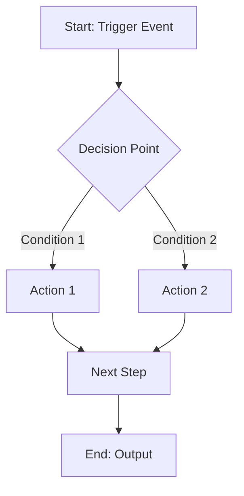
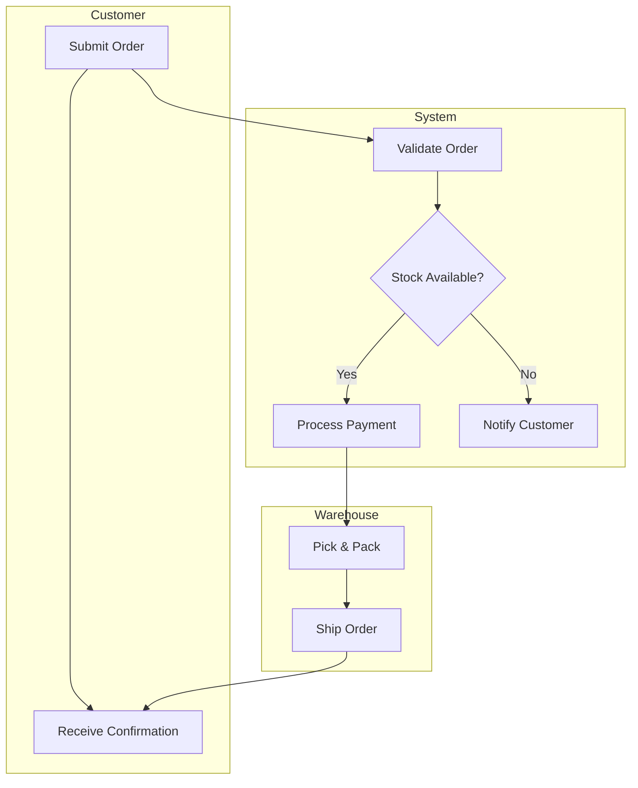
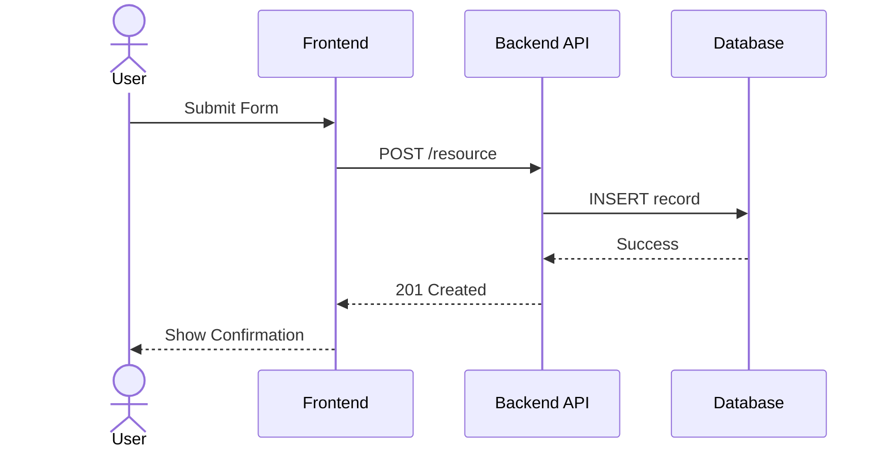
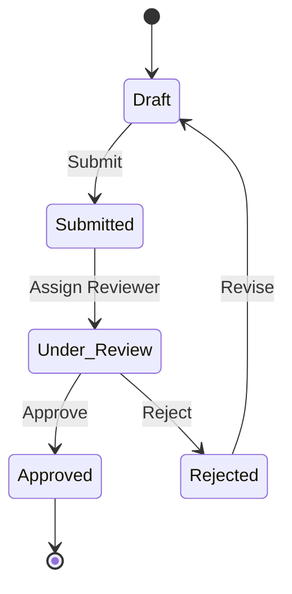

# Phase 4: Process Modeling

## Table of Contents
- [Workflow](#workflow)
- [AS-IS Process Mapping](#as-is-process-mapping)
- [TO-BE Process Design](#to-be-process-design)
- [Mermaid Diagram Templates](#mermaid-diagram-templates)
- [Gap Analysis](#gap-analysis)

## Workflow

1. Map AS-IS process (current state)
2. Identify pain points, bottlenecks, redundancies
3. Design TO-BE process (future state)
4. Perform gap analysis (AS-IS vs TO-BE)
5. Validate with stakeholders

## AS-IS Process Mapping

### Information to Gather
- Process name and owner
- Trigger: What starts the process?
- Steps: What happens in sequence?
- Actors: Who performs each step?
- Systems: What tools/systems are used?
- Decisions: Where are decision points?
- Handoffs: Where does work transfer between people/systems?
- Outputs: What is produced?
- End condition: How does the process end?
- Exceptions: What can go wrong?
- Time: How long does each step take?

### Mapping Questions
- "Walk me through the process from start to finish."
- "What triggers this process?"
- "Who is involved at each step?"
- "Where do delays or bottlenecks occur?"
- "What happens when something goes wrong?"
- "Are there any manual workarounds?"
- "What systems or tools do you use?"

## TO-BE Process Design

### Improvement Patterns to Consider
- **Eliminate**: Remove non-value-adding steps
- **Automate**: Replace manual steps with system actions
- **Simplify**: Reduce complexity, merge steps
- **Parallelize**: Execute independent steps simultaneously
- **Standardize**: Create consistent procedures
- **Integrate**: Connect disconnected systems

### Design Principles
- Minimize handoffs between people/systems
- Automate repetitive, rule-based tasks
- Build in exception handling
- Include monitoring/measurement points
- Consider user experience for human steps

## Mermaid Diagram Templates

### Basic Flowchart

### Swimlane Process (by Actor)

### Sequence Diagram (System Interactions)

### State Diagram (Entity Lifecycle)

## Gap Analysis

### AS-IS vs TO-BE Comparison Table

| # | Process Step | AS-IS | TO-BE | Gap | Action Required |
|---|-------------|-------|-------|-----|-----------------|
| 1 | [Step name] | [Current] | [Future] | [Difference] | [What to build/change] |
| 2 | ... | ... | ... | ... | ... |

### Gap Categories
- **Process Gap**: Steps that need to change
- **Technology Gap**: Systems/tools to build or procure
- **People Gap**: Skills, roles, training needed
- **Data Gap**: Data not currently available
- **Policy Gap**: Rules or procedures to update

### Output
Produce gap analysis as a structured table. Use xlsx skill for complex analyses with multiple dimensions.
