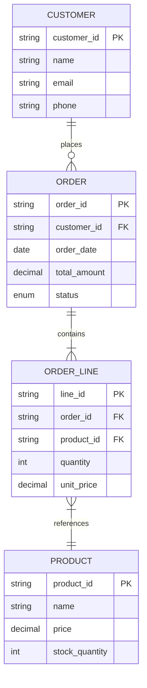
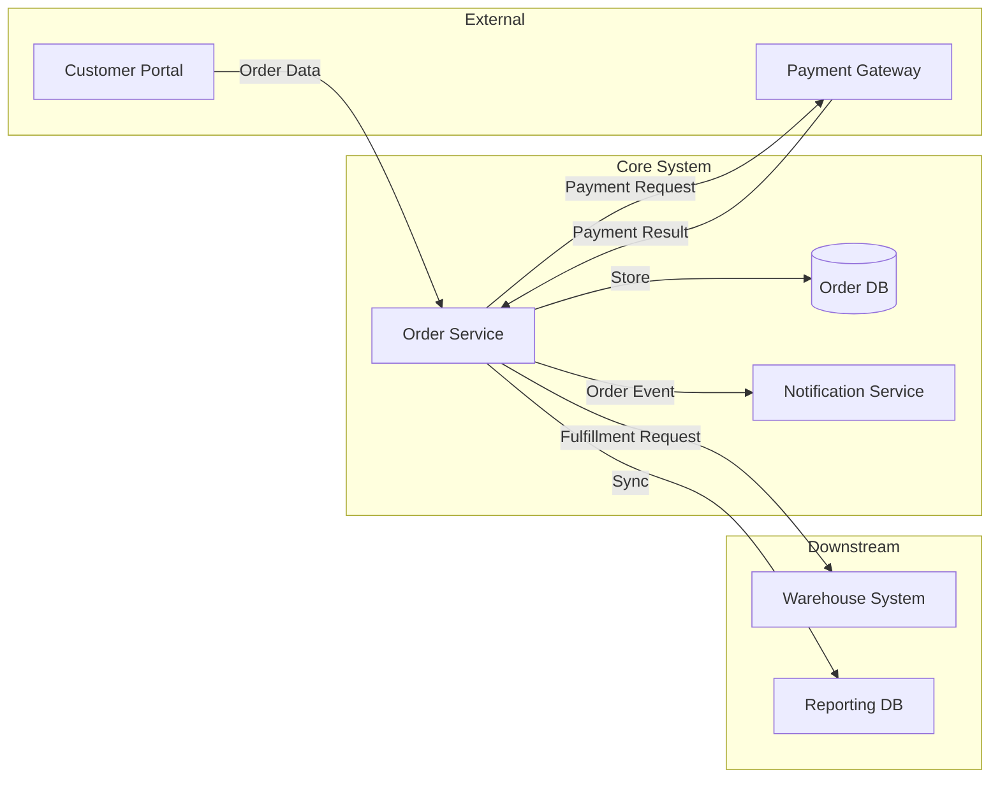

# Phase 5: Data & Entity Modeling

## Table of Contents
- [Workflow](#workflow)
- [Data Dictionary](#data-dictionary)
- [Entity Relationship Diagram](#entity-relationship-diagram)
- [Data Flow Diagram](#data-flow-diagram)
- [Data Mapping](#data-mapping)

## Workflow

1. Identify key entities from requirements and process models
2. Define attributes for each entity
3. Establish relationships between entities
4. Create data dictionary
5. Draw ERD using Mermaid
6. Map data flows between systems (if integration project)
7. Validate with SMEs and technical team

## Data Dictionary

### Template

For each data element, capture:

| Field | Description |
|-------|-------------|
| **Entity** | Parent entity name |
| **Attribute Name** | Field name (use consistent naming convention) |
| **Business Name** | Human-readable label |
| **Description** | What this field represents |
| **Data Type** | String, Integer, Decimal, Date, Boolean, etc. |
| **Length/Format** | Max length, format pattern (e.g., YYYY-MM-DD) |
| **Required** | Yes / No / Conditional |
| **Default Value** | Default if not provided |
| **Validation Rules** | Allowed values, ranges, regex patterns |
| **Source** | Where this data originates |
| **Example** | Sample value |

### Example

| Attribute | Business Name | Type | Length | Required | Validation | Example |
|-----------|--------------|------|--------|----------|------------|---------|
| order_id | Order ID | String | 12 | Yes | ORD-[0-9]{8} | ORD-00000001 |
| customer_id | Customer ID | String | 10 | Yes | FK to Customer | CUST-00001 |
| order_date | Order Date | Date | - | Yes | Cannot be future date | 2025-03-15 |
| total_amount | Total Amount | Decimal | 12,2 | Yes | > 0 | 1250.00 |
| status | Order Status | Enum | - | Yes | Draft/Submitted/Approved/Cancelled | Submitted |

## Entity Relationship Diagram

### Mermaid ERD Template

### Relationship Notation
- `||--||` : One to one (mandatory)
- `||--o|` : One to zero-or-one
- `||--|{` : One to many (mandatory)
- `||--o{` : One to zero-or-many
- `}|--|{` : Many to many (use junction table)

### Discovery Questions
- What are the main "things" (entities) the system manages?
- What information do we store about each entity?
- How do entities relate to each other?
- What is the cardinality of each relationship?
- Are there any many-to-many relationships that need junction tables?
- What uniquely identifies each entity?

## Data Flow Diagram

### Mermaid Data Flow Template

### Information to Capture
- What data flows between systems?
- What format/protocol is used (API, file, message queue)?
- What is the frequency (real-time, batch, on-demand)?
- What transformations occur during transit?
- Who owns each data source?

## Data Mapping

### For Integration / Migration Projects

| # | Source System | Source Field | Target System | Target Field | Transformation | Notes |
|---|-------------|-------------|---------------|-------------|----------------|-------|
| 1 | Legacy CRM | cust_name | New CRM | full_name | Direct map | |
| 2 | Legacy CRM | addr1 + addr2 | New CRM | address | Concatenate with ", " | |
| 3 | - | - | New CRM | created_at | Set to migration date | New field |
| 4 | Legacy CRM | status_code | New CRM | status | Lookup table (A→Active) | See mapping table |

### Transformation Types
- **Direct**: No change needed
- **Format**: Change format (date, currency, etc.)
- **Lookup**: Map codes to new values
- **Concatenate**: Combine multiple fields
- **Split**: Break one field into multiple
- **Derive**: Calculate from other fields
- **Default**: Set a fixed value
- **Conditional**: Apply logic based on conditions
