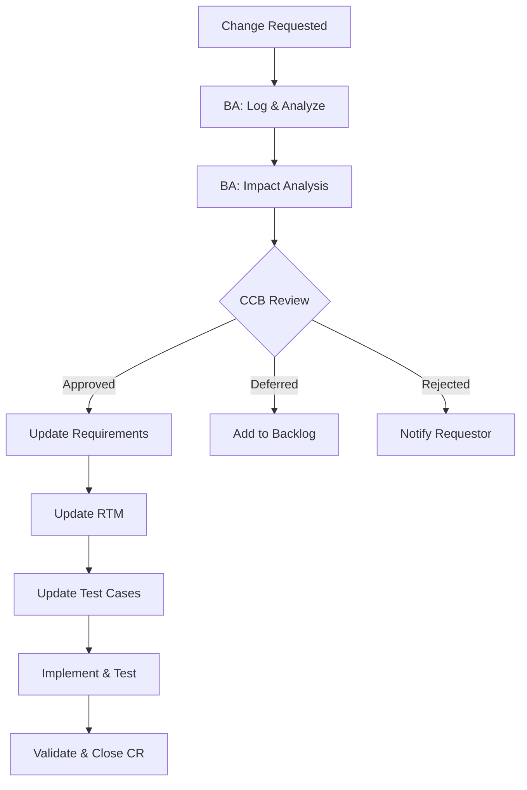

# Phase 7: Change Management & Traceability

## Table of Contents
- [Workflow](#workflow)
- [Requirements Traceability Matrix](#requirements-traceability-matrix)
- [Change Request Process](#change-request-process)
- [Impact Analysis](#impact-analysis)
- [Version Control](#version-control)
- [Lessons Learned](#lessons-learned)

## Workflow

1. Establish traceability from business needs → requirements → design → test cases
2. When changes arise, follow change request process
3. Perform impact analysis before approving changes
4. Update all affected artifacts
5. Maintain version history

## Requirements Traceability Matrix (RTM)

### Purpose
Track every requirement from origin to implementation and testing to ensure nothing is missed.

### RTM Template

| Req ID | Business Need | Requirement Description | Priority | Design Ref | Dev Status | Test Case ID | Test Status | Comments |
|--------|--------------|------------------------|----------|------------|------------|-------------|-------------|----------|
| FR-001 | BN-001 | System shall allow SSO login | Must | DD-Auth-01 | Complete | TC-AUTH-001 | Pass | |
| FR-002 | BN-001 | System shall support MFA | Should | DD-Auth-02 | In Progress | TC-AUTH-005 | Not Run | Phase 2 |
| FR-003 | BN-002 | System shall generate monthly report | Must | DD-RPT-01 | Complete | TC-RPT-001 | Fail | DEF-015 |

### RTM Coverage Metrics
- **Forward traceability**: Every requirement has design + test coverage
- **Backward traceability**: Every test case maps to a requirement
- **Coverage %**: (Requirements with test cases / Total requirements) × 100
- **Target**: 100% coverage for Must/Should requirements

### When to Update RTM
- New requirement added
- Requirement modified or removed
- Design document updated
- Test case created or modified
- Test execution completed
- Defect linked to requirement

## Change Request Process

### Change Request Template

```
CR-[Number]

1. Change Description
   - What is being requested?
   - Why is this change needed?
   - Who requested it? (Name, Role, Date)

2. Current Behavior
   - How does the system/process work today?

3. Proposed Change
   - What should change?
   - Detailed description of new behavior

4. Business Justification
   - Business value of the change
   - Risk of NOT making the change

5. Impact Analysis (see next section)

6. Estimated Effort
   - Development: [hours/days]
   - Testing: [hours/days]
   - Documentation: [hours/days]
   - Training: [hours/days]

7. Priority
   - Critical / High / Medium / Low

8. Approval
   | Role | Name | Decision | Date |
   |------|------|----------|------|
   | BA | | Recommend / Not Recommend | |
   | PM | | Approve / Reject / Defer | |
   | Sponsor | | Approve / Reject / Defer | |
```

### Change Request Workflow



CCB = Change Control Board (typically: Sponsor, PM, BA, Tech Lead)

## Impact Analysis

### Impact Analysis Template

For each change request, assess impact across these dimensions:

| Dimension | Impact | Details |
|-----------|--------|---------|
| **Requirements** | [List affected Req IDs] | Which requirements change, add, or remove? |
| **Process** | [High/Medium/Low/None] | Which process steps are affected? |
| **Systems** | [List affected systems] | Which modules/components need changes? |
| **Data** | [High/Medium/Low/None] | Schema changes? Data migration needed? |
| **Users** | [List affected user groups] | Training needed? Workflow changes? |
| **Timeline** | [+X days/weeks] | Delay to current schedule? |
| **Cost** | [+$X] | Additional development, testing, infrastructure? |
| **Risk** | [High/Medium/Low] | New risks introduced? |
| **Dependencies** | [List] | Other changes or projects affected? |
| **Testing** | [List affected test cases] | New test cases needed? Regression scope? |

### Impact Summary Format

```
Change Request: CR-[Number]
Overall Impact: [High / Medium / Low]

Summary: [1-2 sentence summary of the change's total impact]

Recommendation: [Approve / Approve with conditions / Defer to Phase X / Reject]
Rationale: [Why this recommendation]
```

## Version Control

### Document Versioning

| Version | Date | Author | Changes | Approved By |
|---------|------|--------|---------|-------------|
| 0.1 | YYYY-MM-DD | [Name] | Initial draft | - |
| 0.2 | YYYY-MM-DD | [Name] | Updated per review feedback | - |
| 1.0 | YYYY-MM-DD | [Name] | Baseline approved | [Sponsor] |
| 1.1 | YYYY-MM-DD | [Name] | CR-001 incorporated | [Sponsor] |

### Versioning Rules
- **0.x**: Draft versions (under review)
- **1.0**: First approved baseline
- **1.x**: Minor changes (clarifications, corrections)
- **2.0**: Major revision (significant scope change)

## Lessons Learned

### Capture Template (for project closure)

| Category | What Went Well | What Could Improve | Action for Next Time |
|----------|---------------|-------------------|---------------------|
| Elicitation | Workshop format was effective | SME availability was limited | Schedule SMEs earlier |
| Documentation | Templates saved time | BRD was too long for stakeholders | Create executive summary view |
| Testing | Early UAT involvement caught issues | Test data was not realistic | Invest in test data preparation |
| Communication | Weekly demos kept alignment | Change requests were informal | Enforce CR process from day 1 |
| Tools | Mermaid diagrams were quick to create | Version control was manual | Use shared doc platform |

### Key Questions
- What BA techniques worked best for this project type?
- Where did we discover requirements too late?
- What artifacts were most valued by stakeholders?
- What would we do differently next time?
