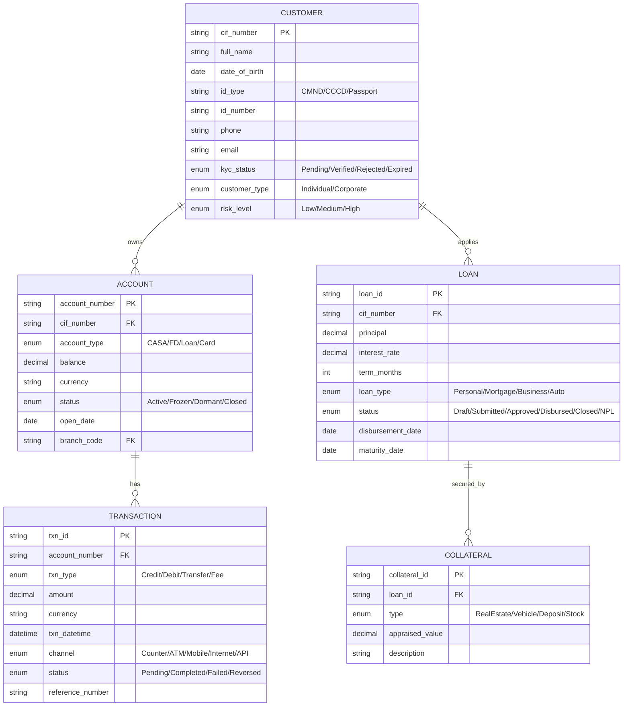
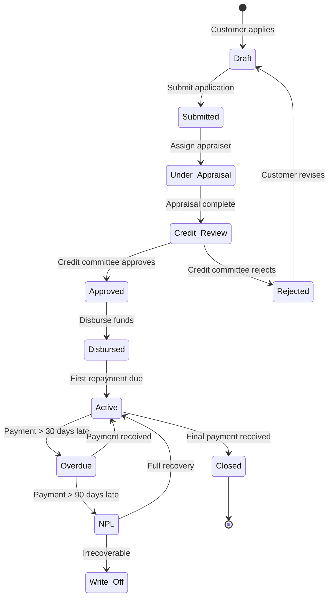
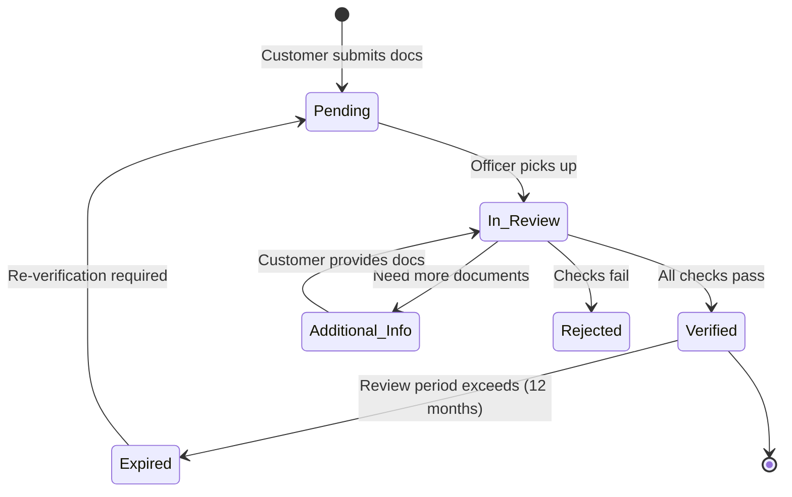
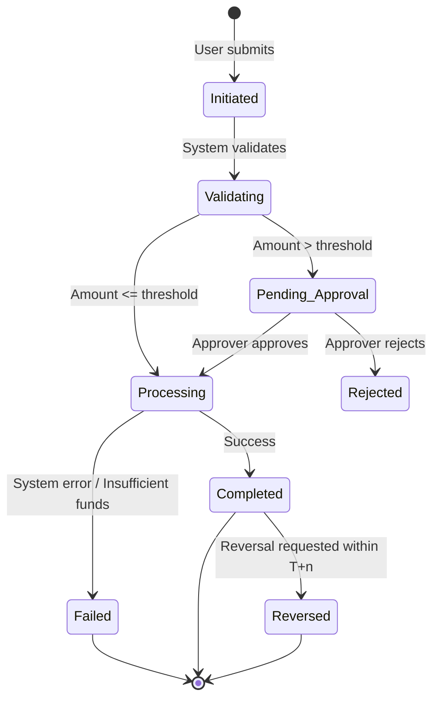

# Domain: Ngân Hàng / Tài Chính (Banking & Finance)

## 1. Thuật Ngữ Chuyên Ngành

| Thuật ngữ | Tiếng Anh | Giải thích |
|-----------|-----------|------------|
| KYC | Know Your Customer | Quy trình xác minh danh tính khách hàng trước khi cung cấp dịch vụ |
| AML | Anti-Money Laundering | Phòng chống rửa tiền — hệ thống giám sát giao dịch bất thường |
| CIF | Customer Information File | Hồ sơ thông tin tổng hợp của khách hàng |
| Core Banking | Core Banking System | Hệ thống lõi xử lý giao dịch ngân hàng (T24, Flexcube, Silverlake...) |
| GL | General Ledger | Sổ cái tổng hợp — ghi nhận mọi bút toán kế toán |
| FD / TD | Fixed Deposit / Term Deposit | Tiền gửi có kỳ hạn |
| CASA | Current Account Savings Account | Tài khoản thanh toán + tiết kiệm không kỳ hạn |
| NPL | Non-Performing Loan | Nợ xấu — khoản vay quá hạn > 90 ngày |
| LOS | Loan Origination System | Hệ thống khởi tạo khoản vay |
| Collateral | Tài sản đảm bảo | Tài sản thế chấp cho khoản vay |
| T+n | Settlement Date | Ngày thanh toán (T+0 = cùng ngày, T+1 = ngày tiếp theo) |
| SWIFT | Society for Worldwide Interbank Financial Telecommunication | Hệ thống chuyển tiền quốc tế |
| Napas | National Payment Corporation | Công ty Thanh toán Quốc gia Việt Nam |
| EOD | End of Day | Quy trình cuối ngày — đóng sổ, tính lãi, đối soát |
| SOD | Start of Day | Quy trình đầu ngày — mở sổ, cập nhật tỷ giá |

## 2. Compliance & Quy Định

| Quy định | Phạm vi | Yêu cầu chính cho BA |
|----------|---------|----------------------|
| **Thông tư 09/2020/TT-NHNN** | An toàn CNTT ngân hàng | Phân loại hệ thống (Level 1-5), yêu cầu DR/BCP |
| **Thông tư 35/2016/TT-NHNN** | An toàn, bảo mật cho thanh toán trực tuyến | OTP, xác thực 2 yếu tố, mã hóa dữ liệu |
| **PCI-DSS** | Bảo mật thẻ thanh toán | Không lưu CVV, mã hóa PAN, audit log |
| **Basel III** | Quản trị rủi ro | Tỷ lệ an toàn vốn (CAR), quản lý thanh khoản |
| **Luật Phòng chống rửa tiền** | AML | Báo cáo giao dịch đáng ngờ (STR), giám sát ngưỡng |

## 3. Entities Chính



## 4. State Diagrams

### 4.1 Loan Lifecycle



### 4.2 KYC Verification



### 4.3 Transaction Processing



## 5. Events (Sự Kiện Kích Hoạt)

| Event | Trigger | System Action | Notification |
|-------|---------|---------------|-------------|
| Account Opened | KYC verified + Account created | Generate account number, update CIF | SMS + Email to customer |
| Large Transaction | Amount ≥ threshold (VD: 300M VND) | Flag for AML review, auto-hold if suspicious | Alert to Compliance team |
| Loan Overdue | Payment date + grace period exceeded | Change status to Overdue, calculate penalty | SMS to customer, alert to collector |
| EOD Processing | Scheduled (VD: 22:00 daily) | Calculate interest, update balances, generate reports | System log |
| KYC Expiry | 12 months since last verification | Lock high-risk transactions | Email to RM, SMS to customer |
| Card Blocked | 3 wrong PIN attempts / Fraud detected | Block card immediately | SMS + Push notification |
| FD Maturity | Maturity date reached | Auto-renew or credit to CASA (per config) | SMS 7 days before + on maturity |
| Collateral Value Drop | Market value < threshold % of loan | Trigger margin call | Alert to RM + Credit dept |

## 6. User Roles

| Role | Tiếng Việt | Permissions | Typical Actions |
|------|-----------|-------------|-----------------|
| **Teller** | Giao dịch viên | Create txn, view account, cash handling | Nộp/rút tiền, chuyển khoản tại quầy |
| **CSR** | Chuyên viên DVKH | View/update customer info, open account | Mở tài khoản, cập nhật KYC |
| **Relationship Manager** | Chuyên viên QHKH | Full customer view, loan initiation | Tư vấn sản phẩm, khởi tạo khoản vay |
| **Credit Officer** | Chuyên viên tín dụng | Appraise loan, review collateral | Thẩm định khoản vay, định giá TSĐB |
| **Credit Approver** | Phê duyệt tín dụng | Approve/reject loan (per limit) | Phê duyệt khoản vay theo hạn mức |
| **Compliance Officer** | Chuyên viên tuân thủ | AML alerts, STR filing, KYC oversight | Giám sát giao dịch đáng ngờ |
| **Branch Manager** | Giám đốc chi nhánh | Approve high-value txn, override, reports | Phê duyệt giao dịch lớn, xem báo cáo |
| **System Admin** | Quản trị hệ thống | User management, config, audit log | Phân quyền, cấu hình tham số |
| **Auditor** | Kiểm toán | Read-only all, audit trail | Kiểm tra giao dịch, xem log |

## 7. Common Business Rules

| Rule ID | Mô tả | Điều kiện | Hành động |
|---------|-------|-----------|-----------|
| BR-BNK-001 | Giới hạn chuyển khoản online/ngày | Amount > daily_limit (per tier) | Reject + notify |
| BR-BNK-002 | Phê duyệt khoản vay theo hạn mức | Loan ≤ 500M: Branch Manager; > 500M: Regional; > 2B: HO | Route to approver |
| BR-BNK-003 | KYC bắt buộc trước khi mở tài khoản | KYC status ≠ Verified | Block account opening |
| BR-BNK-004 | Tự động đóng tài khoản dormant | Balance = 0 AND no txn > 12 months | Change status to Dormant → Closed |
| BR-BNK-005 | Tính lãi tiết kiệm | EOD trigger | Interest = Balance × Rate × Days / 365 |
| BR-BNK-006 | AML flagging | Single txn ≥ 300M OR cumulative/day ≥ 500M | Auto-flag for review |
| BR-BNK-007 | OTP cho giao dịch online | All online transfers | Generate OTP, valid 3 min, max 3 attempts |

## 8. Mẫu Requirement Đặc Thù

**User Story:**
```
As a Relationship Manager,
I want to view a consolidated dashboard of my customer's accounts, loans, and cards,
So that I can provide personalized advisory during meetings.

AC1: Given I search by CIF number,
     When the customer exists,
     Then display: all accounts (with balance), active loans (with outstanding), active cards.

AC2: Given the customer has KYC status = Expired,
     When I open their profile,
     Then show a warning banner "KYC hết hạn — cần xác minh lại" and block new product opening.
```

**Non-Functional:**
```
NFR-BNK-001: Core banking transactions must complete within 3 seconds (95th percentile).
NFR-BNK-002: All PII (name, ID, phone) must be encrypted at rest (AES-256) and in transit (TLS 1.2+).
NFR-BNK-003: System must support 10,000 concurrent online banking sessions.
NFR-BNK-004: Transaction audit log must be immutable and retained for 10 years.
NFR-BNK-005: RPO < 15 minutes, RTO < 1 hour for core banking system.
```
