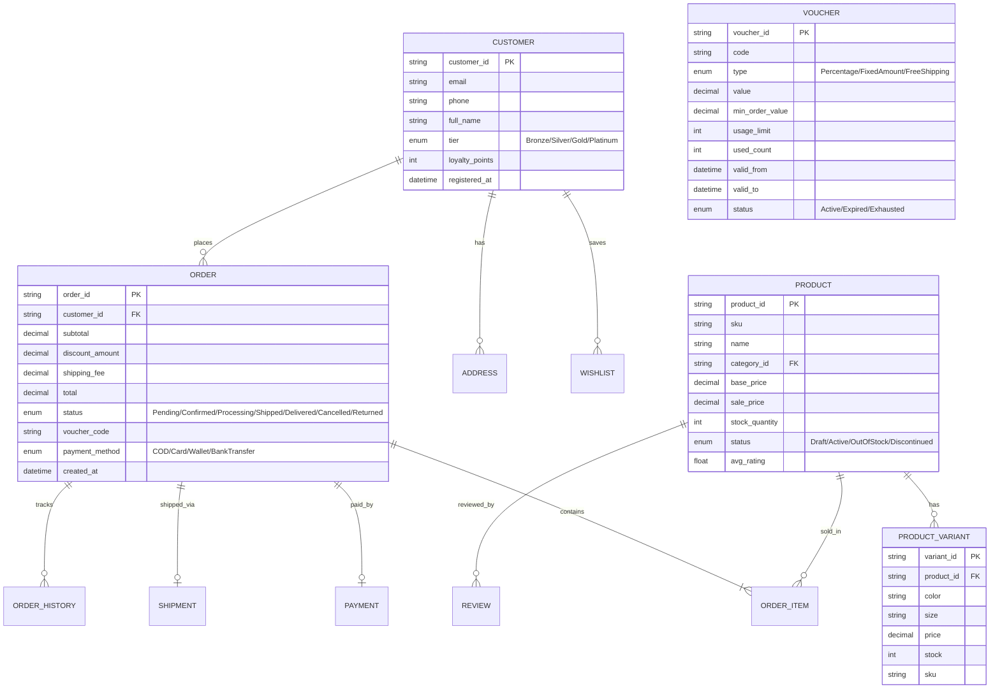
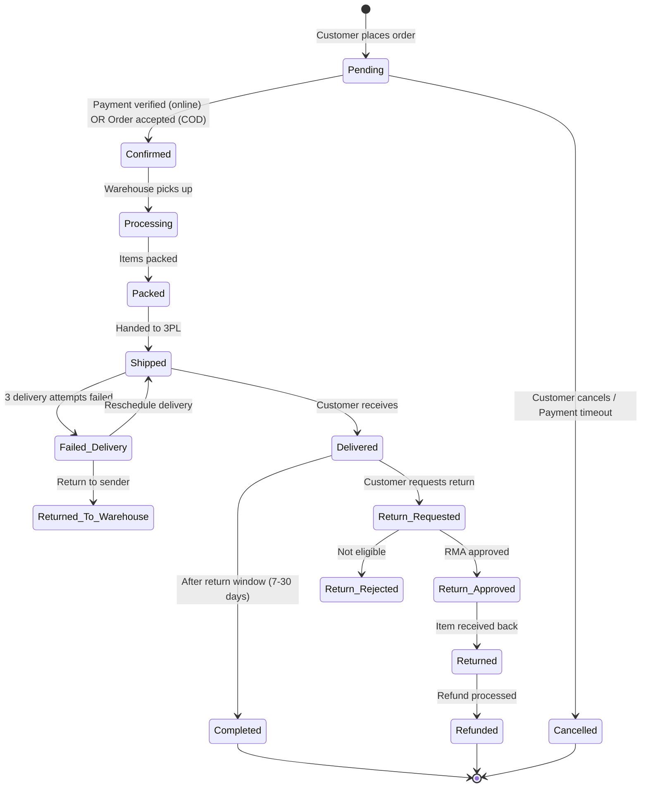
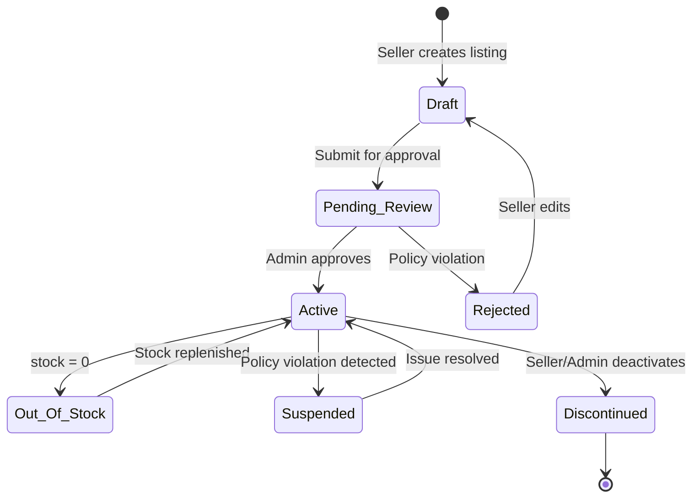
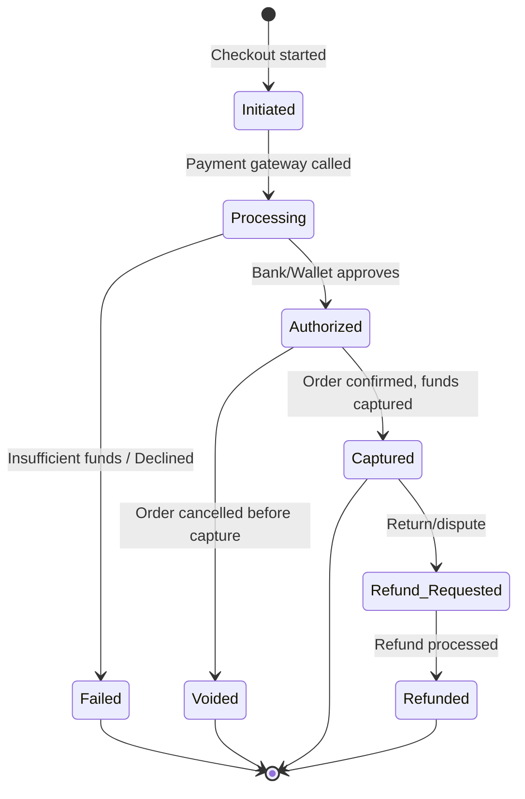

# Domain: Thương Mại Điện Tử / Bán Lẻ (E-commerce & Retail)

## 1. Thuật Ngữ Chuyên Ngành

| Thuật ngữ | Tiếng Anh | Giải thích |
|-----------|-----------|------------|
| SKU | Stock Keeping Unit | Mã định danh duy nhất cho từng sản phẩm/biến thể |
| GMV | Gross Merchandise Value | Tổng giá trị hàng hóa giao dịch (trước trừ hoàn/hủy) |
| AOV | Average Order Value | Giá trị đơn hàng trung bình |
| Cart Abandonment | Tỷ lệ bỏ giỏ hàng | % người thêm giỏ nhưng không thanh toán |
| Fulfillment | Hoàn tất đơn hàng | Quy trình từ nhận đơn → đóng gói → giao hàng |
| 3PL | Third-Party Logistics | Đơn vị vận chuyển bên thứ 3 (GHN, GHTK, Viettel Post) |
| COD | Cash on Delivery | Thanh toán khi nhận hàng |
| RMA | Return Merchandise Authorization | Phiếu ủy quyền trả hàng |
| Dropship | Giao hàng từ nhà cung cấp | Không qua kho seller, ship thẳng từ supplier |
| Flash Sale | Khuyến mãi chớp nhoáng | Giảm giá sâu, giới hạn thời gian và số lượng |
| Voucher / Coupon | Mã giảm giá | Áp dụng khi checkout (% hoặc fixed amount) |
| PDP | Product Detail Page | Trang chi tiết sản phẩm |
| PLP | Product Listing Page | Trang danh sách sản phẩm (category/search) |
| Conversion Rate | Tỷ lệ chuyển đổi | % visitor → buyer |
| Inventory Sync | Đồng bộ tồn kho | Cập nhật stock giữa các kênh bán (web, app, marketplace) |

## 2. Compliance & Quy Định

| Quy định | Phạm vi | Yêu cầu chính cho BA |
|----------|---------|----------------------|
| **Nghị định 52/2013/NĐ-CP** | Thương mại điện tử VN | Đăng ký website TMĐT, công bố thông tin rõ ràng |
| **Luật Bảo vệ QLTD 2023** | Dữ liệu cá nhân | Consent trước khi thu thập PII, quyền xóa/sửa dữ liệu |
| **PCI-DSS** | Thanh toán thẻ online | Không lưu CVV, mã hóa số thẻ, 3D Secure |
| **Luật Bảo vệ NTD 2023** | Quyền người tiêu dùng | Chính sách đổi trả rõ ràng, không ép mua, hiển thị giá đầy đủ |
| **Quy định hóa đơn điện tử** | Thuế | Xuất hóa đơn điện tử cho mọi đơn hàng |

## 3. Entities Chính



## 4. State Diagrams

### 4.1 Order Lifecycle



### 4.2 Product Lifecycle



### 4.3 Payment Lifecycle



## 5. Events

| Event | Trigger | System Action | Notification |
|-------|---------|---------------|-------------|
| Order Placed | Customer clicks "Đặt hàng" | Create order, reserve stock, initiate payment | Email + Push + SMS to customer |
| Payment Confirmed | Gateway callback success | Update order to Confirmed, notify warehouse | Push to seller/warehouse |
| Stock Low | stock_quantity < threshold | Alert to merchandiser | Email/Slack to inventory team |
| Flash Sale Started | Scheduled datetime reached | Apply discount, enable countdown, lock stock | Push notification to app users |
| Delivery Failed | 3PL reports failed attempt | Update shipment status, schedule retry | SMS to customer with reschedule link |
| Return Requested | Customer submits RMA | Create return record, notify CS team | Email with RMA instructions |
| Review Submitted | Customer writes review | Moderate (auto + manual), update avg_rating | Push to seller |
| Cart Abandoned | No checkout within 30 min | Trigger remarketing email/push | Email "Bạn quên giỏ hàng!" |
| Voucher Expiring | 24h before expiry | Reminder notification | Push + Email to voucher holders |
| Price Drop | Seller updates price lower | Notify wishlist customers | Push "Sản phẩm bạn theo dõi giảm giá!" |

## 6. User Roles

| Role | Tiếng Việt | Permissions | Typical Actions |
|------|-----------|-------------|-----------------|
| **Customer** | Khách hàng | Browse, cart, order, review, return | Mua hàng, theo dõi đơn, viết đánh giá |
| **Seller** | Người bán | CRUD products, manage orders, view analytics | Đăng sản phẩm, xử lý đơn, xem doanh thu |
| **Warehouse Staff** | Nhân viên kho | Pick, pack, handover to 3PL | Lấy hàng, đóng gói, bàn giao vận chuyển |
| **CS Agent** | CSKH | View orders, process returns, handle complaints | Xử lý khiếu nại, phê duyệt đổi trả |
| **Merchandiser** | Quản lý sản phẩm | Manage categories, promotions, flash sales | Tạo chương trình KM, quản lý danh mục |
| **Marketing** | Marketing | Create vouchers, push notifications, banners | Tạo mã giảm giá, gửi thông báo |
| **Finance** | Kế toán | View transactions, process refunds, reconciliation | Đối soát, xử lý hoàn tiền, báo cáo |
| **Platform Admin** | Quản trị nền tảng | User management, policy enforcement, system config | Quản lý seller, duyệt sản phẩm, cấu hình |

## 7. Common Business Rules

| Rule ID | Mô tả | Điều kiện | Hành động |
|---------|-------|-----------|-----------|
| BR-ECM-001 | Voucher stacking | Max 1 platform voucher + 1 seller voucher per order | Validate at checkout |
| BR-ECM-002 | Free shipping threshold | Order subtotal ≥ 300K VND | Waive shipping fee |
| BR-ECM-003 | Return window | Within 7 days of delivery, item unused | Allow return request |
| BR-ECM-004 | Flash sale stock lock | Reserved stock for flash sale, separate from normal | Deduct from flash sale pool first |
| BR-ECM-005 | Auto-cancel unpaid COD | COD order not delivered after 3 attempts | Cancel + restore stock |
| BR-ECM-006 | Review eligibility | Only buyers of the product, after delivery | Allow review submission |
| BR-ECM-007 | Seller payout | T+7 after delivery confirmed, no dispute | Release funds to seller |

## 8. Mẫu Requirement Đặc Thù

**User Story:**
```
As a Customer,
I want to apply a voucher code at checkout,
So that I can get a discount on my order.

AC1: Given I have a valid voucher "SALE50" (50% off, max 100K, min order 200K),
     When my cart subtotal is 250K and I apply "SALE50",
     Then discount = 100K (capped), total = 150K + shipping.

AC2: Given the voucher has reached its usage_limit,
     When I try to apply it,
     Then show error "Mã giảm giá đã hết lượt sử dụng".

AC3: Given my cart subtotal < min_order_value,
     When I apply the voucher,
     Then show error "Đơn hàng tối thiểu 200.000đ để sử dụng mã này".
```

**Non-Functional:**
```
NFR-ECM-001: Product listing page must load within 2 seconds with 1000+ products.
NFR-ECM-002: System must handle 50,000 concurrent users during flash sale events.
NFR-ECM-003: Stock deduction must be atomic — no overselling under concurrent orders.
NFR-ECM-004: Payment callback must be processed within 5 seconds.
NFR-ECM-005: Search results must update within 5 minutes of product/price changes.
```
