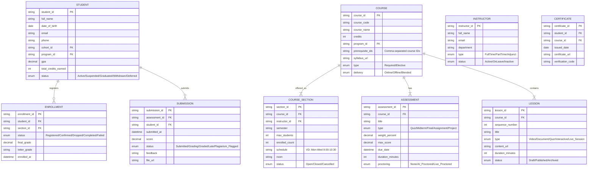
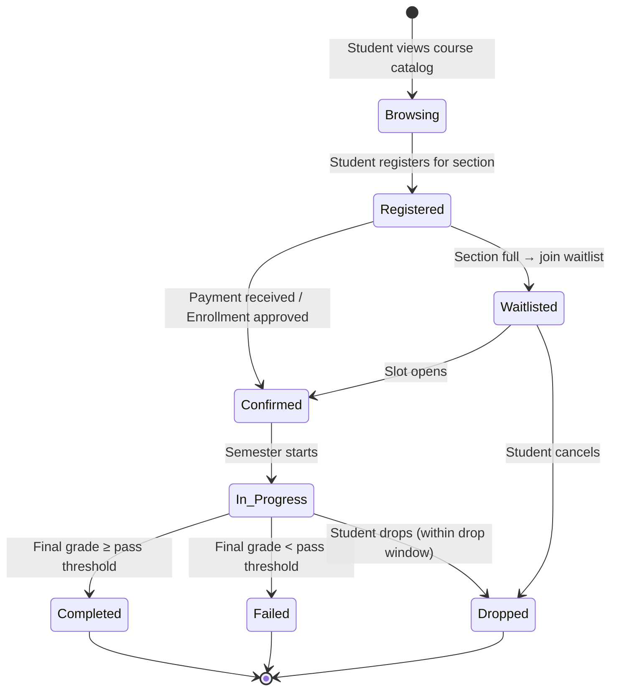
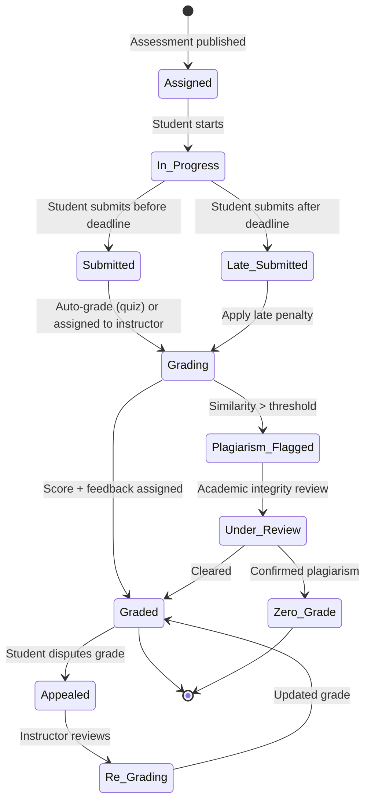
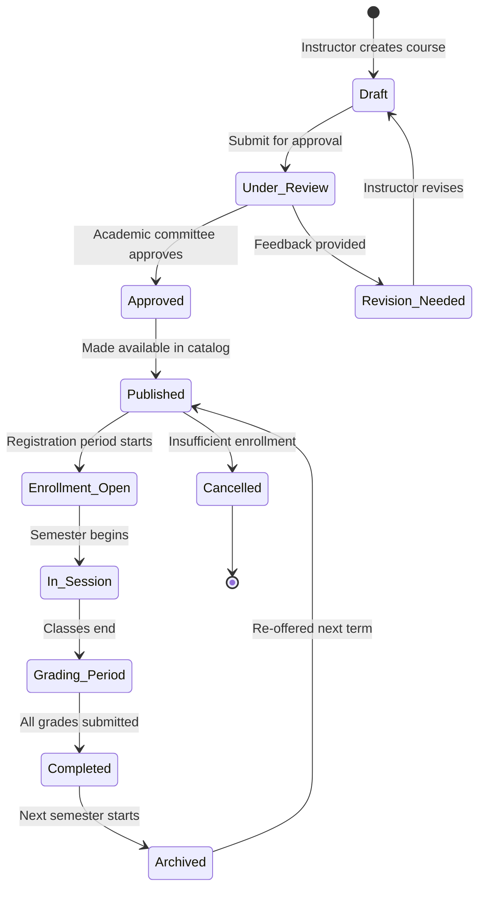

# Domain: Giáo Dục / EdTech (Education & EdTech)

## 1. Thuật Ngữ Chuyên Ngành

| Thuật ngữ | Tiếng Anh | Giải thích |
|-----------|-----------|------------|
| LMS | Learning Management System | Hệ thống quản lý học tập (Moodle, Canvas, homegrown) |
| SIS | Student Information System | Hệ thống quản lý thông tin sinh viên |
| SCORM | Sharable Content Object Reference Model | Chuẩn đóng gói nội dung e-learning |
| Curriculum | Chương trình đào tạo | Cấu trúc môn học, tín chỉ, lộ trình |
| Syllabus | Đề cương môn học | Chi tiết nội dung, phương pháp, đánh giá |
| GPA | Grade Point Average | Điểm trung bình tích lũy |
| Credit | Tín chỉ | Đơn vị đo lường khối lượng học tập |
| Enrollment | Đăng ký học | Ghi danh vào khóa/lớp |
| Assessment | Đánh giá | Bài kiểm tra, bài tập, đồ án |
| Proctoring | Giám sát thi | Giám sát thi trực tuyến (AI proctoring) |
| Cohort | Khóa / Nhóm học | Nhóm học viên cùng lộ trình |
| Blended Learning | Học kết hợp | Online + offline |
| Gamification | Trò chơi hóa | Điểm, huy hiệu, bảng xếp hạng trong học tập |
| Adaptive Learning | Học tập thích ứng | Hệ thống tự điều chỉnh nội dung theo năng lực |
| Certificate | Chứng chỉ | Chứng nhận hoàn thành khóa học |

## 2. Compliance & Quy Định

| Quy định | Phạm vi | Yêu cầu chính cho BA |
|----------|---------|----------------------|
| **Luật Giáo dục 2019** | Hệ thống GD quốc dân | Chương trình, kiểm định, quyền người học |
| **Thông tư 08/2021/TT-BGDĐT** | Đào tạo trực tuyến ĐH | Tỷ lệ online/offline, yêu cầu hạ tầng |
| **FERPA (tham khảo quốc tế)** | Bảo mật hồ sơ sinh viên | Quyền truy cập, đồng ý trước khi chia sẻ |
| **Nghị định 13/2023/NĐ-CP** | BVDL cá nhân | Bảo mật thông tin học sinh/sinh viên |
| **Kiểm định chất lượng GD** | Cơ sở GD | Chuẩn kiểm định AUN-QA, ABET |

## 3. Entities Chính



## 4. State Diagrams

### 4.1 Student Enrollment



### 4.2 Assessment Submission



### 4.3 Course Lifecycle



## 5. Events

| Event | Trigger | System Action | Notification |
|-------|---------|---------------|-------------|
| Course Published | Admin approves course | Add to catalog, enable enrollment | Email to eligible students |
| Enrollment Opened | Registration period starts | Unlock registration, start waitlist | Push notification to app |
| Section Full | enrolled_count = max_students | Close registration, activate waitlist | Waitlist confirmation to student |
| Lesson Published | Instructor publishes content | Make available to enrolled students | Push "Bài học mới đã được đăng" |
| Assessment Due Soon | 24h before deadline | Reminder to students who haven't submitted | Push + Email reminder |
| Submission Received | Student submits work | Log submission time, run plagiarism check | Email confirmation to student |
| Plagiarism Detected | Similarity score > 30% | Flag for review, notify instructor | Email to instructor + student |
| Grade Posted | Instructor submits grade | Update student record, recalculate GPA | Push + Email to student |
| Graduation Eligible | Student meets all credit + GPA requirements | Flag for graduation review | Email to academic office |
| Certificate Generated | Course completed + grade ≥ threshold | Generate certificate with verification code | Email with certificate PDF |
| Payment Overdue | Tuition due date passed | Lock enrollment for next semester | SMS + Email warning |

## 6. User Roles

| Role | Tiếng Việt | Permissions | Typical Actions |
|------|-----------|-------------|-----------------|
| **Student** | Sinh viên/Học viên | Enroll, view content, submit assignments, view grades | Đăng ký môn, học, nộp bài, xem điểm |
| **Instructor** | Giảng viên | CRUD lessons/assessments, grade, view class roster | Tạo bài giảng, chấm bài, quản lý lớp |
| **Teaching Assistant** | Trợ giảng | View roster, grade (delegated), answer forums | Chấm bài, hỗ trợ sinh viên |
| **Academic Advisor** | Cố vấn học tập | View student records, approve course plans | Tư vấn đăng ký, theo dõi tiến độ |
| **Department Head** | Trưởng bộ môn | Approve courses, assign instructors, view reports | Duyệt môn học, phân công giảng viên |
| **Registrar** | Phòng đào tạo | Manage enrollment, schedule, transcripts | Quản lý đăng ký, xếp lịch, bảng điểm |
| **Finance** | Phòng tài chính | Manage tuition, scholarships, payment tracking | Quản lý học phí, học bổng |
| **Content Creator** | Xây dựng nội dung | Create/edit digital learning content | Tạo video, quiz, tài liệu elearning |
| **Admin** | Quản trị hệ thống | System config, user management, master data | Cấu hình LMS, phân quyền |

## 7. Common Business Rules

| Rule ID | Mô tả | Điều kiện | Hành động |
|---------|-------|-----------|-----------|
| BR-EDU-001 | Prerequisite check | Student not completed prerequisite course | Block enrollment |
| BR-EDU-002 | Max credits per semester | Credits > 24 (regular) or > 30 (excellent GPA) | Block registration, require advisor approval |
| BR-EDU-003 | Drop deadline | After week 4 of semester | Cannot drop, grade = F if not completed |
| BR-EDU-004 | Late submission penalty | Submitted after deadline | Deduct 10% per day, max 3 days late |
| BR-EDU-005 | Graduation requirements | All required courses passed + GPA ≥ 2.0 + credits ≥ 130 | Eligible for graduation |
| BR-EDU-006 | Academic probation | GPA < 1.5 for 2 consecutive semesters | Suspend enrollment |
| BR-EDU-007 | Plagiarism policy | Similarity > 30% on any submission | Zero grade + academic integrity review |

## 8. Mẫu Requirement

**User Story:**
```
As an Instructor,
I want to create a timed quiz with auto-grading and question bank randomization,
So that each student gets a different set of questions to reduce cheating.

AC1: Given I create a quiz with 50 questions in the bank and set "Random 20 per student",
     When a student starts the quiz,
     Then they receive a unique random subset of 20 questions, shuffled order.

AC2: Given the quiz time limit is 30 minutes,
     When 30 minutes elapsed and student hasn't submitted,
     Then auto-submit with answered questions only, mark unanswered as 0.

AC3: Given all students have completed the quiz,
     When I view the results,
     Then show: class average, score distribution chart, per-question difficulty analysis.
```
