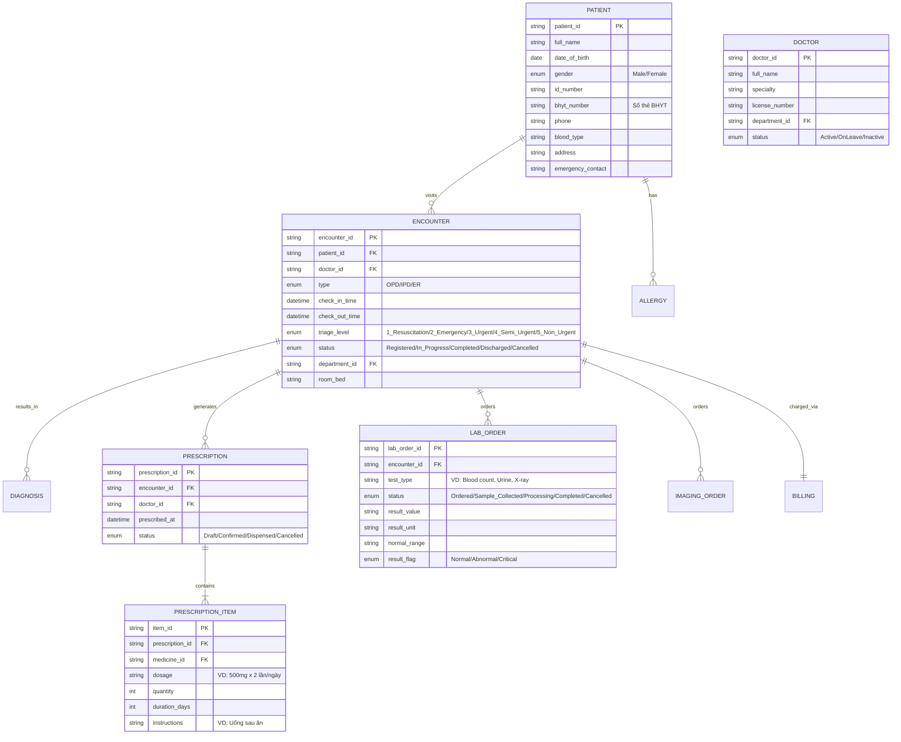
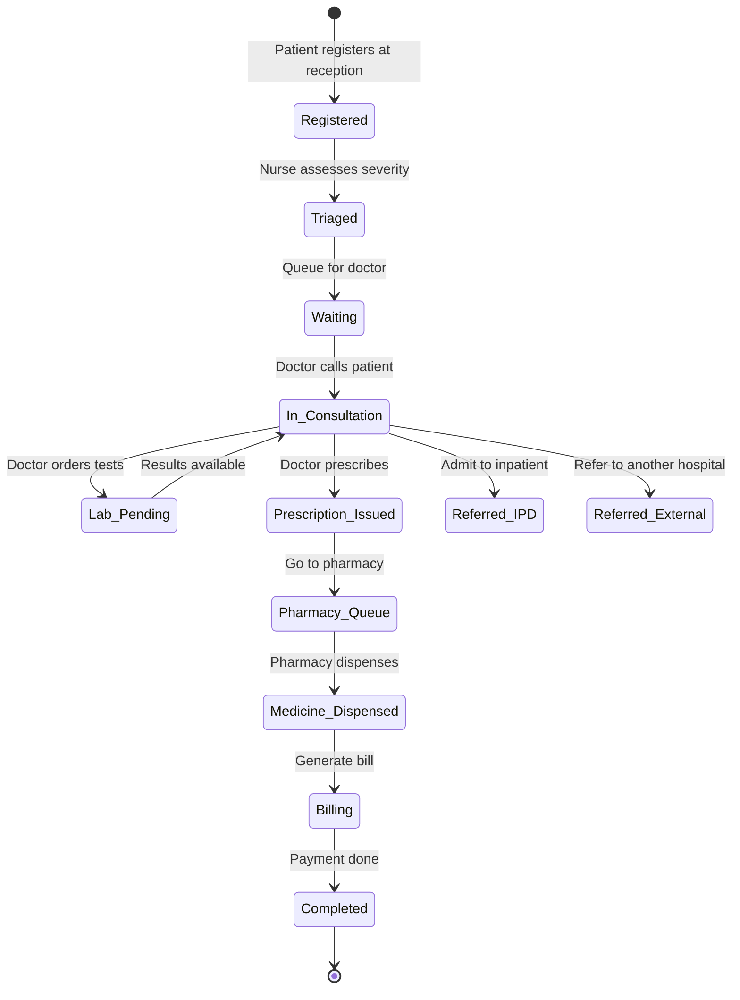
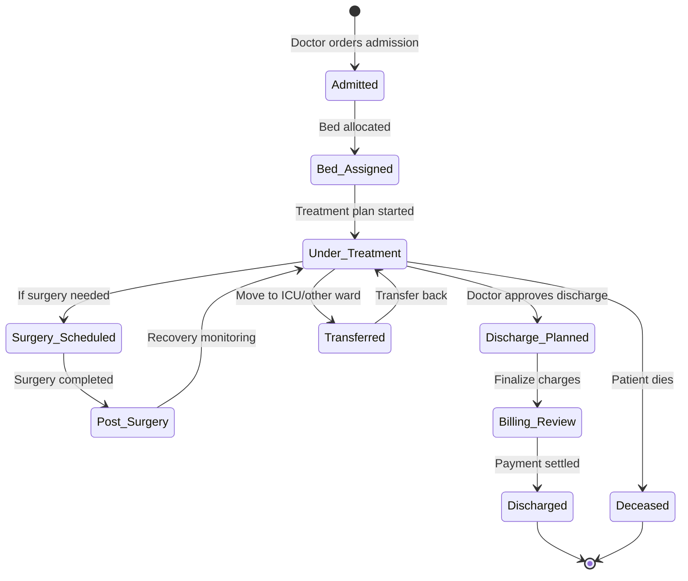
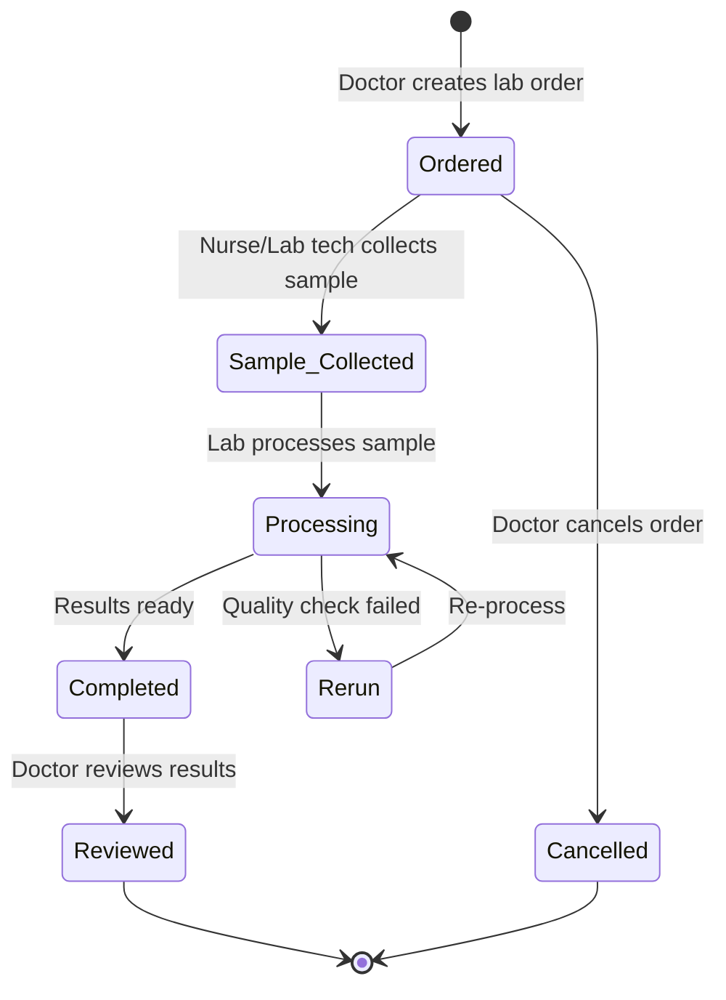

# Domain: Y Tế / Healthcare

## 1. Thuật Ngữ Chuyên Ngành

| Thuật ngữ | Tiếng Anh | Giải thích |
|-----------|-----------|------------|
| EMR | Electronic Medical Record | Bệnh án điện tử |
| HIS | Hospital Information System | Hệ thống thông tin bệnh viện |
| LIS | Laboratory Information System | Hệ thống quản lý xét nghiệm |
| RIS/PACS | Radiology IS / Picture Archiving | Hệ thống lưu trữ hình ảnh y khoa (X-quang, CT, MRI) |
| ICD-10 | International Classification of Diseases | Mã phân loại bệnh quốc tế |
| HL7/FHIR | Health Level 7 / Fast Healthcare Interoperability Resources | Chuẩn trao đổi dữ liệu y tế |
| BHYT | Bảo hiểm Y tế | Social health insurance (VN) |
| DRG | Diagnosis Related Groups | Nhóm chẩn đoán liên quan — phương pháp thanh toán |
| OPD | Outpatient Department | Phòng khám ngoại trú |
| IPD | Inpatient Department | Khoa nội trú |
| ER | Emergency Room | Phòng cấp cứu |
| Prescription | Đơn thuốc | Danh sách thuốc bác sĩ kê cho bệnh nhân |
| Formulary | Danh mục thuốc | Danh sách thuốc được phê duyệt sử dụng |
| Triage | Phân loại bệnh nhân | Đánh giá mức độ cấp cứu (1-5 levels) |
| Discharge | Xuất viện | Kết thúc điều trị nội trú |

## 2. Compliance & Quy Định

| Quy định | Phạm vi | Yêu cầu chính cho BA |
|----------|---------|----------------------|
| **Thông tư 46/2018/TT-BYT** | Bệnh án điện tử | Chuẩn format EMR, chữ ký số, lưu trữ ≥ 10 năm |
| **Thông tư 54/2017/TT-BYT** | Danh mục thuốc BHYT | Thuốc nào được BH chi trả, tỷ lệ đồng chi trả |
| **Nghị định 13/2023/NĐ-CP** | Bảo vệ dữ liệu cá nhân | Bảo mật thông tin bệnh nhân, consent |
| **HIPAA (tham khảo quốc tế)** | Bảo mật thông tin y tế | PHI protection, access control, audit trail |
| **HL7 FHIR R4** | Trao đổi dữ liệu | Chuẩn API cho interoperability giữa các hệ thống |
| **Quy chế bệnh viện** | Quy trình khám chữa bệnh | Quy trình tiếp nhận, chẩn đoán, điều trị, xuất viện |

## 3. Entities Chính



## 4. State Diagrams

### 4.1 Patient Encounter (Outpatient)



### 4.2 Inpatient Stay



### 4.3 Lab Order



## 5. Events

| Event | Trigger | System Action | Notification |
|-------|---------|---------------|-------------|
| Patient Registered | Reception registers patient | Create encounter, assign queue number | Queue number display |
| Triage Complete | Nurse submits triage assessment | Update priority, route to department | Doctor queue updated |
| Critical Lab Result | Result value in critical range | Flag as CRITICAL, auto-alert | SMS/Call to doctor immediately |
| Prescription Confirmed | Doctor signs prescription | Send to pharmacy queue, check drug interactions | Alert if allergy/interaction found |
| Drug Interaction Alert | System detects conflict in prescription | Block dispensing, require doctor override | Pop-up alert to doctor + pharmacist |
| BHYT Claim Generated | Encounter completed for BHYT patient | Generate claim XML per BHXH format | Submit to BHXH portal |
| Bed Occupancy High | Ward occupancy > 90% | Alert bed management | Notification to admission office |
| Discharge Summary Due | 24h after discharge, no summary | Reminder to doctor | System notification |
| Appointment Reminder | 24h before scheduled appointment | Auto-send reminder | SMS to patient |
| Medicine Stock Low | Formulary item below threshold | Generate purchase request | Alert to pharmacy manager |

## 6. User Roles

| Role | Tiếng Việt | Permissions | Typical Actions |
|------|-----------|-------------|-----------------|
| **Patient** | Bệnh nhân | View own records, book appointment | Đặt lịch khám, xem kết quả XN |
| **Receptionist** | Lễ tân | Register patient, manage queue | Tiếp nhận, lấy số khám |
| **Nurse** | Điều dưỡng | Triage, vital signs, administer meds, collect samples | Phân loại, đo sinh hiệu, lấy mẫu XN |
| **Doctor** | Bác sĩ | Full EMR access (own patients), prescribe, order tests, diagnose | Khám, chẩn đoán, kê đơn, chỉ định XN |
| **Specialist** | Bác sĩ chuyên khoa | EMR access for referred patients, advanced procedures | Hội chẩn, thực hiện thủ thuật chuyên sâu |
| **Pharmacist** | Dược sĩ | Dispense medicines, check interactions, manage formulary | Phát thuốc, kiểm tra tương tác thuốc |
| **Lab Technician** | Kỹ thuật viên XN | Process samples, enter results | Xử lý mẫu, nhập kết quả xét nghiệm |
| **Billing Staff** | Nhân viên viện phí | Generate bills, process payment, BHYT claims | Tính phí, thu viện phí, gửi BH |
| **Department Head** | Trưởng khoa | View dept reports, approve, manage staff | Duyệt ca trực, xem báo cáo khoa |
| **Hospital Admin** | Quản trị bệnh viện | System config, user management, master data | Cấu hình hệ thống, quản lý danh mục |

## 7. Common Business Rules

| Rule ID | Mô tả | Điều kiện | Hành động |
|---------|-------|-----------|-----------|
| BR-HC-001 | Drug interaction check | Prescription contains interacting drugs | Block + alert doctor, require override |
| BR-HC-002 | BHYT eligibility | Patient has valid BHYT + correct referral line | Apply BHYT co-payment rate |
| BR-HC-003 | Critical result escalation | Lab result in critical range (VD: glucose < 50) | Auto-call doctor + flag in EMR |
| BR-HC-004 | Prescription duplicate check | Same drug prescribed within 7 days | Warning to doctor |
| BR-HC-005 | Discharge summary mandatory | IPD patient discharged | Block discharge until summary completed |
| BR-HC-006 | Narcotic prescription | Thuốc gây nghiện/hướng thần | Require 2 doctor signatures, special form |
| BR-HC-007 | BHYT referral chain | BV tuyến dưới → tuyến trên | Validate referral letter, or patient pays full |

## 8. Mẫu Requirement Đặc Thù

**User Story:**
```
As a Doctor,
I want the system to automatically check for drug allergies and interactions when I prescribe,
So that I can avoid adverse drug events.

AC1: Given patient has allergy to "Penicillin" recorded,
     When I prescribe "Amoxicillin" (penicillin group),
     Then show RED alert "Bệnh nhân DỊ ỨNG Penicillin — Amoxicillin cùng nhóm" and BLOCK prescription.

AC2: Given I prescribe "Warfarin" and "Aspirin" together,
     When interaction severity = HIGH,
     Then show YELLOW alert with interaction details, require confirmation checkbox + reason to proceed.

AC3: Given no allergy or interaction detected,
     When I confirm the prescription,
     Then send to pharmacy queue with status "Confirmed".
```
