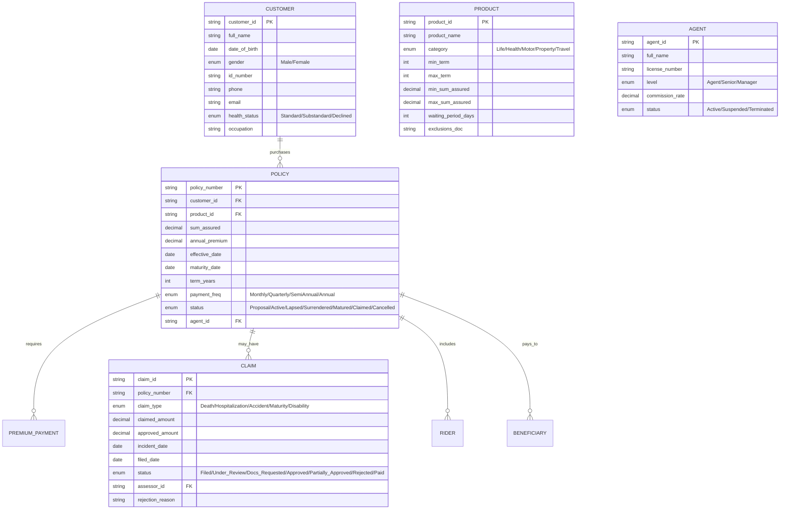
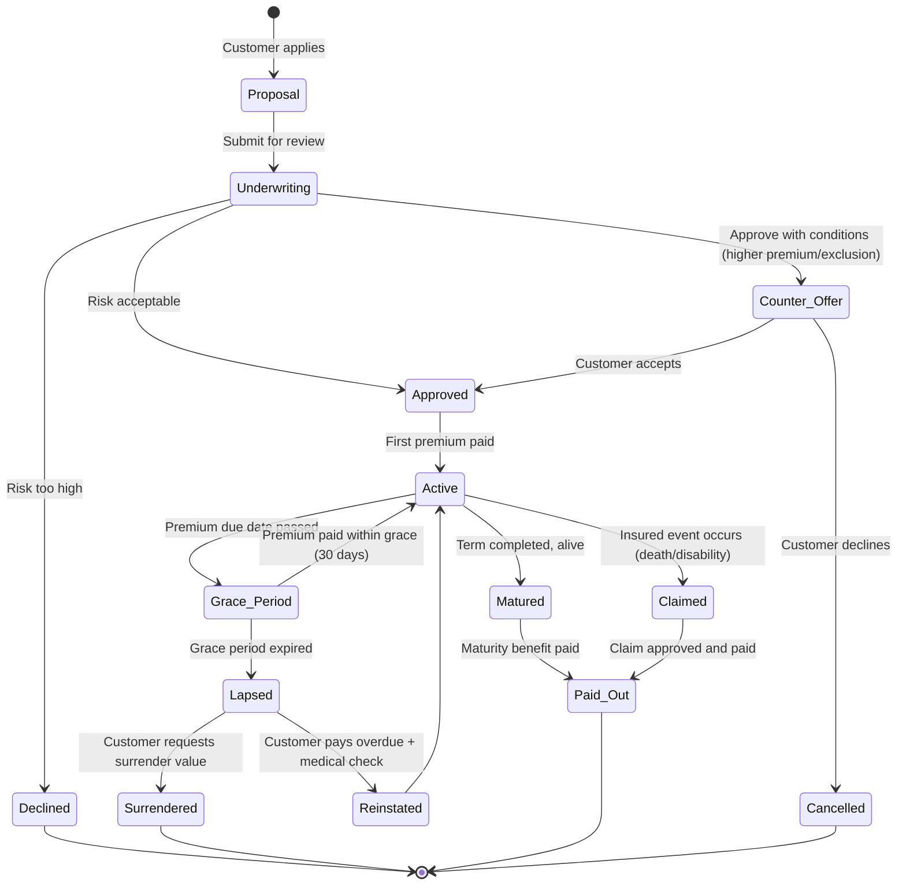
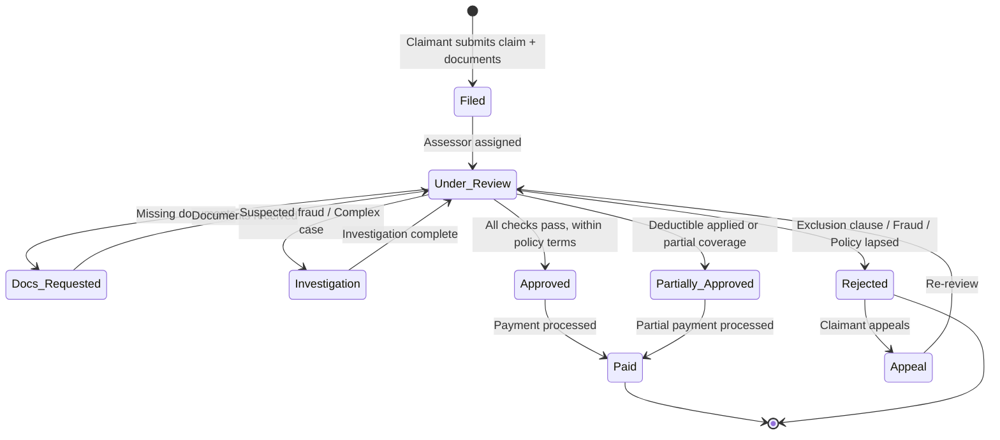

# Domain: Bảo Hiểm (Insurance)

## 1. Thuật Ngữ Chuyên Ngành

| Thuật ngữ | Tiếng Anh | Giải thích |
|-----------|-----------|------------|
| Policy | Hợp đồng bảo hiểm | Thỏa thuận giữa người mua BH và công ty BH |
| Premium | Phí bảo hiểm | Số tiền người mua đóng định kỳ |
| Claim | Yêu cầu bồi thường | Người mua yêu cầu chi trả khi xảy ra sự kiện BH |
| Underwriting | Thẩm định rủi ro | Đánh giá rủi ro để quyết định chấp nhận/từ chối/định phí |
| Sum Assured | Số tiền bảo hiểm | Mức chi trả tối đa khi xảy ra sự kiện |
| Deductible | Mức khấu trừ | Phần chi phí người mua tự chịu trước khi BH chi trả |
| Beneficiary | Người thụ hưởng | Người nhận quyền lợi BH |
| Rider | Quyền lợi bổ sung | Gói bổ sung đính kèm hợp đồng chính |
| Lapse | Mất hiệu lực | Hợp đồng hết hiệu lực do không đóng phí |
| Reinstatement | Khôi phục hiệu lực | Kích hoạt lại hợp đồng đã lapse |
| Actuary | Chuyên viên tính toán BH | Chuyên gia tính phí, dự phòng rủi ro |
| Reinsurance | Tái bảo hiểm | Công ty BH mua BH cho chính mình |
| Exclusion | Điều khoản loại trừ | Trường hợp KHÔNG được bồi thường |
| Waiting Period | Thời gian chờ | Khoảng thời gian sau khi mua, chưa được claim |
| Surrender | Hủy hợp đồng / Giá trị hoàn lại | Khách hàng hủy, nhận lại giá trị tích lũy |

## 2. Compliance & Quy Định

| Quy định | Phạm vi | Yêu cầu chính cho BA |
|----------|---------|----------------------|
| **Luật Kinh doanh BH 2022** | Toàn ngành | Yêu cầu vốn, quản trị rủi ro, bảo vệ người mua BH |
| **Thông tư 67/2023/TT-BTC** | Bảo hiểm nhân thọ | Quy tắc, điều khoản sản phẩm, tỷ lệ hoa hồng |
| **Thông tư 50/2017/TT-BTC** | Bảo hiểm phi nhân thọ | Quản lý sản phẩm, phí, bồi thường |
| **Solvency II (tham khảo)** | Quản trị vốn | Yêu cầu vốn dựa trên rủi ro thực tế |
| **AML/CFT** | Phòng chống rửa tiền | KYC cho hợp đồng có giá trị lớn |

## 3. Entities Chính



## 4. State Diagrams

### 4.1 Policy Lifecycle



### 4.2 Claim Processing



## 5. Events

| Event | Trigger | System Action | Notification |
|-------|---------|---------------|-------------|
| Policy Issued | First premium received + underwriting approved | Generate policy number, activate coverage | Policy docs via email/post |
| Premium Due | 15 days before due date | Generate payment reminder | SMS + Email reminder |
| Premium Overdue | Due date passed, no payment | Start grace period (30 days) | SMS warning every 7 days |
| Policy Lapsed | Grace period expired, no payment | Suspend coverage, calculate surrender value | Formal letter + SMS |
| Claim Filed | Customer/beneficiary submits claim | Create claim record, assign assessor | SMS acknowledgment + claim ID |
| Claim Approved | Assessor + manager approve | Calculate payout, initiate payment | SMS + Email with details |
| Policy Anniversary | 12 months since effective date | Recalculate premium (if applicable), generate statement | Annual statement email |
| Agent Commission Due | Policy premium collected | Calculate commission per rate | Credit to agent account |
| Maturity Reached | Policy term ends, insured alive | Calculate maturity benefit | Letter + SMS 30 days before |
| Fraud Flagged | Pattern detection / Investigation trigger | Escalate to SIU (Special Investigation Unit) | Internal alert |

## 6. User Roles

| Role | Tiếng Việt | Permissions | Typical Actions |
|------|-----------|-------------|-----------------|
| **Customer** | Khách hàng/Bên mua BH | View policy, pay premium, file claim | Đóng phí, nộp yêu cầu bồi thường |
| **Agent** | Đại lý BH | Create proposal, view customer policies | Tư vấn, tạo hồ sơ yêu cầu BH |
| **Underwriter** | Thẩm định viên | Review proposals, set terms, approve/decline | Thẩm định rủi ro, quyết định chấp nhận |
| **Claim Assessor** | Chuyên viên bồi thường | Review claims, request docs, approve/reject | Xử lý hồ sơ bồi thường |
| **Claim Manager** | Quản lý bồi thường | Approve high-value claims, override | Phê duyệt claim lớn, xử lý khiếu nại |
| **Actuary** | Chuyên viên tính toán | View all data, model risk, set premium tables | Tính phí, dự phòng kỹ thuật |
| **Finance** | Kế toán | Process payments, reconcile, generate reports | Xử lý thanh toán, đối soát |
| **Compliance** | Tuân thủ | Audit policies, monitor AML, review complaints | Giám sát tuân thủ quy định |
| **Admin** | Quản trị | Product config, user management, system setup | Cấu hình sản phẩm, phân quyền |

## 7. Common Business Rules

| Rule ID | Mô tả | Điều kiện | Hành động |
|---------|-------|-----------|-----------|
| BR-INS-001 | Waiting period | Claim within first 30-90 days (tùy sản phẩm) | Reject claim (trừ tai nạn) |
| BR-INS-002 | Grace period | Premium overdue ≤ 30 days | Coverage still active |
| BR-INS-003 | Reinstatement window | Lapsed ≤ 2 years | Allow reinstate with medical + back premium |
| BR-INS-004 | Claim approval authority | Claim ≤ 100M: Assessor; ≤ 500M: Manager; > 500M: Director | Route to approver |
| BR-INS-005 | Age limit | Entry age: 18-60 (nhân thọ), coverage to 75 | Validate at proposal |
| BR-INS-006 | Exclusion — Pre-existing | Condition existed before policy effective date | Deny claim for that condition |
| BR-INS-007 | Surrender value | Active ≥ 2 years | Calculate surrender = accumulated value − fees |

## 8. Mẫu Requirement Đặc Thù

**User Story:**
```
As a Claim Assessor,
I want to view all supporting documents attached to a claim in one screen,
So that I can make an assessment decision without switching between multiple screens.

AC1: Given a claim has 5 attached documents (medical report, hospital bill, ID, policy copy, photos),
     When I open the claim detail,
     Then all 5 documents are listed with thumbnails, file type, upload date, and "View" button.

AC2: Given a required document type is missing,
     When I open the claim,
     Then a warning banner shows "Thiếu: Giấy ra viện" and a "Request Documents" button is enabled.
```
