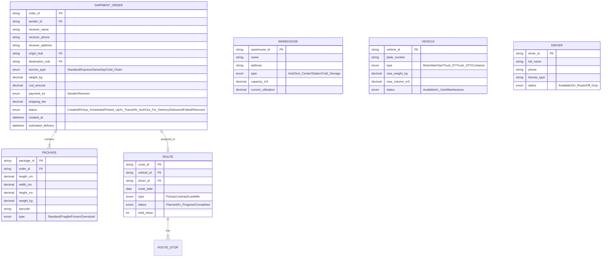
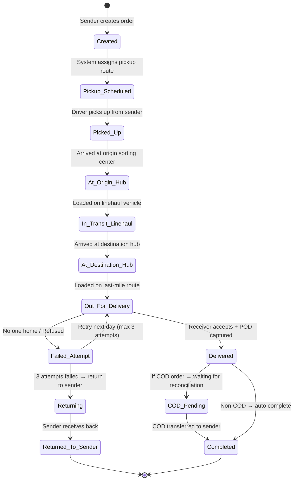
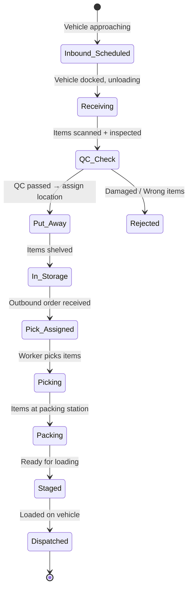

# Domain: Logistics / Vận Tải (Logistics & Transportation)

## 1. Thuật Ngữ Chuyên Ngành

| Thuật ngữ | Tiếng Anh | Giải thích |
|-----------|-----------|------------|
| WMS | Warehouse Management System | Hệ thống quản lý kho |
| TMS | Transportation Management System | Hệ thống quản lý vận tải |
| 3PL / 4PL | Third/Fourth-Party Logistics | Nhà cung cấp dịch vụ logistics bên thứ 3/4 |
| BOL / B/L | Bill of Lading | Vận đơn — chứng từ vận chuyển hàng hóa |
| AWB | Airway Bill | Vận đơn hàng không |
| FCL / LCL | Full Container Load / Less than Container Load | Hàng nguyên container / hàng lẻ |
| ETA / ETD | Estimated Time of Arrival / Departure | Thời gian dự kiến đến / đi |
| POD | Proof of Delivery | Bằng chứng giao hàng (ảnh, chữ ký) |
| Last Mile | Giao hàng chặng cuối | Từ hub/kho đến tay người nhận |
| Cross-docking | Trung chuyển nhanh | Hàng qua kho không lưu trữ, chuyển thẳng |
| Pick & Pack | Lấy hàng & đóng gói | Quy trình lấy hàng từ kệ + đóng gói |
| SKU | Stock Keeping Unit | Mã quản lý hàng tồn kho |
| Lead Time | Thời gian giao hàng | Tổng thời gian từ đặt hàng → nhận hàng |
| Reverse Logistics | Logistics ngược | Quy trình xử lý hàng trả về |
| COD Reconciliation | Đối soát COD | Đối chiếu tiền thu hộ với đơn hàng |

## 2. Compliance & Quy Định

| Quy định | Phạm vi | Yêu cầu chính cho BA |
|----------|---------|----------------------|
| **Luật Giao thông đường bộ** | Vận tải đường bộ | Tải trọng, giờ lái xe tối đa, bằng lái |
| **Nghị định 163/2017/NĐ-CP** | Kinh doanh dịch vụ logistics | Điều kiện kinh doanh, trách nhiệm |
| **Customs regulations** | Hải quan XNK | Tờ khai hải quan, thuế, C/O |
| **Dangerous Goods (IATA/ADR)** | Hàng nguy hiểm | Phân loại, đóng gói, nhãn mác đặc biệt |
| **Cold Chain compliance** | Hàng lạnh/dược phẩm | Kiểm soát nhiệt độ liên tục, audit trail |

## 3. Entities Chính



## 4. State Diagrams

### 4.1 Shipment Lifecycle



### 4.2 Warehouse Inbound/Outbound



## 5. Events

| Event | Trigger | System Action | Notification |
|-------|---------|---------------|-------------|
| Order Created | Sender submits shipment | Validate address, calculate fee, assign pickup | SMS/App confirmation to sender |
| Pickup Completed | Driver scans barcode at pickup | Update status, generate tracking | SMS tracking link to receiver |
| Hub Scan | Package scanned at sorting center | Update location, route to next hub | Tracking update |
| Out For Delivery | Driver starts last-mile route | Notify receiver with ETA | SMS "Đơn hàng đang giao, dự kiến 14:00-16:00" |
| Delivery Failed | Driver marks failed attempt | Schedule retry, notify operations | SMS to receiver "Giao không thành công" |
| COD Collected | Driver collects cash from receiver | Record COD amount, pending reconciliation | None (internal) |
| COD Reconciled | Finance confirms cash received | Release payment to sender | SMS to sender "Tiền COD đã chuyển" |
| SLA Breach Warning | Shipment approaching SLA deadline | Escalate to operations manager | Internal alert |
| Vehicle Breakdown | Driver reports issue | Reassign route, dispatch backup | Alert to fleet manager |
| Temperature Alert | Cold chain sensor exceeds range | Alert + log deviation | SMS to operations + quality team |

## 6. User Roles

| Role | Tiếng Việt | Permissions | Typical Actions |
|------|-----------|-------------|-----------------|
| **Sender** | Người gửi | Create orders, track, manage returns | Tạo đơn, theo dõi vận chuyển |
| **Receiver** | Người nhận | Track package, reschedule, confirm delivery | Theo dõi, đổi lịch giao |
| **Pickup Driver** | Tài xế lấy hàng | View pickup routes, scan packages | Lấy hàng từ sender, scan barcode |
| **Delivery Driver** | Tài xế giao hàng | View delivery routes, capture POD, collect COD | Giao hàng, chụp POD, thu COD |
| **Hub Operator** | Nhân viên hub | Scan in/out, sort packages, manage exceptions | Nhận hàng, phân loại, xử lý sự cố |
| **Warehouse Staff** | Nhân viên kho | Pick, pack, put-away, cycle count | Lấy hàng, đóng gói, nhập kho |
| **Route Planner** | Lập kế hoạch tuyến | Create/modify routes, assign drivers/vehicles | Tối ưu tuyến đường, phân tài xế |
| **Operations Manager** | Quản lý vận hành | Dashboard, SLA monitoring, escalation | Giám sát vận hành, xử lý escalation |
| **Finance** | Kế toán | COD reconciliation, invoicing, settlements | Đối soát COD, xuất hóa đơn |
| **Fleet Manager** | Quản lý đội xe | Vehicle maintenance, driver assignment | Bảo trì xe, quản lý tài xế |

## 7. Common Business Rules

| Rule ID | Mô tả | Điều kiện | Hành động |
|---------|-------|-----------|-----------|
| BR-LOG-001 | Max delivery attempts | 3 failed delivery attempts | Return to sender |
| BR-LOG-002 | COD limit | COD amount > 10M VND | Require sender verification |
| BR-LOG-003 | SLA by service type | Standard: 3-5 days, Express: 1-2 days, SameDay: same day | Track + escalate if breaching |
| BR-LOG-004 | Weight surcharge | Actual weight > volumetric weight → charge higher | Max(actual, L×W×H/5000) |
| BR-LOG-005 | Restricted items | Prohibited items (battery, liquid > 100ml for air) | Block + notify sender |
| BR-LOG-006 | Auto-assign route | Orders in same zone + same time window | Group into single route |

## 8. Mẫu Requirement

**User Story:**
```
As a Receiver,
I want to reschedule my delivery to a different time slot,
So that I can be home to receive the package.

AC1: Given my package status is "Out_For_Delivery" and delivery is today,
     When I click "Đổi lịch giao" and select tomorrow 14:00-16:00,
     Then update delivery schedule, notify driver, show confirmation.

AC2: Given my package has already had 2 failed attempts,
     When I try to reschedule,
     Then this is the last chance — show warning "Lần giao cuối. Nếu không nhận, hàng sẽ trả về."
```
