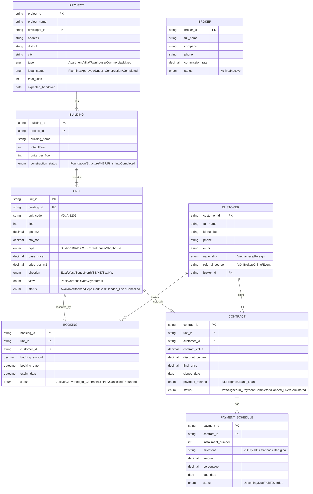
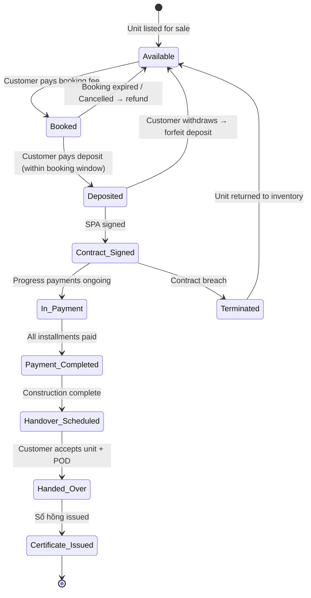
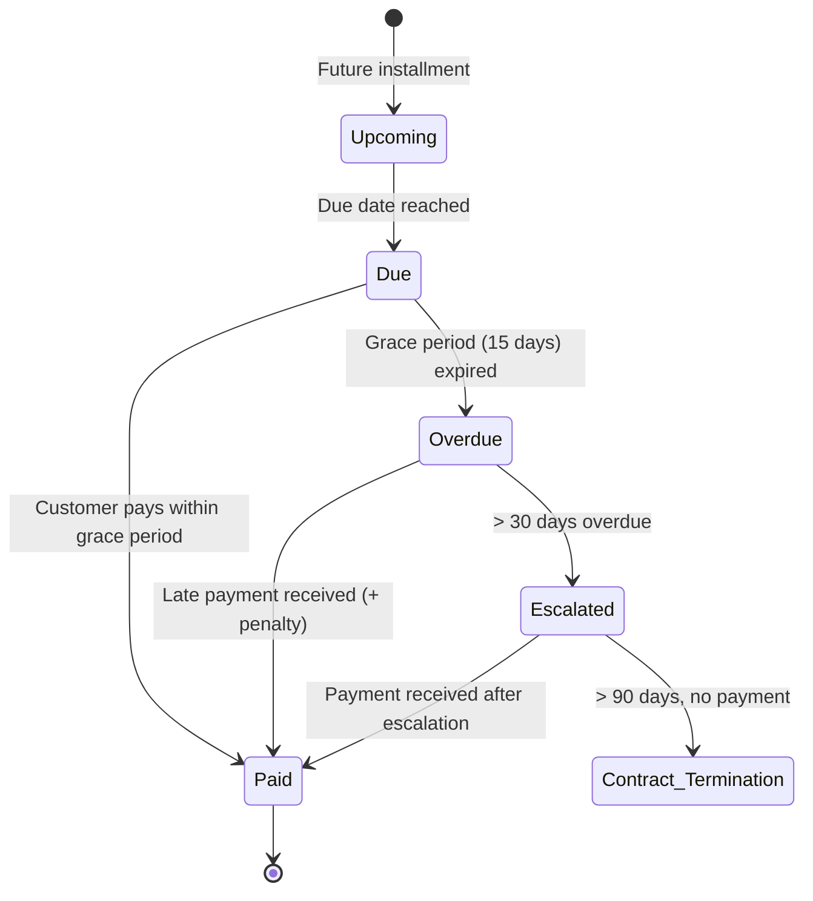

# Domain: Bất Động Sản (Real Estate)

## 1. Thuật Ngữ Chuyên Ngành

| Thuật ngữ | Tiếng Anh | Giải thích |
|-----------|-----------|------------|
| Sổ đỏ / Sổ hồng | Land Use Right Certificate | Giấy chứng nhận quyền sử dụng đất / sở hữu nhà |
| Chủ đầu tư (CĐT) | Developer / Investor | Tổ chức/cá nhân phát triển dự án BĐS |
| Booking / Đặt chỗ | Reservation | Đặt cọc giữ chỗ trước khi ký HĐMB |
| HĐMB | Sale & Purchase Agreement (SPA) | Hợp đồng mua bán |
| Bàn giao | Handover | Giao nhà/căn hộ cho khách hàng |
| Phí bảo trì | Maintenance Fee | 2% giá trị căn hộ, nộp khi bàn giao |
| Phí quản lý | Management Fee | Phí quản lý tòa nhà hàng tháng (VND/m²/tháng) |
| NOM | Net Operating Margin | Biên lợi nhuận hoạt động |
| GFA / NFA | Gross/Net Floor Area | Diện tích sàn thô / thực tế sử dụng |
| CĐT / Sàn GD | Developer / Trading Floor | Chủ đầu tư / Sàn giao dịch BĐS |
| Pháp lý dự án | Project Legal Status | Giấy phép xây dựng, quy hoạch 1/500, EIA |
| Thanh toán theo tiến độ | Progress Payment | Thanh toán theo % hoàn thành xây dựng |
| Mở bán | Sales Launch | Sự kiện mở bán chính thức |
| Commission | Hoa hồng môi giới | % giá trị giao dịch trả cho broker |

## 2. Compliance & Quy Định

| Quy định | Phạm vi | Yêu cầu chính cho BA |
|----------|---------|----------------------|
| **Luật Kinh doanh BĐS 2023** | Toàn ngành | Điều kiện bán, thanh toán, bảo lãnh ngân hàng |
| **Luật Nhà ở 2023** | Nhà ở | Sở hữu chung cư có thời hạn, quản lý tòa nhà |
| **Nghị định 99/2015/NĐ-CP** | Sở hữu nhà cho người nước ngoài | Tối đa 30% căn hộ/tòa nhà, sở hữu 50 năm |
| **Thông tư 19/2016/TT-BXD** | Bảo lãnh nhà ở hình thành tương lai | Ngân hàng bảo lãnh nghĩa vụ CĐT |
| **Luật Đất đai 2024** | Sử dụng đất | Quyền sử dụng đất, bồi thường, giải phóng mặt bằng |

## 3. Entities Chính



## 4. State Diagrams

### 4.1 Unit Sales Lifecycle



### 4.2 Payment Schedule



## 5. Events

| Event | Trigger | System Action | Notification |
|-------|---------|---------------|-------------|
| Sales Launch | CĐT opens sales | Update units to Available, enable booking | Email/SMS to registered leads |
| Booking Created | Customer pays booking fee | Reserve unit, start countdown timer | SMS confirmation + booking receipt |
| Booking Expiry Warning | 3 days before booking expires | Alert sales team | SMS to customer + Email to sales |
| Contract Signed | Both parties sign SPA | Generate payment schedule, lock unit price | Email with contract + schedule |
| Payment Due | 7 days before installment due | Generate payment reminder | SMS + Email reminder |
| Payment Overdue | Due date + grace period passed | Calculate penalty interest, alert finance | SMS warning + Email to customer |
| Construction Milestone | Builder reports progress (VD: cất nóc) | Update building status, trigger next payment | SMS "Dự án đã cất nóc, đợt TT tiếp theo..." |
| Handover Invitation | Unit ready for handover | Schedule handover appointment | Letter + SMS + Email to customer |
| Commission Due | Contract signed OR handover (per policy) | Calculate broker commission | Notify broker + finance |
| Price Adjustment | CĐT updates price list | Update unit prices, log change history | Internal alert to sales team |

## 6. User Roles

| Role | Tiếng Việt | Permissions | Typical Actions |
|------|-----------|-------------|-----------------|
| **Customer** | Khách hàng | View units, book, track payments | Xem căn hộ, đặt chỗ, theo dõi thanh toán |
| **Sales Consultant** | Tư vấn viên | CRUD bookings, view units, manage leads | Tư vấn, tạo booking, chăm sóc khách |
| **Sales Manager** | Quản lý kinh doanh | Approve discounts, view reports, manage team | Duyệt giảm giá, xem doanh số |
| **Broker** | Môi giới | View available units, refer customers | Giới thiệu khách, theo dõi hoa hồng |
| **Finance** | Kế toán | Manage payments, reconcile, generate invoices | Xác nhận thanh toán, xuất hóa đơn |
| **Legal** | Pháp chế | Manage contracts, verify documents | Soạn HĐ, kiểm tra pháp lý |
| **Construction PM** | Quản lý xây dựng | Update construction progress | Cập nhật tiến độ xây dựng |
| **Customer Service** | CSKH | Handle complaints, manage handover scheduling | Xử lý khiếu nại, lên lịch bàn giao |
| **Admin** | Quản trị | System config, user management, master data | Cấu hình dự án, phân quyền |

## 7. Common Business Rules

| Rule ID | Mô tả | Điều kiện | Hành động |
|---------|-------|-----------|-----------|
| BR-RE-001 | Foreign ownership cap | Foreign buyers > 30% units in building | Block booking for foreigners |
| BR-RE-002 | Booking validity | Booking not converted within 15 days | Auto-expire + refund |
| BR-RE-003 | Discount authority | Discount ≤ 3%: Sales Mgr; > 3%: Director | Route for approval |
| BR-RE-004 | Maintenance fee collection | At handover | Collect 2% of contract value |
| BR-RE-005 | Late payment penalty | Payment overdue > grace period | 0.05%/day on overdue amount |
| BR-RE-006 | One unit per booking | 1 customer can book max 1 unit per transaction | Validate at booking |

## 8. Mẫu Requirement

**User Story:**
```
As a Sales Consultant,
I want to view real-time unit availability on an interactive floor plan,
So that I can quickly show customers which units are available during a sales event.

AC1: Given Building A has 200 units,
     When I open the floor plan for Floor 12,
     Then each unit is color-coded: Green=Available, Yellow=Booked, Red=Sold, Grey=Unavailable.

AC2: Given a unit is Booked and booking expires in < 24h,
     When I view the floor plan,
     Then the unit shows a blinking Yellow indicator with countdown timer.
```
