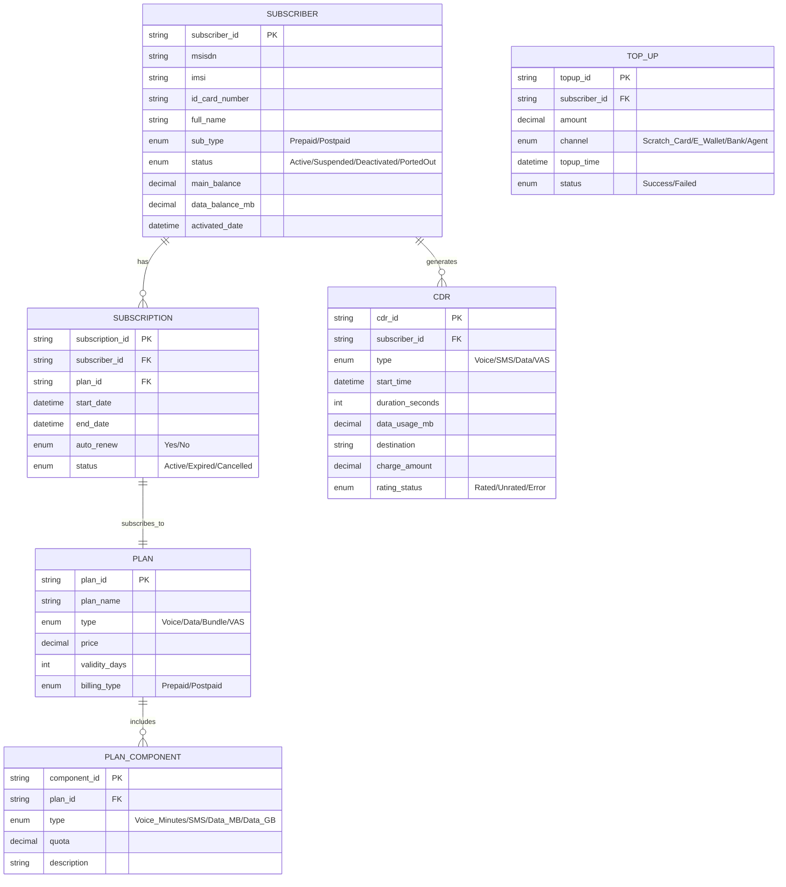
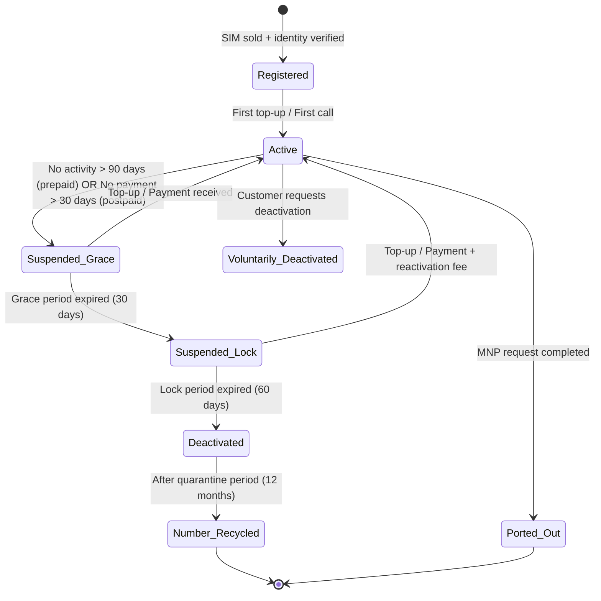
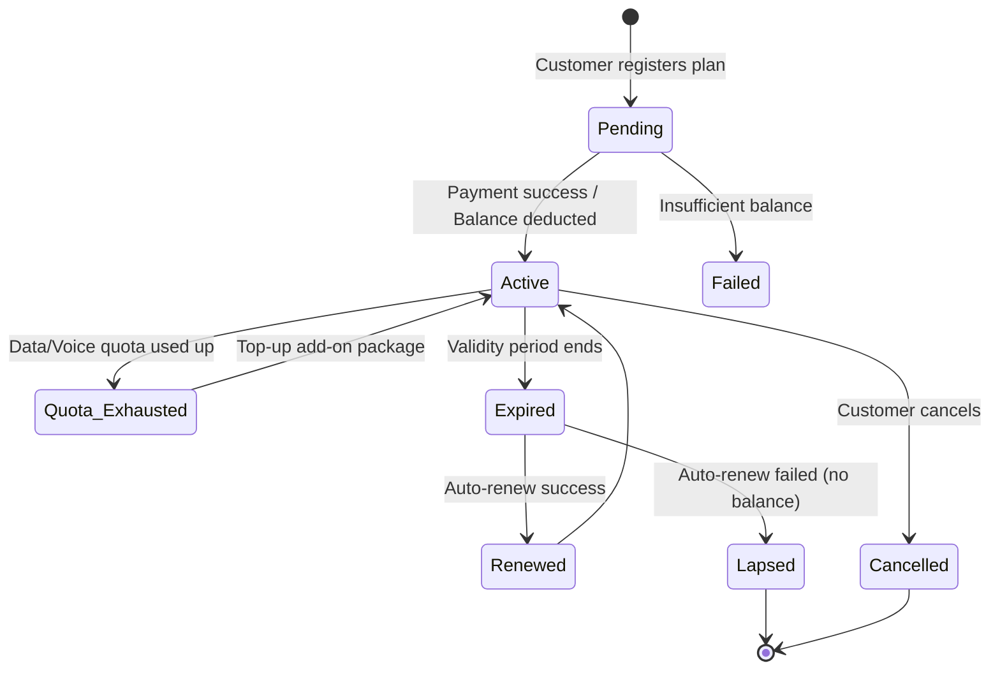

# Domain: Viễn Thông (Telecommunications)

## 1. Thuật Ngữ Chuyên Ngành

| Thuật ngữ | Tiếng Anh | Giải thích |
|-----------|-----------|------------|
| MSISDN | Mobile Station International Subscriber Directory Number | Số thuê bao di động (VD: 0912345678) |
| IMSI | International Mobile Subscriber Identity | Mã định danh thuê bao trên SIM |
| HLR/HSS | Home Location Register / Home Subscriber Server | Cơ sở dữ liệu thuê bao chính |
| OCS | Online Charging System | Hệ thống tính cước thời gian thực (trả trước) |
| OFCS | Offline Charging System | Hệ thống tính cước hậu kỳ (trả sau) |
| PCRF | Policy & Charging Rules Function | Điều khiển chính sách QoS và cước |
| CDR | Call Detail Record | Bản ghi chi tiết cuộc gọi/data/SMS |
| VAS | Value Added Services | Dịch vụ giá trị gia tăng (nhạc chờ, SMS banking...) |
| MNP | Mobile Number Portability | Chuyển mạng giữ số |
| ARPU | Average Revenue Per User | Doanh thu trung bình/thuê bao |
| Churn Rate | Tỷ lệ rời mạng | % thuê bao ngừng sử dụng/chuyển mạng |
| Provisioning | Cung cấp dịch vụ | Kích hoạt/thay đổi gói cước trên hệ thống |
| Top-up | Nạp tiền | Nạp tiền vào tài khoản trả trước |
| Bundle | Gói combo | Gói kết hợp (data + voice + SMS) |
| FTTx | Fiber to the x | Internet cáp quang (FTTH = Fiber to Home) |

## 2. Compliance & Quy Định

| Quy định | Phạm vi | Yêu cầu chính cho BA |
|----------|---------|----------------------|
| **Nghị định 49/2017/NĐ-CP** | Đăng ký thuê bao | Xác thực danh tính, 1 CMND tối đa 3 SIM/nhà mạng |
| **Thông tư 47/2017/TT-BTTTT** | Quản lý thuê bao trả trước | Thu hồi SIM không chính chủ, xác minh qua OTP |
| **Luật Viễn thông 2023** | Toàn ngành | Chia sẻ hạ tầng, bảo vệ thông tin thuê bao |
| **QoS Standards (VNPT/Viettel)** | Chất lượng dịch vụ | Tỷ lệ cuộc gọi thành công ≥ 92%, data latency < 100ms |
| **Nghị định 13/2023/NĐ-CP** | Bảo vệ dữ liệu cá nhân | Consent, quyền truy cập/xóa dữ liệu cá nhân |

## 3. Entities Chính



## 4. State Diagrams

### 4.1 Subscriber Lifecycle



### 4.2 Plan Subscription Lifecycle



## 5. Events

| Event | Trigger | System Action | Notification |
|-------|---------|---------------|-------------|
| SIM Activated | First top-up or call | Provision on HLR, create subscriber record | Welcome SMS |
| Top-up Received | Payment confirmed | Update main_balance, extend validity | SMS balance confirmation |
| Plan Subscribed | Customer registers via USSD/App | Deduct fee, provision quota on OCS/PCRF | SMS plan activation details |
| Quota Exhausted | Data/voice usage reaches limit | Throttle speed (data) or block (voice) | SMS "Bạn đã hết data, mua thêm gói..." |
| CDR Generated | Call ends / Data session closes | Rate CDR, deduct from balance/quota | None (background) |
| Auto-Renew Triggered | Plan expiry date reached | Attempt balance deduction, renew if success | SMS success/failure |
| MNP Request | Customer applies to port | Validate eligibility, coordinate with new carrier | SMS confirmation + timeline |
| Suspension Warning | 60 days no activity (prepaid) | Send warning before suspension | SMS "Thuê bao sắp bị tạm ngưng..." |
| Fraud Detection | Abnormal usage pattern (VD: 100 SMS/min) | Auto-block, flag for review | SMS to subscriber + Alert to fraud team |
| Network Outage | BTS/Node failure detected | Reroute traffic, create incident ticket | Internal alert to NOC |

## 6. User Roles

| Role | Tiếng Việt | Permissions | Typical Actions |
|------|-----------|-------------|-----------------|
| **Subscriber** | Thuê bao | View balance, buy plan, top-up, check usage | Đăng ký gói, nạp tiền, kiểm tra tài khoản |
| **Call Center Agent** | Tổng đài viên | View subscriber info, troubleshoot, change plan | Hỗ trợ thuê bao, đổi gói, khóa/mở SIM |
| **Shop Agent** | Nhân viên cửa hàng | Activate SIM, sell plans, verify identity | Kích hoạt SIM, bán gói, xác minh giấy tờ |
| **Product Manager** | Quản lý sản phẩm | CRUD plans, set pricing, configure promotions | Thiết kế gói cước, cấu hình khuyến mãi |
| **Revenue Assurance** | Đảm bảo doanh thu | View CDR, reconcile billing, detect leakage | Đối soát cước, phát hiện thất thoát doanh thu |
| **NOC Engineer** | Kỹ sư vận hành mạng | Monitor network, manage incidents | Giám sát mạng, xử lý sự cố |
| **Fraud Analyst** | Phân tích gian lận | View flagged accounts, investigate, block | Điều tra thuê bao bất thường |
| **System Admin** | Quản trị hệ thống | Configure OCS/PCRF, user management | Cấu hình hệ thống tính cước |

## 7. Common Business Rules

| Rule ID | Mô tả | Điều kiện | Hành động |
|---------|-------|-----------|-----------|
| BR-TEL-001 | Giới hạn SIM/CMND | 1 CMND ≤ 3 SIM cùng nhà mạng | Block activation nếu vượt |
| BR-TEL-002 | Tính cước theo block | Voice: block 6s (6+1), Data: block 10KB | Round up to nearest block |
| BR-TEL-003 | Ưu tiên trừ cước | Quota gói → Tài khoản khuyến mãi → Tài khoản chính | Sequential deduction |
| BR-TEL-004 | Auto-renew retry | Nếu không đủ tiền, retry sau 24h, max 3 lần | Retry then expire |
| BR-TEL-005 | MNP eligibility | Thuê bao active ≥ 90 ngày, không nợ cước | Allow/deny port request |
| BR-TEL-006 | Data throttle | Hết data tốc độ cao → giảm xuống 128kbps | Apply PCRF policy |

## 8. Mẫu Requirement Đặc Thù

**User Story:**
```
As a Prepaid Subscriber,
I want to register a data plan via USSD code *098#,
So that I can get 2GB/day for 30 days.

AC1: Given my main balance ≥ plan price (VD: 77K),
     When I dial *098# and confirm,
     Then deduct 77K, provision 2GB/day quota, send SMS confirmation.

AC2: Given my balance < 77K,
     When I dial *098#,
     Then show "Tài khoản không đủ. Vui lòng nạp thêm" and do not subscribe.

AC3: Given I already have an active data plan,
     When I register a new one,
     Then stack the new plan (quotas are cumulative, validity = max of two).
```
