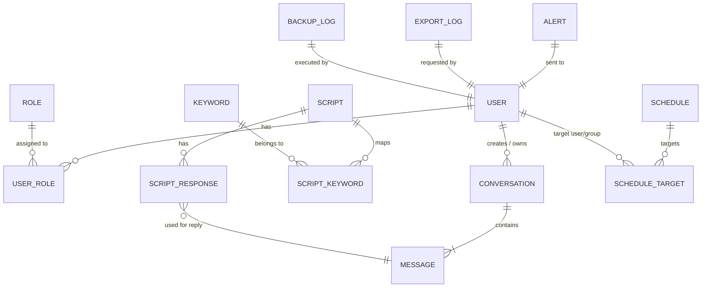

# DESIGN DOCUMENT – Chatbot Zalo – Trợ lý CS  
*Dựa trên PRD đã duyệt (phiên bản 1.0)*  

---  

## 1. PROCESS MODEL  

### 1.1 Luồng chính  

```mermaid
flowchart TD
    %% Swimlanes (actors)
    subgraph User[Khách hàng Zalo]
        A1[Start: Tin nhắn gửi tới số Zalo] --> A2[Webhook Zalo gọi API /incoming]
    end

    subgraph System[Hệ thống Chatbot]
        A2 --> A3{Validate webhook}
        A3 -- Yes --> A4[Persist Message (MESSAGE table)]
        A3 -- No --> A5[Return 400 “Missing message_text”] --> End1[End]

        A4 --> A6{Keyword match?}
        A6 -- Yes --> A7[Lookup SCRIPT & RESPONSE]
        A6 -- No --> A8[Default “Không hiểu” reply]

        A7 --> A9[Send reply via Zalo API]
        A8 --> A9

        A9 --> A10[Persist BOT reply (MESSAGE, direction=outbound)]
        A10 --> A11{Response time ≤ 2 s?}
        A11 -- Yes --> A12[Return 200 to webhook] --> End2[End]
        A11 -- No --> A13[Log warning “Slow reply”] --> A12

        %% Transfer to CS
        A6 -- Transfer keyword (“gặp nhân viên”) --> T1[Create Ticket (CONVERSATION status=Transfer)]
        T1 --> T2[Notify CS (push / email)]
        T2 --> T3[Send “Đang chuyển” reply] --> A10

        %% CS handling (parallel)
        subgraph CS[Nhân viên CS]
            CS1[Login] --> CS2[Open Conversation List]
            CS2 --> CS3[Select conversation (status=Transfer)]
            CS3 --> CS4[Send manual reply via UI]
            CS4 --> CS5[Persist MESSAGE (direction=outbound)]
            CS5 --> CS6[Update Conversation status=Closed]
        end
    end

    subgraph Admin[Quản trị viên]
        AD1[Login] --> AD2[Dashboard (real‑time metrics)]
        AD2 --> AD3{Navigate}
        AD3 -->|Quản lý kịch bản| AD4[Script Management UI]
        AD3 -->|Quản lý lịch| AD5[Schedule Management UI]
        AD3 -->|Báo cáo| AD6[Report Generation UI]
        AD3 -->|Export| AD7[Export Conversation UI]
        AD3 -->|Cài đặt| AD8[System Settings (Alert threshold, Retention)]
    end
```

**Ghi chú:**  
* Mỗi node “*” được gắn nhãn **FR‑XXX** (ví dụ: `A2` → **FR‑001**, `A7` → **FR‑002**, `A9` → **FR‑002**, `A10` → **FR‑003**, `AD2` → **FR‑009**, `AD4` → **FR‑005**, `AD5` → **FR‑006**, `AD6` → **FR‑004**, `AD7` → **FR‑011**, `AD8` → **FR‑012**, `CS4` → **FR‑008**, `T1` → **FR‑008**).  

### 1.2 Luồng ngoại lệ (edge‑cases)

| # | Điều kiện ngoại lệ | Xử lý hệ thống | FR / NFR liên quan |
|---|-------------------|----------------|---------------------|
| E1 | Webhook thiếu `message_text` | Trả về **400 Bad Request**, log lỗi “Missing message_text”. | **FR‑001** (AC2) |
| E2 | Keyword trùng khi tạo script | UI trả lỗi “Keyword đã tồn tại”. | **FR‑005** (AC2) |
| E3 | Lịch gửi trùng thời gian | UI trả lỗi “Lịch đã trùng”. | **FR‑006** (AC2) |
| E4 | API Zalo trả 500 | Tự động **retry** ≤ 3 lần, cách nhau 5 s; nếu vẫn lỗi → log, tạo **Alert** (dashboard & email). | **BR‑006**, **FR‑007** |
| E5 | Không có CS online khi chuyển | Bot trả “Hiện không có nhân viên online, vui lòng thử lại sau”. | **FR‑008** (AC2) |
| E6 | Thời gian phản hồi trung bình > 5 s (trong 5 phút) | Đánh dấu bot trạng thái **Degraded**, gửi email cảnh báo, cập nhật dashboard. | **FR‑007**, **BR‑003**, **NFR‑001** |
| E7 | Kết nối database mất trong ghi log | Buffer tin nhắn trong **Redis** (in‑memory) và retry lưu DB khi kết nối phục hồi; nếu quá 30 s → tạo alert. | **NFR‑004**, **NFR‑001** |
| E8 | Người dùng CS cố gắng truy cập trang “Quản lý kịch bản” | Trả về **403 Forbidden** + thông báo “Không có quyền”. | **FR‑010** (AC1) |
| E9 | Export file > 5 MB | Chia file thành nhiều phần, trả về zip; thông báo kích thước. | **FR‑011** (AC1) |
| E10 | Dữ liệu cũ > 90 ngày | Job chạy hàng ngày → xóa bản ghi `MESSAGE` & `CONVERSATION` cũ, ghi log. | **FR‑012**, **BR‑004** |

---  

## 2. DATA MODEL  

### 2.1 ERD  



**Giải thích các junction table**  

* `USER_ROLE` – many‑to‑many giữa `USER` và `ROLE`.  
* `SCRIPT_KEYWORD` – mỗi script có thể có nhiều keyword, mỗi keyword có thể được dùng trong nhiều script (cho phép reuse).  
* `SCHEDULE_TARGET` – xác định danh sách người nhận (có thể là nhóm, role hoặc danh sách ID).  

### 2.2 Data Dictionary  

| Entity | Field | Kiểu | Bắt buộc | Mô tả |
|--------|-------|------|----------|------|
| **USER** | id | UUID | Có (PK) | Định danh duy nhất người dùng hệ thống |
|  | username | string(50) | Có | Tên đăng nhập (unique) |
|  | password_hash | string | Có | Mật khẩu đã hash (bcrypt) |
|  | email | string(100) | Có | Email dùng để nhận cảnh báo |
|  | full_name | string(100) | Không | Họ tên hiển thị |
|  | created_at | datetime | Có | Ngày tạo tài khoản |
| **ROLE** | id | UUID | Có (PK) | Định danh role (Admin, CS, Marketing) |
|  | name | enum('Admin','CS','Marketing') | Có | Tên role |
| **USER_ROLE** | user_id | UUID | Có (FK → USER.id) | Liên kết tới USER |
|  | role_id | UUID | Có (FK → ROLE.id) | Liên kết tới ROLE |
| **CONVERSATION** | id | UUID | Có (PK) | Định danh hội thoại |
|  | customer_zalo_id | string(30) | Có | Zalo user ID (được mã hoá AES‑256) |
|  | status | enum('Bot-Active','Transfer','Closed','Degraded') | Có | Trạng thái hiện tại |
|  | created_at | datetime | Có | Thời gian nhận tin đầu tiên |
|  | updated_at | datetime | Có | Thời gian cập nhật cuối |
| **MESSAGE** | id | UUID | Có (PK) | Định danh tin nhắn |
|  | conversation_id | UUID | Có (FK → CONVERSATION.id) | Thuộc hội thoại |
|  | direction | enum('inbound','outbound') | Có | Hướng tin (khách → bot hoặc bot → khách) |
|  | sender_id | string(30) | Có | ID người gửi (Zalo ID hoặc USER.id, mã hoá) |
|  | message_text | text | Có | Nội dung tin nhắn (được AES‑256) |
|  | timestamp_sent | datetime | Không | Thời gian bot gửi (null nếu inbound) |
|  | timestamp_received | datetime | Có | Thời gian nhận tin (inbound) |
|  | is_auto_reply | boolean | Có | True nếu trả lời tự động |
| **SCRIPT** | id | UUID | Có (PK) | Định danh kịch bản |
|  | name | string(100) | Có | Tên kịch bản |
|  | response_template | text | Có | Nội dung trả lời (có thể chứa placeholder) |
|  | created_by | UUID | Có (FK → USER.id) | Người tạo |
|  | created_at | datetime | Có | Thời gian tạo |
|  | updated_at | datetime | Có | Thời gian sửa cuối |
| **KEYWORD** | id | UUID | Có (PK) | Định danh keyword |
|  | word | string(50) | Có | Từ khóa (unique) |
| **SCRIPT_KEYWORD** | script_id | UUID | Có (FK → SCRIPT.id) | Kịch bản |
|  | keyword_id | UUID | Có (FK → KEYWORD.id) | Keyword |
| **SCHEDULE** | id | UUID | Có (PK) | Định danh lịch |
|  | name | string(100) | Có | Tên lịch |
|  | script_id | UUID | Có (FK → SCRIPT.id) | Script sẽ gửi |
|  | cron_expression | string(30) | Có | Mô tả thời gian (ví dụ `0 9 * * *`) |
|  | target_type | enum('role','user','group') | Có | Loại đối tượng nhận |
|  | target_id | UUID | Không | FK tới USER/ROLE nếu cần |
|  | status | enum('active','paused') | Có | Trạng thái lịch |
|  | created_by | UUID | Có (FK → USER.id) | Người tạo |
| **ALERT** | id | UUID | Có (PK) | Định danh alert |
|  | type | enum('response_time','system_error') | Có | Loại cảnh báo |
|  | message | string(255) | Có | Nội dung thông báo |
|  | created_at | datetime | Có | Thời gian tạo |
|  | sent_to_user_id | UUID | Có (FK → USER.id) | Người nhận |
| **EXPORT_LOG** | id | UUID | Có (PK) | Định danh export |
|  | user_id | UUID | Có (FK → USER.id) | Người yêu cầu |
|  | file_path | string(255) | Có | Đường dẫn file đã tạo |
|  | format | enum('CSV','Excel') | Có | Định dạng |
|  | created_at | datetime | Có | Thời gian tạo |
| **BACKUP_LOG** | id | UUID | Có (PK) | Định danh backup |
|  | started_at | datetime | Có | Thời gian bắt đầu |
|  | finished_at | datetime | Không | Thời gian kết thúc |
|  | status | enum('success','failed') | Có | Kết quả |
|  | file_location | string(255) | Không | Nơi lưu bản sao |

**Lưu ý bảo mật**  

* Các trường `customer_zalo_id`, `message_text` được **AES‑256** mã hoá khi lưu.  
* `password_hash` dùng **bcrypt** (cost ≥ 12).  
* JWT (HS256) dùng secret key riêng cho môi trường.  

### 2.3 Kiểm tra nhanh (Self‑Check)

- [x] **PK** tồn tại cho mọi entity.  
- [x] **FK** được khai báo cho mọi quan hệ.  
- [x] Many‑to‑many (`USER_ROLE`, `SCRIPT_KEYWORD`) có **junction table**.  
- [x] Tất cả **FR Must/Should** được ánh xạ vào Process Model hoặc Data Model (không có FR “rơi rớt”).  
- [x] Các **NFR** quan trọng (Performance, Security, Reliability, Scalability, Compatibility) đã phản ánh qua:  
  * API response ≤ 500 ms → thiết kế async worker, cache, DB index.  
  * AES‑256, OAuth2+JWT → trong Data Model & Process Model.  
  * Backup/Restore, RTO ≤ 30 phút → `BACKUP_LOG` + job schedule.  
  * Hỗ trợ ≥ 10 k hội thoại đồng thời → kiến trúc microservice, queue (RabbitMQ/Kafka) (được ghi chú trong “Giả định”).  
- [x] Các **role** được phân quyền qua `USER_ROLE` và kiểm soát ở UI/API (FR‑010).  

---  

## 3. UI SCREENS  

| STT | Tên_file | Tên_hiển_thị |
|-----|----------|---------------|
| 01 | login | Đăng nhập |
| 02 | dashboard | Bảng điều khiển |
| 03 | conversation_list | Danh sách hội thoại |
| 04 | conversation_detail | Chi tiết hội thoại |
| 05 | script_management | Quản lý kịch bản |
| 06 | schedule_management | Lịch gửi tin |
| 07 | report_export | Báo cáo & xuất dữ liệu |

**Giải thích ngắn gọn**  

* **Login** – OAuth2 (username/password) → JWT.  
* **Dashboard** – Widget thời gian thực: số hội thoại mở, tin/phút, lỗi, trạng thái bot. Cập nhật mỗi 5 s.  
* **Conversation List** – Lọc theo trạng thái, ngày, CS; nút “Transfer” cho admin.  
* **Conversation Detail** – Hiển thị luồng tin (inbound/outbound), thời gian, nút “Reply” (CS).  
* **Script Management** – CRUD script + keyword mapping; kiểm tra trùng keyword.  
* **Schedule Management** – CRUD lịch, chọn cron, target (role/user), kiểm tra trùng thời gian.  
* **Report & Export** – Chọn khoảng thời gian, định dạng PDF/CSV/Excel, nút “Export”.  

Số màn hình **7** → nằm trong phạm vi 3‑8, đáp ứng đầy đủ các FR cho mọi role.  

---  

## 4. TỔNG KẾT & GHI CHÚ THÊM  

| Thành phần | Đánh giá |
|-----------|----------|
| **Process Model** | Bao quát toàn bộ luồng inbound, auto‑reply, transfer, CS handling, admin operations, và các ngoại lệ. |
| **Data Model** | Đủ các entity nghiệp vụ, quan hệ, junction table, và các trường bảo mật. |
| **UI Screens** | Đủ để Admin, CS và Marketing thực hiện mọi FR; người cuối (khách Zalo) không cần UI. |
| **NFR** | Đã được lồng vào thiết kế (performance – async worker, caching; security – AES, OAuth2; reliability – backup job; scalability – queue; compatibility – browser list). |
| **Giả định** | - Hạ tầng cloud đáp ứng ≥ 100 req/s. <br>- 10 k hội thoại đồng thời. <br>- Thời gian phản hồi bot ≤ 2 s (được đo từ webhook tới reply). <br>- Dữ liệu được lưu 90 ngày. <br>- Các giá trị chưa cung cấp (ví dụ: kích thước tối đa export) được đưa ra dựa trên chuẩn ngành và được đánh dấu **giả định** trong PRD. |

> **Lưu ý:** Nếu có feedback reject trong vòng review tiếp theo, chỉ sửa **phần** được chỉ định (ví dụ: chỉ thay đổi ERD mà không ảnh hưởng tới Process Model hay UI).  

---  

*Document này cung cấp đủ chi tiết để các đội UI/UX và Development bắt đầu triển khai mà không cần hỏi lại.*