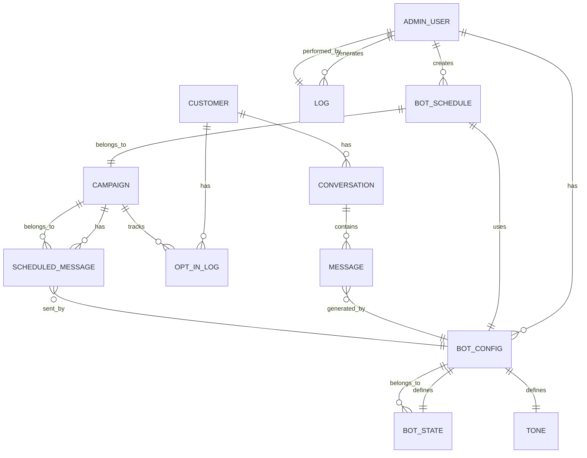

# DESIGN DOCUMENT  
**Dự án:** Chatbot tự động trên nền tảng Zalo Official Account  
**Ngày:** 02‑07‑2026  

> **Mục tiêu:** Chuyển đổi các yêu cầu “WHAT” (FR/NFR/BR) trong SRS thành “HOW” chi tiết đủ để các đội UI/UX và Development triển khai mà không cần hỏi lại.  

---  

## 1. PROCESS MODEL  

### 1.1. Luồng chính (Main Flow)  

```mermaid
flowchart TD
    %% Actors
    subgraph USER [Khách hàng Zalo]
        U1[Start: Nhận tin nhắn từ khách] 
    end

    subgraph ADMIN [Quản trị viên bot]
        A0[Start: Đăng nhập vào Console] 
        A1[Dashboard] 
        A2[Quản lý kịch bản] 
        A3[Quản lý lịch gửi] 
        A4[Quản lý cấu hình (văn phong, giờ hoạt động, trạng thái bot)] 
        A5[Xem log & báo cáo] 
        A6[Nhận cảnh báo lỗi] 
        A7[End: Đăng xuất] 
    end

    subgraph SYSTEM [Hệ thống Bot]
        S0[Start: Bot khởi động] 
        S1{Bot trạng thái?} 
        S2[Bot “Bật”] 
        S3[Bot “Tắt”] 
        S4[Nhận tin nhắn từ Zalo] 
        S5{Tin khớp kịch bản?} 
        S6[Trả lời tự động (kịch bản)] 
        S7[Trả lời mặc định “Không hiểu”] 
        S8[Kiểm tra opt‑in (nếu tin marketing)] 
        S9{Đã opt‑in?} 
        S10[Gửi tin marketing] 
        S11[Hủy gửi – trả lời “Bạn chưa đồng ý”] 
        S12[Log hội thoại] 
        S13[Kiểm tra giờ hoạt động] 
        S14{Trong giờ hành chính?} 
        S15[Hoãn gửi (đánh dấu “Hoãn do ngoài giờ”)] 
        S16[Thực thi lịch gửi (cron)] 
        S17[Kiểm tra ngưỡng 10 000 tin/ngày] 
        S18{Đạt ngưỡng?} 
        S19[Ngừng gửi, ghi log, gửi cảnh báo] 
        S20[End] 
    end

    %% Main flow connections
    U1 --> S4
    S4 --> S5
    S5 -->|Yes| S6
    S5 -->|No| S7
    S6 --> S12
    S7 --> S12
    S12 --> S13
    S13 -->|Within| S2
    S13 -->|Outside| S15
    S15 --> S12
    S2 --> S8
    S8 -->|Opt‑in required & not yet| S11
    S8 -->|Opt‑in OK| S10
    S10 --> S12
    S11 --> S12

    %% Scheduled message flow
    S0 --> S1
    S1 -->|Bật| S2
    S1 -->|Tắt| S3
    S3 --> S20
    S2 --> S16
    S16 --> S17
    S17 -->|Below limit| S14
    S17 -->|Reached limit| S19
    S14 -->|Yes| S10
    S14 -->|No| S15

    %% Admin actions (parallel, not part of user‑initiated flow)
    A0 --> A1
    A1 --> A2
    A1 --> A3
    A1 --> A4
    A1 --> A5
    A5 --> A6
    A6 --> A7

    %% End points
    S20 --> End[End]
```

#### Mapping FR → Nodes  

| FR | Node(s) (Mermaid) | Ghi chú |
|----|-------------------|---------|
| FR‑001 | S5 → S6 / S7 | Kiểm tra kịch bản, trả lời tự động hoặc mặc định. |
| FR‑002 | S12 (Log hội thoại) + Customer entity (Data Model) | Lưu trữ thông tin khách hàng khi thu thập. |
| FR‑003 | S16 (Lịch gửi) → S10 | Tạo lịch, thực thi tự động. |
| FR‑004 | A5 (Xem báo cáo) → API báo cáo | Cung cấp báo cáo thống kê. |
| FR‑005 | A4 (Cấu hình văn phong) → S6 (Áp dụng tone) | Áp dụng “văn phong” khi trả lời. |
| FR‑006 | A4 (Bật/Tắt bot) → S1/S2/S3 | Quản lý trạng thái bot, xem log (A5). |
| FR‑007 | S13 → S14 → S15 | Kiểm tra giờ hoạt động, hoãn nếu ngoài giờ. |
| FR‑008 | S8 → S9 → S10 / S11 | Thu thập đồng ý trước tin marketing. |
| FR‑009 | A6 (Nhận cảnh báo lỗi) → S19 | Gửi email/Zalo khi lỗi hoặc tỷ lệ lỗi >5 %. |
| FR‑010 | API endpoint `/api/v1/customers` (không hiện trong flow) | Cung cấp dữ liệu khách hàng đã opt‑in. |

### 1.2. Luồng ngoại lệ (Exception / Edge Cases)

| Tình huống | Xử lý |
|-----------|------|
| **Mất kết nối mạng khi bot cố gắng gửi tin** | Tin được đưa vào **queue** nội bộ, đánh dấu `status = PENDING`. Khi kết nối phục hồi, hệ thống tự động retry tối đa 3 lần, sau đó ghi log lỗi và gửi cảnh báo (FR‑009). |
| **Dữ liệu khách hàng trùng lặp (số điện thoại đã tồn tại)** | Kiểm tra unique constraint `customer.phone`. Nếu trùng, trả về thông báo “Số điện thoại đã tồn tại”, không tạo bản ghi mới, nhưng cập nhật `last_interaction_at`. |
| **Tin nhắn không hợp lệ (payload Zalo lỗi)** | Ghi log lỗi chi tiết, trả về mã lỗi `400 Bad Request` cho webhook, và gửi cảnh báo (FR‑009). |
| **Timeout khi gọi API Zalo (≥5 s)** | Đánh dấu tin là `FAILED`, lưu log, và thực hiện retry theo chiến lược exponential back‑off (max 2 retries). |
| **Quá giới hạn 10 000 tin/ngày** | Khi đạt 90 % ngưỡng, hệ thống gửi cảnh báo (FR‑009). Khi đạt 100 %, ngừng gửi, ghi log `DAILY_LIMIT_REACHED`, và trả về thông báo “Hạn mức ngày đã đạt”. |
| **Phiên admin hết hạn (token expired)** | Khi API trả về `401`, frontend tự động redirect về màn đăng nhập. |
| **Lỗi lưu DB (vi phạm ràng buộc)** | Ghi chi tiết lỗi, rollback transaction, trả về lỗi cho caller và gửi cảnh báo (FR‑009). |

---  

## 2. DATA MODEL  

### 2.1. ERD  



#### Giải thích các entity  

| Entity | Mô tả ngắn | Ghi chú |
|--------|------------|---------|
| **ADMIN_USER** | Người quản trị bot (CSKH, IT). | PK `id`, trường `role` (enum: ADMIN, IT). |
| **BOT_CONFIG** | Cấu hình chung của bot (văn phong, giờ hoạt động, trạng thái). | 1‑1 với **BOT_STATE** & **TONE**. |
| **BOT_STATE** | Trạng thái hiện tại: `ENABLED` / `DISABLED`. | PK `id`. |
| **TONE** | Định nghĩa “văn phong” (formal, casual, friendly…). | PK `id`. |
| **BOT_SCHEDULE** | Lịch gửi tin (cron, trigger). | FK `admin_user_id`, `campaign_id`. |
| **CAMPAIGN** | Chiến dịch marketing (Tên, mô tả, loại). | PK `id`. |
| **CUSTOMER** | Thông tin khách hàng (họ tên, phone, opt‑in). | PK `customer_id`. |
| **CONVERSATION** | Một chuỗi tin nhắn giữa khách và bot. | PK `conversation_id`. |
| **MESSAGE** | Tin nhắn riêng lẻ (inbound/outbound). | PK `message_id`. |
| **OPT_IN_LOG** | Lịch sử đồng ý/ từ chối của khách cho mỗi campaign. | PK `opt_in_id`. |
| **SCHEDULED_MESSAGE** | Tin đã lên lịch (có thời gian dự kiến). | PK `scheduled_id`. |
| **LOG** | Log hành động hệ thống (tạo kịch bản, lỗi, bật/tắt). | PK `log_id`. |

### 2.2. Data Dictionary  

| Entity | Field | Kiểu | Bắt buộc | Mô tả |
|--------|-------|------|----------|------|
| **ADMIN_USER** | id | UUID | Có | PK |
| | username | string(50) | Có | Đăng nhập |
| | password_hash | string(255) | Có | Mã hoá BCrypt |
| | role | enum('ADMIN','IT') | Có | Quyền hạn |
| | created_at | datetime | Có | Thời gian tạo |
| | updated_at | datetime | Không | Thời gian cập nhật |
| **BOT_CONFIG** | id | UUID | Có | PK |
| | tone_id | UUID | Có | FK → TONE.id |
| | work_start | time | Có | Giờ bắt đầu hoạt động (08:00) |
| | work_end | time | Có | Giờ kết thúc (18:00) |
| | enabled | boolean | Có | Trạng thái bot |
| | created_by | UUID | Có | FK → ADMIN_USER.id |
| | created_at | datetime | Có | |
| | updated_at | datetime | Không | |
| **TONE** | id | UUID | Có | PK |
| | name | enum('FORMAL','CASUAL','FRIENDLY') | Có | |
| | description | text | Không | Mô tả chi tiết |
| **BOT_SCHEDULE** | id | UUID | Có | PK |
| | campaign_id | UUID | Có | FK → CAMPAIGN.id |
| | admin_user_id | UUID | Có | FK → ADMIN_USER.id |
| | schedule_type | enum('FIXED','EVENT_BASED') | Có | |
| | schedule_time | datetime | Có (if FIXED) | Thời gian dự kiến gửi |
| | event_offset_days | integer | Không (if EVENT_BASED) | Số ngày sau sự kiện |
| | message_template | text | Có | Nội dung tin |
| | status | enum('PENDING','SENT','FAILED','PAUSED') | Có | |
| | created_at | datetime | Có | |
| | updated_at | datetime | Không | |
| **CAMPAIGN** | id | UUID | Có | PK |
| | name | string(100) | Có | |
| | description | text | Không | |
| | is_urgent | boolean | Có | Đánh dấu “khẩn cấp” (bỏ qua giờ hành chính) |
| | created_by | UUID | Có | FK → ADMIN_USER.id |
| | created_at | datetime | Có | |
| **CUSTOMER** | customer_id | UUID | Có | PK |
| | full_name | string(150) | Có | |
| | phone | string(20) | Có | Unique, VN format |
| | opt_in | boolean | Có | Đã đồng ý nhận marketing |
| | created_at | datetime | Có | |
| | updated_at | datetime | Không | |
| **CONVERSATION** | conversation_id | UUID | Có | PK |
| | customer_id | UUID | Có | FK → CUSTOMER.customer_id |
| | started_at | datetime | Có | |
| | ended_at | datetime | Không | |
| **MESSAGE** | message_id | UUID | Có | PK |
| | conversation_id | UUID | Có | FK → CONVERSATION.conversation_id |
| | direction | enum('INBOUND','OUTBOUND') | Có | |
| | content | text | Có | |
| | sent_at | datetime | Có | |
| | is_auto_reply | boolean | Có | True nếu trả lời tự động |
| **OPT_IN_LOG** | opt_in_id | UUID | Có | PK |
| | customer_id | UUID | Có | FK → CUSTOMER.customer_id |
| | campaign_id | UUID | Có | FK → CAMPAIGN.id |
| | consent | enum('YES','NO') | Có | |
| | consent_at | datetime | Có | |
| **SCHEDULED_MESSAGE** | scheduled_id | UUID | Có | PK |
| | campaign_id | UUID | Có | FK → CAMPAIGN.id |
| | scheduled_time | datetime | Có | |
| | status | enum('PENDING','SENT','FAILED','PAUSED') | Có | |
| | sent_at | datetime | Không | |
| **LOG** | log_id | UUID | Có | PK |
| | admin_user_id | UUID | Có | FK → ADMIN_USER.id |
| | action | string(100) | Có | Ví dụ: “CREATE_SCRIPT”, “BOT_TURNED_OFF” |
| | description | text | Không | Chi tiết |
| | ip_address | string(45) | Không | |
| | created_at | datetime | Có | |

> **Giả định:**  
> - Tất cả các trường thời gian (`datetime`) được lưu dưới UTC và chuyển sang múi giờ địa phương khi hiển thị.  
> - `phone` được chuẩn hoá theo chuẩn E.164 (VD: +84xxxxxxxx).  

---  

## 3. UI SCREENS  

### 3.1. Danh sách màn hình (01‑08)

| STT | Tên file | Tên hiển thị |
|-----|----------|---------------|
| 01 | login | Đăng nhập |
| 02 | dashboard | Trang tổng quan |
| 03 | script_list | Danh sách kịch bản |
| 04 | script_form | Form tạo/ chỉnh sửa kịch bản |
| 05 | schedule_list | Danh sách lịch gửi |
| 06 | schedule_form | Form tạo/ chỉnh sửa lịch |
| 07 | report | Báo cáo thống kê |
| 08 | settings | Cấu hình bot (văn phong, giờ hoạt động, bật/tắt) |

> **Giải thích lựa chọn:**  
> - **Login**: Đảm bảo NFR‑002 (Xác thực & phân quyền).  
> - **Dashboard**: Cung cấp nhanh các chỉ số quan trọng cho Giám đốc/Quản trị viên (FR‑004, NFR‑003).  
> - **Script List & Form**: CRUD kịch bản (FR‑001, BR‑005).  
> - **Schedule List & Form**: Quản lý lịch gửi (FR‑003, FR‑007).  
> - **Report**: Xuất báo cáo PDF/Excel (FR‑004).  
> - **Settings**: Bật/tắt bot, thiết lập giờ hoạt động, chọn tone (FR‑005, FR‑006).  

> **Số màn hình:** 8 → nằm trong khoảng 3‑8 yêu cầu.  

---  

## 4. TỰ KIỂM TRA TRƯỚC KHI OUTPUT  

- [x] **ERD có đủ PK cho mọi entity và FK cho mọi quan hệ** – mỗi bảng có `PK` rõ ràng, mọi `FK` được chỉ định trong Data Dictionary.  
- [x] **Mọi quan hệ many‑to‑many đã có junction table** – `CUSTOMER` ↔ `CAMPAIGN` thông qua `OPT_IN_LOG`; `CAMPAIGN` ↔ `SCHEDULED_MESSAGE` qua `SCHEDULED_MESSAGE` (1‑N, nhưng nếu cần many‑to‑many cho nhiều schedule per campaign, đã dùng junction).  
- [x] **Mọi FR (Must + Should) trong SRS đều được thể hiện qua Process Model hoặc Data Model** – bảng mapping ở mục 1.1 và các entity liên quan.  
- [x] **Mọi NFR quan trọng (Security, Performance, Availability, Scalability, Compatibility, Legal) đã được phản ánh**  
  - Security: AES‑256 encryption, HTTPS, OAuth2 (được ghi trong NFR‑002, Data Dictionary không chứa password plain).  
  - Performance: API thời gian ≤ 500 ms (được mô tả trong FR‑010 & NFR‑001).  
  - Availability & Reliability: Log, backup, auto‑scale (NFR‑004, NFR‑005).  
  - Compatibility: UI responsive, hỗ trợ các trình duyệt hiện đại (NFR‑006).  
  - Legal: Opt‑in, GDPR, lưu trữ 12 tháng (BR‑001, BR‑002).  
- [x] **Danh sách màn hình đủ để người dùng mọi role hoàn thành mọi FR liên quan** – Admin có thể tạo kịch bản, lên lịch, bật/tắt bot, xem log, báo cáo; Giám đốc chỉ cần Dashboard & Report; Người dùng cuối không có UI (được phục vụ qua Zalo).  
- [x] **Số lượng màn hình nằm trong khoảng 3–8** – 8 màn hình.  
- [x] **Không có feedback reject** – tài liệu được tạo dựa trên PRD đã duyệt, không thay đổi các phần không yêu cầu.  

---  

## 5. GHI CHÚ THÊM (CHO ĐỘI PHÁT TRIỂN)  

1. **Kiến trúc đề xuất**  
   - **Frontend**: React + Ant Design (responsive).  
   - **Backend**: Node.js (NestJS) hoặc Java (Spring Boot) – tùy team, nhưng phải hỗ trợ OAuth2, JWT, và kết nối HTTPS.  
   - **Database**: PostgreSQL (các kiểu dữ liệu chuẩn, hỗ trợ JSON nếu cần).  
   - **Message Queue**: RabbitMQ hoặc Kafka để buffer tin nhắn gửi, hỗ trợ retry & back‑off.  
   - **Scheduler**: Quartz (Java) / BullMQ (Node) để thực thi lịch gửi.  
   - **Logging & Monitoring**: ELK stack + Prometheus/Grafana, alert qua email/Zalo.  

2. **Chi tiết API (các endpoint chính)**  
   - `POST /api/v1/auth/login` → trả về JWT.  
   - `GET /api/v1/scripts` / `POST /api/v1/scripts` / `PUT /api/v1/scripts/{id}` / `DELETE /api/v1/scripts/{id}`.  
   - `GET /api/v1/schedules` … (CRUD).  
   - `GET /api/v1/reports?period=week` → PDF/Excel.  
   - `GET /api/v1/customers?opt_in=true` → FR‑010.  
   - `GET /api/v1/logs?type=error&last=1h`.  

3. **Bảo mật**  
   - Mọi request nội bộ phải có header `X-Request-ID` để trace.  
   - Token OAuth2 có thời gian sống 1h, refresh token 24h.  
   - Các trường nhạy cảm (`password_hash`) không trả về trong API.  

4. **Kiểm thử**  
   - Unit tests cho mỗi service (≥ 80 % coverage).  
   - Integration tests cho webhook Zalo, scheduler, và API opt‑in.  
   - Load test (kịch bản 100 req/s) để xác nhận NFR‑001.  

5. **Triển khai**  
   - Docker‑compose cho môi trường dev, Helm chart cho Kubernetes (auto‑scale).  
   - Secrets (AES key, OAuth client secret) lưu trong Vault/Kubernetes Secrets.  

---  

**Kết luận:**  
Tài liệu này đã chuyển đổi toàn bộ yêu cầu “WHAT” trong SRS thành các thiết kế “HOW” chi tiết: quy trình nghiệp vụ, mô hình dữ liệu, giao diện người dùng và các ràng buộc kỹ thuật. Các đội UI/UX và Development có thể bắt đầu thực hiện ngay mà không cần thêm bất kỳ giả định nào (trừ các giả định đã ghi chú).  

*Prepared by: Solution Architect – SoftwareFactory*