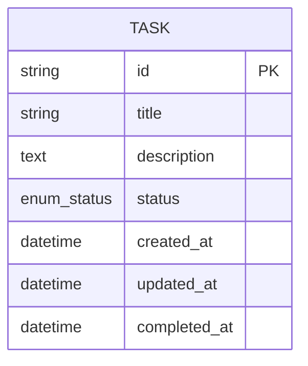

Tôi sẽ chuyển hóa SRS này thành Design Document chi tiết. Đây là bản thiết kế đầu tiên (không phải bản sửa feedback).

---

# DESIGN DOCUMENT

**Dự án:** Personal Task Manager  
**Phiên bản:** 1.0  
**Ngày:** 2024  
**Dựa trên:** SRS v1.0 (Draft — chưa có bản approved, sử dụng prd_v1 làm fallback)

---

# 1. PROCESS MODEL

## Luồng chính

```mermaid
flowchart TD
    Start([Start: Mở ứng dụng]) --> Init[Khởi tạo ứng dụng<br/>Đọc dữ liệu từ localStorage]
    Init --> LoadList{Danh sách<br/>có dữ liệu?}
    
    LoadList -- No --> ShowEmpty[Hiển thị trạng thái rỗng<br/>"Nhấn để thêm việc cần làm đầu tiên"<br/><i>FR-003 AC2</i>]
    LoadList -- Yes --> ShowList[Hiển thị danh sách nhiệm vụ<br/>Sắp xếp: chưa hoàn thành trước,<br/>mới nhất trước<br/><i>FR-003 AC1, BR-004</i>]
    
    ShowEmpty --> UserAction1{Người dùng<br/>thao tác?}
    ShowList --> UserAction2{Người dùng<br/>thao tác?}
    
    %% Tạo nhiệm vụ mới
    UserAction1 -- "Tạo nhiệm vụ" --> InputTitle[Nhập tiêu đề<br/>Giới hạn 200 ký tự<br/>Đếm ký tự hiển thị]
    UserAction2 -- "Tạo nhiệm vụ" --> InputTitle
    
    InputTitle --> ValidateTitle{Tiêu đề<br/>hợp lệ?}
    ValidateTitle -- No (rỗng/chỉ khoảng trắng) --> ShowErrEmpty[Hiển thị lỗi: "Tiêu đề không được để trống"<br/><i>FR-001 AC2, BR-001, BR-002</i>] --> InputTitle
    ValidateTitle -- No (vượt 200 ký tự) --> BlockInput[Ngăn nhập thêm<br/>Hiển thị "0/200"<br/><i>FR-001 AC3</i>] --> InputTitle
    ValidateTitle -- Yes --> InputDesc[Nhập mô tả tùy chọn<br/>Giới hạn 1000 ký tự<br/><i>FR-002</i>]
    
    InputDesc --> ConfirmCreate[Xác nhận tạo]
    ConfirmCreate --> Normalize[Chuẩn hóa: trim, collapse spaces<br/><i>BR-002</i>]
    Normalize --> SaveCreate[Lưu nhiệm vụ mới<br/>status: pending<br/>created_at: now<br/>updated_at: now<br/><i>FR-001 AC1</i>]
    SaveCreate --> Persist[Persist localStorage<br/><i>FR-008</i>]
    Persist --> ShowList
    
    %% Xem danh sách + Lọc
    UserAction2 -- "Chọn lọc trạng thái" --> ApplyFilter[Áp dụng bộ lọc:<br/>• All: hiển thị tất cả<br/>• Pending: chỉ chưa hoàn thành<br/>• Completed: chỉ đã hoàn thành<br/><i>FR-007</i>]
    ApplyFilter --> ShowFiltered[Hiển thị danh sách đã lọc<br/>Giữ nguyên thứ tự sắp xếp<br/>trong mỗi nhóm]
    ShowFiltered --> UserAction2
    
    %% Đánh dấu hoàn thành
    UserAction2 -- "Đánh dấu hoàn thành" --> CheckTask{Trạng thái<br/>hiện tại?}
    CheckTask -- "pending" --> MarkDone[Chuyển status: completed<br/>completed_at: now<br/>updated_at: now<br/><i>FR-004 AC1</i>]
    CheckTask -- "completed" --> MarkUndo[Chuyển status: pending<br/>completed_at: null<br/>updated_at: now<br/><i>FR-004 AC2</i>]
    MarkDone --> Persist
    MarkUndo --> Persist
    
    %% Chỉnh sửa nhiệm vụ
    UserAction2 -- "Chỉnh sửa" --> CheckEditable{Trạng thái<br/>nhiệm vụ?}
    CheckEditable -- "completed" --> BlockEdit[Chỉ cho phép bỏ đánh dấu hoàn thành<br/>Không cho sửa nội dung<br/><i>FR-006 AC2, BR-003</i>] --> UserAction2
    CheckEditable -- "pending" --> EditForm[Mở form chỉnh sửa<br/>Tiêu đề + Mô tả<br/><i>FR-006 AC1</i>]
    EditForm --> ValidateEdit{Tiêu đề<br/>hợp lệ?}
    ValidateEdit -- No --> ShowErrEdit[Hiển thị lỗi tương tự tạo mới] --> EditForm
    ValidateEdit -- Yes --> SaveEdit[Lưu thay đổi<br/>updated_at: now<br/><i>FR-006 AC1</i>]
    SaveEdit --> Persist
    
    %% Xóa nhiệm vụ
    UserAction2 -- "Xóa nhiệm vụ" --> ConfirmDelete{Hộp thoại<br/>xác nhận}
    ConfirmDelete -- "Hủy" --> UserAction2
    ConfirmDelete -- "Xác nhận xóa" --> HardDelete[Xóa vĩnh viễn khỏi danh sách<br/>Không lưu lịch sử<br/><i>FR-005, BR-005</i>]
    HardDelete --> Persist
    
    %% Kết thúc
    UserAction2 -- "Đóng ứng dụng" --> End([End])
    ShowEmpty --> UserAction1
    
    style Start fill:#e1f5e1
    style End fill:#ffe1e1
    style ShowErrEmpty fill:#ffe1e1
    style BlockEdit fill:#ffe1e1
```

## Luồng ngoại lệ

| Edge Case | Cách xử lý | Tham chiếu SRS |
|-----------|-----------|----------------|
| **localStorage đầy (quota exceeded)** | Hiển thị cảnh báo: "Bộ nhớ đã đầy, không thể lưu thêm. Vui lòng xóa nhiệm vụ cũ." Không cho phép tạo mới đến khi giải phóng. | NFR-005 (500+ tasks), NFR-004 |
| **localStorage không khả dụng (private mode Safari, disabled)** | Fallback sang memory storage + hiển thị banner cảnh báo: "Dữ liệu sẽ không được lưu khi đóng trình duyệt." | FR-008, NFR-004 |
| **Dữ liệu localStorage bị corrupt (invalid JSON)** | Xóa toàn bộ dữ liệu cũ, khởi tạo danh sách rỗng, log lỗi console. Tránh crash ứng dụng. | NFR-004 |
| **Tạo nhiệm vụ khi đã có 1000 nhiệm vụ** | Hiển thị cảnh báo: "Bạn đã đạt giới hạn 1000 nhiệm vụ. Vui lòng xóa bớt trước khi tạo mới." | NFR-005 |
| **Xóa nhiệm vụ khi đang lọc/filter** | Xóa khỏi data, cập nhật view hiện tại (có thể rỗng nếu xóa hết). Không reset filter. | FR-005 |
| **Thao tác nhanh liên tiếp (double click)** | Debounce 300ms các thao tác CRUD; disable button trong lúc xử lý. | NFR-001 (300ms response) |

---

# 2. DATA MODEL

## ERD



> **Giả định:** Do không có đăng nhập, không có entity USER. Mỗi thiết bị/browser là một không gian dữ liệu độc lập (BR-006). Dữ liệu lưu trực tiếp trong localStorage dạng JSON array, không cần junction table vì chỉ có 1 entity.

## Data Dictionary

| Entity | Field | Kiểu | Bắt buộc | Mô tả |
|--------|-------|------|----------|-------|
| **TASK** | `id` | string | Có | PK. UUID v4 (e.g., "550e8400-e29b-41d4-a716-446655440000") hoặc timestamp + random suffix để đảm bảo unique client-side |
| **TASK** | `title` | string | Có | Tiêu đề nhiệm vụ. Đã trim, collapse spaces. Độ dài 1–200 ký tự sau khi chuẩn hóa |
| **TASK** | `description` | text | Không | Mô tả chi tiết. Cho phép rỗng. Độ dài 0–1000 ký tự |
| **TASK** | `status` | enum(pending, completed) | Có | Trạng thái: `pending` = chưa hoàn thành, `completed` = đã hoàn thành. Mặc định: `pending` |
| **TASK** | `created_at` | datetime | Có | Thời điểm tạo nhiệm vụ. ISO 8601 format. Dùng để sắp xếp |
| **TASK** | `updated_at` | datetime | Có | Thời điểm cập nhật gần nhất. Tự động cập nhật khi có thay đổi |
| **TASK** | `completed_at` | datetime | Không | Thời điểm đánh dấu hoàn thành. `null` khi `status = pending` |

### localStorage Schema

```javascript
// Key: "ptm_tasks"
// Value: JSON string of Task[]
{
  "ptm_tasks": "[...]",           // Mảng serialized Task[]
  "ptm_version": "1.0",             // Schema version để migration tương lai
  "ptm_last_sync": "2024-01-15T08:30:00Z"  // Timestamp để debug
}
```

---

# 3. UI SCREENS

## Danh sách màn hình

```
01_task_list|Danh sách nhiệm vụ
02_task_form|Form nhiệm vụ
03_task_detail|Chi tiết nhiệm vụ
04_empty_state|Trạng thái rỗng
05_confirm_delete|Xác nhận xóa
```

### Chi tiết mỗi màn hình

| # | Tên file | Tên hiển thị | Mục đích | Các FR liên quan |
|---|----------|-------------|----------|----------------|
| 01 | `task_list` | Danh sách nhiệm vụ | Màn hình chính: hiển thị, lọc, đánh dấu hoàn thành, xóa | FR-003, FR-004, FR-005, FR-007 |
| 02 | `task_form` | Form nhiệm vụ | Tạo mới hoặc chỉnh sửa nhiệm vụ (mode chia sẻ) | FR-001, FR-002, FR-006 |
| 03 | `task_detail` | Chi tiết nhiệm vụ | Xem chi tiết nhiệm vụ có mô tả dài | FR-003, FR-004 |
| 04 | `empty_state` | Trạng thái rỗng | Hiển thị khi chưa có nhiệm vụ nào | FR-003 AC2 |
| 05 | `confirm_delete` | Xác nhận xóa | Modal xác nhận trước khi xóa vĩnh viễn | FR-005 |

### Giải thích thiết kế màn hình

- **Gộp tạo/sửa vào `task_form`:** Cùng 1 form, khác nhau ở title ("Thêm việc mới" vs "Chỉnh sửa") và prefill data. Giảm số lượng màn hình, đảm bảo consistency.
- **`task_detail` riêng biệt:** Dù có thể hiển thị mô tả trong list, nhưng với mô tả dài (1000 ký tự) cần view riêng để tránh clutter list view. Đồng thời đây là nơi rõ ràng để block edit nếu completed (BR-003).
- **`empty_state` có thể là component trong `task_list`:** Không cần route riêng, nhưng vẫn liệt kê để đảm bảo đủ thiết kế UI.

---

## TỰ KIỂM TRA (Self-Check)

| # | Tiêu chí | Kết quả |
|---|----------|---------|
| ☑ | ERD có đủ PK cho mọi entity và FK cho mọi quan hệ? | TASK.id là PK. Không có FK vì chỉ 1 entity. |
| ☑ | Mọi quan hệ many-to-many đã có junction table? | Không có many-to-many trong thiết kế này. |
| ☑ | Mọi FR (Must + Should) đều được thể hiện qua Process/Data Model? | FR-001→008 đều được map. FR-006 (ShouldXY) có trong Process Model. |
| ☑ | NFR quan trọng (Security, Performance) phản ánh qua thiết kế? | NFR-001 (debounce 300ms), NFR-002 (XSS prevention qua input sanitization), NFR-005 (500/1000 tasks limit), NFR-007 (ARIA labels ghi chú cho UI team). |
| ☑ | Đủ màn hình cho mọi role hoàn thành mọi FR? | Chỉ 1 role (End User), 5 màn hình đủ cho tất cả thao tác. |
| ☑ | Số lượng màn hình trong khoảng 3–8? | 5 màn hình. ✓ |
| ☑ | Bản sửa feedback reject? | Không áp dụng (bản thiết kế đầu tiên). |

---

## GHI CHÚ BỔ SUNG CHO UI/UX TEAM

| STT | Ghi chú |
|-----|---------|
| 1 | **ARIA labels (NFR-007):** Checkbox hoàn thành cần `aria-label="Đánh dấu hoàn thành nhiệm vụ [tiêu đề]"`. Nút xóa cần `aria-label="Xóa nhiệm vụ [tiêu đề]"`. |
| 2 | **Contrast ratio (NFR-007):** Màu trạng thái `pending`/`completed` phải đạt ≥ 4.5:1 với nền. Khuyến nghị không dùng màu duy nhất để phân biệt (thêm icon hoặc text). |
| 3 | **Responsive breakpoints (NFR-006):** Mobile < 768px: full-width list, form dạng bottom sheet. Tablet 768–1024px: 2-column nếu có space. Desktop > 1024px: max-width 720px centered. |
| 4 | **Empty state illustration:** Nên có hình minh họa đơn giản (SVG < 10KB) để hỗ trợ NFR-003 (30s first task). |
| 5 | **Loading state:** Do localStorage đọc nhanh, không cần spinner toàn màn hình. Dùng skeleton hoặc instant render với fade-in. |

---

## GHI CHÚ BỔ SUNG CHO DEV TEAM

| STT | Ghi chú |
|-----|---------|
| 1 | **Storage abstraction:** Tạo layer `StorageService` để dễ dàng switch từ localStorage sang IndexedDB nếu cần scale lên (NFR-005). |
| 2 | **Schema versioning:** Lưu `ptm_version` để migration khi có thay đổi data structure trong tương lai. |
| 3 | **Input sanitization:** Dùng `DOMPurify` hoặc tương đương trước khi render user input để chống XSS (NFR-002). |
| 4 | **ID generation:** Không dùng `Math.random()` cho production. Dùng `crypto.randomUUID()` nếu browser hỗ trợ, fallback về `Date.now()` + `Math.random()` với entropy đủ cao. |
| 5 | **Performance với 500+ tasks:** Cân nhắc virtual scrolling nếu list dài. Hiện tại chưa cần nhưng code nên dễ refactor. |