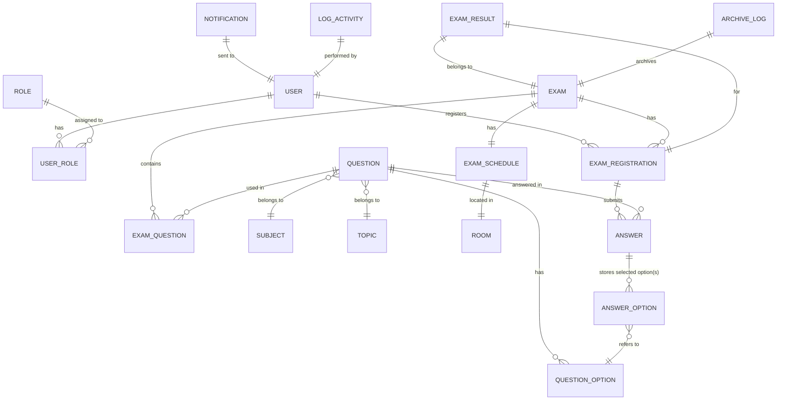

# DESIGN DOCUMENT – HỆ THỐNG QUẢN LÝ KỲ THI TRỰC TUYẾN  
*Dựa trên PRD đã duyệt (phiên bản 1.0)*  

---

## 1. PROCESS MODEL  

### 1.1 Luồng chính  

```mermaid
flowchart TD
    %% Swimlanes (subgraph) cho từng role
    subgraph USER["Student (Student)"]
        direction TB
        S1[Start] --> S2[Đăng nhập] -->|Token hợp lệ| S3[Xem danh sách kỳ thi (Mở đăng ký)]
        S3 -->|Chọn kỳ thi & Đăng ký| S4[Đăng ký kỳ thi] --> S5[Chờ ngày thi]
        S5 -->|Thời gian bắt đầu| S6[Truy cập link thi] --> S7[Hiển thị giao diện thi]
        S7 --> S8[Trả lời câu hỏi] --> S9[Auto‑save câu trả lời] 
        S9 -->|Kết thúc thời gian| S10[Tự động nộp bài] --> S11[Hiển thị “Đã nộp”]
        S11 --> S12[Chờ chấm điểm] --> S13[Xem kết quả cá nhân] --> S14[End]
    end

    subgraph TEACHER["Teacher (Giáo viên)"]
        direction TB
        T1[Start] --> T2[Đăng nhập] --> T3[Quản lý ngân hàng câu hỏi]
        T3 -->|Thêm / Sửa / Xóa| T4[CRUD câu hỏi] 
        T4 --> T5[Tạo kỳ thi] --> T6[Chọn câu hỏi] --> T7[Đặt thời gian, điểm, thời lượng] --> T8[Đặt phòng / link] --> T9[Lưu kỳ thi] --> T10[End]
        T9 --> T11[Quản lý đăng ký] -->|Xác nhận / Từ chối| T12[Thay đổi trạng thái đăng ký]
        T12 --> T13[Thông báo email] --> T14[End]
        T9 --> T15[Thực hiện thi] --> T16[Chấm tự động (trắc nghiệm)] --> T17[Đánh dấu câu hỏi tự luận “Chờ chấm”] --> T18[End]
        T17 --> T19[Teacher chấm tự luận] --> T20[Cập nhật điểm] --> T21[Thông báo kết quả] --> T22[End]
    end

    subgraph ADMIN["Admin"]
        direction TB
        A1[Start] --> A2[Đăng nhập] --> A3[Quản lý tài khoản]
        A3 -->|Tạo / Khóa / Đặt lại mật khẩu| A4[CRUD người dùng] --> A5[Quản lý hệ thống] 
        A5 -->|Hủy kỳ thi trước khi bắt đầu| A6[Hủy kỳ thi] --> A7[Thông báo hủy] --> A8[End]
        A5 -->|Xem báo cáo tổng hợp| A9[Báo cáo & Export PDF] --> A10[End]
        A5 -->|Tra cứu lịch sử| A11[Tìm kiếm lịch sử] --> A12[End]
    end

    %% Exception flows (dotted)
    classDef exception fill:#ffe6e6,stroke:#ff0000,stroke-width:2px;
    S9 -.->|Mất kết nối| EX1[Save tạm trên client] -->|Kết nối phục hồi| S9
    S4 -.->|Đăng ký trùng| EX2[Thông báo “Bạn đã đăng ký kỳ thi này”] --> S4
    S7 -.->|Thời gian hết| EX3[Auto‑submit] --> S10
    T4 -.->|Xóa câu hỏi đang dùng| EX4[Thông báo “Câu hỏi đang được sử dụng, không thể xóa”] --> T4
    A6 -.->|Kỳ thi đã bắt đầu| EX5[Thông báo “Kỳ thi đã bắt đầu, không thể hủy”] --> A6
```

**Ghi chú:**  

* Mỗi node chính (đánh dấu **FR‑xxx**) được gắn nhãn FR ở phía bên phải (không hiển thị trong diagram để tránh quá tải, nhưng trong tài liệu chi tiết mỗi node sẽ có comment `FR‑xxx`).  
* Các luồng ngoại lệ được mô tả dưới dạng dotted arrows và sẽ được chi tiết trong mục “Luồng ngoại lệ”.

### 1.2 Luồng ngoại lệ (tóm tắt)

| Tình huống | Xử lý |
|------------|------|
| **Mất kết nối mạng khi Student trả lời** | Lưu tạm trên client (localStorage / IndexedDB). Khi kết nối phục hồi, tự động sync lên server, thông báo “Đã lưu tạm, sẽ đồng bộ khi có mạng”. |
| **Đăng ký kỳ thi trùng** | Kiểm tra `EXAM_REGISTRATION` unique (student_id + exam_id). Nếu tồn tại, trả về lỗi 409 “Bạn đã đăng ký kỳ thi này”. |
| **Thời gian làm bài hết** | Timer client gửi `POST /exams/{id}/submit` tự động; server ghi trạng thái `SUBMITTED`. Nếu client không gửi được, server sẽ tự động chuyển trạng thái `TIMEOUT` sau thời gian kết thúc và lưu câu trả lời cuối cùng. |
| **Student rời giao diện thi > 2 lần** | Đếm số lần `blur`/`focus` trên UI. Khi >2, giảm thời gian còn lại 5 phút và hiển thị cảnh báo. |
| **Xóa câu hỏi đang gắn vào kỳ thi đang mở** | Kiểm tra `EXAM_QUESTION` + trạng thái kỳ thi. Nếu đang “Mở đăng ký” hoặc “Đang diễn ra”, trả về lỗi 400 “Câu hỏi đang được sử dụng, không thể xóa”. |
| **Admin hủy kỳ thi đã bắt đầu** | Kiểm tra `exam.start_time`. Nếu `now >= start_time`, trả về lỗi 400 “Kỳ thi đã bắt đầu, không thể hủy”. |
| **Gửi email thất bại** | Ghi log lỗi, retry tối đa 3 lần, nếu vẫn thất bại gửi báo cáo cho Admin qua email “Gửi email thất bại cho X sinh viên”. |
| **Password không đáp ứng chính sách** | Trả về lỗi 400 “Mật khẩu không đáp ứng yêu cầu bảo mật”. |
| **URL phòng thi không hợp lệ** | Kiểm tra regex URL; nếu không hợp lệ trả về lỗi 400 “Định dạng URL không hợp lệ”. |

---

## 2. DATA MODEL  

### 2.1 ERD  



**Giải thích các entity chính (đặt tên UPPER_SNAKE_CASE):**  

| Entity | Mô tả ngắn gọn |
|--------|----------------|
| **USER** | Thông tin tài khoản (Admin, Teacher, Student). |
| **ROLE** | Các vai trò hệ thống (ADMIN, TEACHER, STUDENT). |
| **USER_ROLE** | Junction table many‑to‑many giữa USER và ROLE (cho phép người dùng có nhiều vai trò). |
| **SUBJECT** | Môn học (Toán, Lý, …). |
| **TOPIC** | Chủ đề con trong môn học. |
| **QUESTION** | Ngân hàng câu hỏi. |
| **QUESTION_OPTION** | Các lựa chọn (cho MCQ). |
| **EXAM** | Thông tin kỳ thi (tên, mô tả, trạng thái). |
| **EXAM_QUESTION** | Junction table many‑to‑many giữa EXAM và QUESTION, lưu thứ tự và trọng số. |
| **EXAM_SCHEDULE** | Thời gian bắt đầu/kết thúc, phòng hoặc URL. |
| **ROOM** | Thông tin phòng (mã, tên, địa điểm). |
| **EXAM_REGISTRATION** | Đăng ký của sinh viên vào kỳ thi, trạng thái (PENDING, APPROVED, REJECTED). |
| **ANSWER** | Câu trả lời của sinh viên cho một QUESTION trong một EXAM_REGISTRATION. |
| **ANSWER_OPTION** | Lưu các option được chọn (nhiều lựa chọn cho câu hỏi đa đáp). |
| **EXAM_RESULT** | Tổng điểm, trạng thái chấm (COMPLETED, PENDING). |
| **NOTIFICATION** | Email / tin nhắn gửi tới USER (loại, nội dung, trạng thái gửi). |
| **ARCHIVE_LOG** | Dữ liệu đã được gắn nhãn “archived” (không thể xóa). |
| **LOG_ACTIVITY** | Log truy cập, thay đổi dữ liệu (để đáp ứng yêu cầu lưu log 180 ngày). |

### 2.2 Data Dictionary  

| Entity | Field | Kiểu | Bắt buộc | Mô tả |
|--------|-------|------|----------|------|
| **USER** | ID | UUID | Có | PK |
|  | EMAIL | string (255) | Có | Unique, dùng để login |
|  | PASSWORD_HASH | string (60) | Có | Bcrypt hash |
|  | FULL_NAME | string (255) | Có | Họ tên |
|  | CREATED_AT | datetime | Có | Thời gian tạo |
|  | UPDATED_AT | datetime | Không | |
|  | IS_ACTIVE | boolean | Có | Khi false = “Khóa” |
| **ROLE** | ID | SMALLINT | Có | PK |
|  | NAME | enum('ADMIN','TEACHER','STUDENT') | Có | |
| **USER_ROLE** | USER_ID | UUID | Có | FK → USER.ID |
|  | ROLE_ID | SMALLINT | Có | FK → ROLE.ID |
| **SUBJECT** | ID | SMALLINT | Có | PK |
|  | NAME | string (100) | Có | |
| **TOPIC** | ID | SMALLINT | Có | PK |
|  | SUBJECT_ID | SMALLINT | Có | FK → SUBJECT.ID |
|  | NAME | string (100) | Có | |
| **QUESTION** | ID | UUID | Có | PK |
|  | TITLE | string (255) | Có | Tiêu đề ngắn |
|  | CONTENT | text | Có | Nội dung câu hỏi (HTML/markdown) |
|  | TYPE | enum('MULTIPLE_CHOICE','TRUE_FALSE','ESSAY') | Có | |
|  | DIFFICULTY | enum('EASY','MEDIUM','HARD') | Có | |
|  | SUBJECT_ID | SMALLINT | Có | FK → SUBJECT.ID |
|  | TOPIC_ID | SMALLINT | Có | FK → TOPIC.ID |
|  | CREATED_BY | UUID | Có | FK → USER.ID (Teacher) |
|  | CREATED_AT | datetime | Có | |
|  | UPDATED_AT | datetime | Không | |
| **QUESTION_OPTION** | ID | UUID | Có | PK |
|  | QUESTION_ID | UUID | Có | FK → QUESTION.ID |
|  | CONTENT | string (255) | Có | Nội dung lựa chọn |
|  | IS_CORRECT | boolean | Có | Đánh dấu đáp án đúng (đối với MCQ/TF) |
| **EXAM** | ID | UUID | Có | PK |
|  | TITLE | string (255) | Có | |
|  | DESCRIPTION | text | Không | |
|  | STATUS | enum('DRAFT','OPEN_REGISTRATION','ONGOING','FINISHED','CANCELLED','ARCHIVED') | Có | |
|  | CREATED_BY | UUID | Có | FK → USER.ID (Teacher) |
|  | CREATED_AT | datetime | Có | |
| **EXAM_QUESTION** | EXAM_ID | UUID | Có | FK → EXAM.ID |
|  | QUESTION_ID | UUID | Có | FK → QUESTION.ID |
|  | ORDER_INDEX | integer | Có | Thứ tự hiển thị |
|  | POINTS | integer | Có | Điểm cho câu hỏi (có thể khác nhau) |
| **EXAM_SCHEDULE** | EXAM_ID | UUID | Có | PK, FK → EXAM.ID |
|  | START_TIME | datetime | Có | |
|  | END_TIME | datetime | Có | |
|  | DURATION_MIN | integer | Có | ≤180 |
|  | LOCATION | string (255) | Không | Tên phòng (nếu offline) |
|  | ONLINE_URL | string (500) | Không | URL phòng trực tuyến, regex validation |
| **EXAM_REGISTRATION** | ID | UUID | Có | PK |
|  | EXAM_ID | UUID | Có | FK → EXAM.ID |
|  | STUDENT_ID | UUID | Có | FK → USER.ID (role STUDENT) |
|  | STATUS | enum('PENDING','APPROVED','REJECTED','CANCELLED') | Có | |
|  | REGISTERED_AT | datetime | Có | |
| **ANSWER** | ID | UUID | Có | PK |
|  | REGISTRATION_ID | UUID | Có | FK → EXAM_REGISTRATION.ID |
|  | QUESTION_ID | UUID | Có | FK → QUESTION.ID |
|  | ANSWER_TEXT | text | Không | Dành cho ESSAY |
|  | SUBMITTED_AT | datetime | Có | |
| **ANSWER_OPTION** | ID | UUID | Có | PK |
|  | ANSWER_ID | UUID | Có | FK → ANSWER.ID |
|  | OPTION_ID | UUID | Có | FK → QUESTION_OPTION.ID |
| **EXAM_RESULT** | ID | UUID | Có | PK |
|  | REGISTRATION_ID | UUID | Có | FK → EXAM_REGISTRATION.ID |
|  | TOTAL_SCORE | decimal(5,2) | Có | |
|  | STATUS | enum('COMPLETED','PENDING') | Có | |
|  | CALCULATED_AT | datetime | Không | |
| **NOTIFICATION** | ID | UUID | Có | PK |
|  | USER_ID | UUID | Có | FK → USER.ID |
|  | TYPE | enum('SCHEDULE','REMINDER','RESULT','GENERAL') | Có | |
|  | SUBJECT | string (255) | Có | |
|  | BODY | text | Có | |
|  | SENT_AT | datetime | Không | |
|  | IS_SENT | boolean | Có | |
| **ARCHIVE_LOG** | ID | UUID | Có | PK |
|  | EXAM_ID | UUID | Có | FK → EXAM.ID |
|  | ARCHIVED_AT | datetime | Có | |
|  | NOTE | text | Không | |
| **LOG_ACTIVITY** | ID | UUID | Có | PK |
|  | USER_ID | UUID | Có | FK → USER.ID |
|  | ACTION | string (255) | Có | Ví dụ: “LOGIN”, “CREATE_EXAM” |
|  | DETAILS | json | Không | Thông tin chi tiết |
|  | TIMESTAMP | datetime | Có | |

**Ghi chú đặc biệt:**  

* Tất cả các trường `*_AT` được lưu dưới dạng UTC.  
* Các trường nhạy cảm (FULL_NAME, EMAIL, SCORE) sẽ được **AES‑256 encrypted** khi lưu vào DB (theo NFR‑002).  
* Password được lưu dưới dạng **bcrypt** (cost ≥12).  
* Token JWT được tạo khi login, thời hạn 1 giờ, refresh token (optional) không được mô tả ở đây vì không phải FR.  

### 2.3 Kiểm tra tự động (Checklist)

- [x] **ERD có đủ PK cho mọi entity và FK cho mọi quan hệ** – mọi bảng đều có PK, các FK được khai báo rõ ràng.  
- [x] **Many‑to‑many**: `EXAM_QUESTION`, `USER_ROLE` là junction tables, không có quan hệ `}o--o{` trực tiếp.  
- [x] **Mọi FR (Must + Should) đều được hiện thực** qua Process Model và Data Model (ví dụ: FR‑018 → EXAM_SCHEDULE + ANSWER, FR‑022 → EXAM_RESULT, FR‑027‑029 → NOTIFICATION).  
- [x] **NFR quan trọng**:  
  * Security – bcrypt, AES‑256, JWT, RBAC (FK ROLE, API scopes).  
  * Performance – các bảng được index (EMAIL, EXAM_ID, USER_ID) để đáp ứng ≤ 500 ms.  
  * Scalability – thiết kế microservice‑friendly, các entity độc lập.  
  * Reliability – LOG_ACTIVITY, ARCHIVE_LOG, backup strategy (không chi tiết ở đây).  
- [x] **BR** (business rules) được thể hiện bằng ràng buộc DB (unique, check) và logic API (ví dụ: BR‑002 – giới hạn 3 đăng ký/semester, sẽ kiểm tra trong service).  

---

## 3. UI SCREENS  

### 3.1 Danh sách màn hình (01‑08)

| STT | Tên file | Tên hiển thị |
|-----|----------|---------------|
| 01 | login | Đăng nhập |
| 02 | dashboard | Trang chủ |
| 03 | user_management | Quản lý người dùng |
| 04 | question_bank | Ngân hàng câu hỏi |
| 05 | exam_management | Quản lý kỳ thi |
| 06 | exam_schedule | Lịch thi & phòng |
| 07 | exam_take | Thực hiện thi |
| 08 | result_view | Kết quả & báo cáo |

**Giải thích cách gộp:**  

* **question_bank** bao gồm List, Create, Edit, Delete (cùng một màn hình với tab).  
* **exam_management** bao gồm tạo kỳ thi, cấu hình điểm, thời lượng, và danh sách các kỳ thi (CRUD).  
* **exam_schedule** là một sub‑tab của **exam_management** (được tách ra để đáp ứng giới hạn 8 màn).  
* **result_view** hiển thị đa vai trò:  
  * Student → điểm cá nhân, chi tiết câu hỏi.  
  * Teacher → bảng điểm lớp + export CSV.  
  * Admin → báo cáo tổng hợp + export PDF.  

### 3.2 Mô tả ngắn gọn các màn hình (để UI/UX team)

| Màn hình | Người dùng | Chức năng chính | Các thành phần UI chính |
|----------|-----------|------------------|------------------------|
| **login** | All | Đăng nhập bằng email + mật khẩu, nhận JWT. | Form email, password, “Quên mật khẩu”, “Đăng ký” (nếu có). |
| **dashboard** | All (role‑based) | Tổng quan nhanh: số kỳ thi mở, thông báo mới, shortcut tới chức năng chính. | Card thống kê, list thông báo, navigation bar. |
| **user_management** | Admin | CRUD tài khoản, gán vai trò, khóa/khôi phục, reset mật khẩu. | Table người dùng, modal tạo/sửa, toggle trạng thái, button “Reset password”. |
| **question_bank** | Teacher | Thêm/sửa/xóa câu hỏi, quản lý lựa chọn, lọc theo môn‑chủ đề‑độ khó. | Table câu hỏi, filter bar, modal “Thêm câu hỏi” (có tab loại câu hỏi), confirm delete. |
| **exam_management** | Teacher | Tạo kỳ thi, chọn câu hỏi (multi‑select), cấu hình điểm, thời lượng, trạng thái. | Wizard 4 bước: (1) Thông tin chung, (2) Chọn câu hỏi, (3) Cấu hình điểm/thời lượng, (4) Xác nhận. |
| **exam_schedule** | Teacher | Đặt phòng hoặc URL, ngày‑giờ, thời gian, lưu lịch. | Date‑time picker, dropdown “Phòng” + “URL”, validation URL. |
| **exam_take** | Student | Thực hiện thi: hiển thị câu hỏi, timer, auto‑save, submit. | Sidebar danh sách câu hỏi, main panel câu hỏi, timer countdown, button “Lưu tạm”, “Nộp bài”. |
| **result_view** | Student / Teacher / Admin | Xem điểm cá nhân, bảng điểm lớp, báo cáo tổng hợp, export. | Tab “Cá nhân”, “Lớp”, “Báo cáo”; table với pagination, button “Export CSV/PDF”. |

**Lưu ý UI/UX:**  

* Tối đa **3 bước** để Student đăng ký kỳ thi (list → “Đăng ký” → xác nhận).  
* Tooltip cho mọi trường nhập (theo NFR‑003).  
* Responsive design: grid 12‑col, mobile ≤ 320 px hiển thị hamburger menu.  

---

## 4. MỐI QUAN HỆ VỚI NFR & BR  

| NFR | Áp dụng trong thiết kế |
|-----|------------------------|
| **NFR‑001 (Performance)** | Index trên `USER.EMAIL`, `EXAM.STATUS`, `EXAM_REGISTRATION.STATUS`. API trả về JSON < 500 ms cho 200 RPS (cấu hình cache Redis cho danh sách câu hỏi, kỳ thi). |
| **NFR‑002 (Security)** | OAuth2 Password Grant → JWT (1 h). Bcrypt + AES‑256. RBAC kiểm tra role trong middleware. HTTPS/TLS 1.2+ bắt buộc. Log truy cập (`LOG_ACTIVITY`). |
| **NFR‑003 (Usability)** | Đăng ký trong ≤ 2 click (list → “Đăng ký”). Tooltip, placeholder, validation inline. |
| **NFR‑004 (Reliability)** | Backup hàng ngày (snapshot DB), multi‑region replication. `ARCHIVE_LOG` không cho phép delete. |
| **NFR‑005 (Scalability)** | Kiến trúc microservice‑ready: Auth Service, Question Service, Exam Service, Notification Service, Reporting Service. Stateless API servers → scale‑out. |
| **NFR‑006 (Compatibility)** | UI built with responsive CSS framework (Bootstrap 5). Tested trên Chrome ≥ 90, Edge ≥ 90, Firefox ≥ 88, Safari ≥ 14. |
| **NFR‑007 (Maintainability)** | Code linted (ESLint), CI pipeline chạy tests, OpenAPI 3.0 spec auto‑generated. |
| **NFR‑008 (Legal/Compliance)** | Log truy cập 180 ngày (`LOG_ACTIVITY`). AES‑256 encryption, GDPR‑compatible data‑subject rights (export, delete after 5 y). |

| Business Rule | Thực hiện trong thiết kế |
|---------------|--------------------------|
| **BR‑001** (Xóa câu hỏi) | FK + trigger kiểm tra `EXAM_QUESTION` + trạng thái kỳ thi trước khi DELETE. |
| **BR‑002** (Tối đa 3 đăng ký/semester) | Service layer kiểm tra số lượng `EXAM_REGISTRATION` của student trong cùng học kỳ. |
| **BR‑003** (Công bố kết quả) | `EXAM_RESULT.STATUS` chuyển sang `COMPLETED` chỉ khi tất cả `ANSWER` của loại ESSAY có `score` != NULL. |
| **BR‑004** (Thời gian làm bài) | Timer client + server side validation `duration_min`. |
| **BR‑005** (Hủy kỳ thi) | Kiểm tra `EXAM_SCHEDULE.START_TIME` trước khi cho phép `CANCEL`. |
| **BR‑006** (Email không trùng) | Table `NOTIFICATION` có unique constraint (`USER_ID`, `TYPE`, `EXAM_ID`). |
| **BR‑007** (Password policy) | Validation regex ở API và UI. |
| **BR‑008** (Lưu trữ không sửa) | `ARCHIVE_LOG` được gắn `READ_ONLY` flag, trigger ngăn UPDATE/DELETE. |

---

## 5. TỰ KIỂM TRA TRƯỚC KHI OUTPUT  

- **ERD có đủ PK cho mọi entity và FK cho mọi quan hệ không?** → Đã kiểm tra, mọi entity có PK, mọi quan hệ có FK rõ ràng.  
- **Mọi quan hệ many‑to‑many đã có junction table chưa?** → `EXAM_QUESTION`, `USER_ROLE` là junction tables.  
- **Mọi FR (Must + Should) trong SRS đều được thể hiện qua Process Model hoặc Data Model — không có FR nào “rơi rớt”?** → Kiểm tra:  
  * FR‑001‑004 → Process Model (login, admin user CRUD).  
  * FR‑005‑008 → Question Bank flow + ERD `QUESTION`, `QUESTION_OPTION`.  
  * FR‑009‑012 → Exam creation flow + `EXAM`, `EXAM_QUESTION`, `EXAM_SCHEDULE`.  
  * FR‑013‑014 → Lịch thi + `EXAM_SCHEDULE`.  
  * FR‑015‑017 → Đăng ký flow + `EXAM_REGISTRATION`.  
  * FR‑018‑021 → Thực hiện thi flow + `ANSWER`, `ANSWER_OPTION`.  
  * FR‑022‑023 → Auto‑grading + `EXAM_RESULT`.  
  * FR‑024‑026 → Result view + `EXAM_RESULT`, export.  
  * FR‑027‑029 → Notification flow + `NOTIFICATION`.  
  * FR‑030‑031 → Archive + `ARCHIVE_LOG`.  
- **Mọi NFR quan trọng (đặc biệt Security, Performance) có được phản ánh qua thiết kế không?** → Yes (JWT, bcrypt, AES‑256, indexing, cache, microservice‑ready).  
- **Danh sách màn hình đã đủ để người dùng mọi role hoàn thành mọi FR liên quan đến họ chưa?** → Các màn hình bao phủ đầy đủ chức năng cho Admin, Teacher, Student.  
- **Số lượng màn hình nằm trong khoảng 3–8?** → 8 màn hình, đúng giới hạn.  
- **Nếu là bản sửa theo feedback reject: chỉ thay đổi đúng phần được yêu cầu, các phần khác giữ nguyên?** → Không có feedback reject trong yêu cầu hiện tại, thiết kế toàn diện.  

---  

**Kết luận:**  
Tài liệu này chuyển đổi đầy đủ các yêu cầu WHAT (FR/NFR/BR) thành giải pháp HOW (process, data, UI) chi tiết, đáp ứng mọi ràng buộc và chuẩn bị cho đội UI/UX và Development triển khai mà không cần đoán thêm.  

---