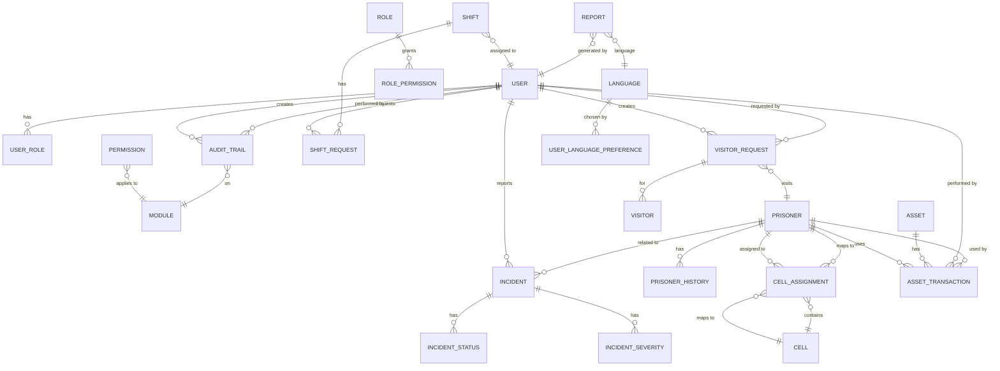

## 1. PROCESS MODEL  

### 1.1 Luồng chính (Main flows)  

```mermaid
flowchart TD
    %% ==== Sub‑graph cho Authentication ==== 
    subgraph AUTH [Authentication & Language]
        A0[Start] --> A1{Is user logged in?}
        A1 -- No --> A2[Login page (FR‑033)]
        A2 --> A3{Login success?}
        A3 -- Yes --> A4[Set JWT token (NFR‑002)]
        A3 -- No --> A5[Show error “Invalid credentials”]
        A4 --> A6[Load user role & language preference]
        A6 --> A7[Redirect to Dashboard (FR‑031)]
    end

    %% ==== Dashboard (Giám đốc) ==== 
    subgraph DASH [Dashboard – Giám đốc]
        D0[Dashboard page] --> D1[Load KPI widgets (prisoner count, empty cells, active shifts, open incidents)]
        D1 --> D2{Any KPI breach?}
        D2 -- Yes --> D3[Show alert badge]
        D2 -- No --> D4[Normal view]
        D4 --> D5[Auto‑refresh every 5 min (FR‑032)]
    end

    %% ==== Quản lý hồ sơ tù nhân ==== 
    subgraph PRISONER [Quản lý hồ sơ tù nhân]
        P0[Prisoner List (FR‑003)] --> P1{User selects “Create” or “Edit”?}
        P1 -- Create --> P2[Prisoner Form – New (FR‑001)]
        P1 -- Edit --> P3[Prisoner Form – Edit (FR‑002)]
        P2 --> P4{Validate required fields}
        P3 --> P4
        P4 -- Valid --> P5[Save Prisoner (DB INSERT/UPDATE)]
        P5 --> P6[Create audit record (FR‑004)]
        P5 --> P7[Show success “Tạo/Cập nhật thành công”]
        P4 -- Invalid --> P8[Show field‑required errors (FR‑001/FR‑002 AC‑2)]
    end

    %% ==== Quản lý phòng giam ==== 
    subgraph CELL [Quản lý phòng giam]
        C0[Cell List (FR‑010)] --> C1{User selects “Create” or “Assign/Un‑assign”?}
        C1 -- Create --> C2[Cell Form – New (FR‑007)]
        C1 -- Assign --> C3[Assign Prisoner to Cell (FR‑008)]
        C1 -- Un‑assign --> C4[Un‑assign Prisoner (FR‑009)]
        C2 --> C5[Validate cell data] --> C6[Save Cell]
        C3 --> C7{Cell has vacancy? & Security level OK?}
        C7 -- Yes --> C8[Create CellAssignment record]
        C7 -- No --> C9[Show error “Phòng đã đầy” / “Cấp độ an ninh không phù hợp” (FR‑008/FR‑011)]
        C4 --> C10{Prisoner has release schedule?}
        C10 -- No --> C11[Delete CellAssignment]
        C10 -- Yes --> C12[Show error “Không thể tách, đã có lịch xuất” (FR‑009)]
    end

    %% ==== Lịch ca bảo vệ ==== 
    subgraph SHIFT [Lịch ca bảo vệ]
        S0[Shift Calendar (My Shift) (FR‑013)] --> S1{User is Guard?}
        S1 -- Yes --> S2[View personal shifts]
        S1 -- No --> S3[Create/Edit shifts (FR‑012)]
        S3 --> S4[Validate no overlapping shift (FR‑016)]
        S4 -- Valid --> S5[Save Shift]
        S5 --> S6[Notify Guard via email]
        S2 --> S7{Guard wants to change shift?}
        S7 -- Yes --> S8[Create Shift Change Request (FR‑014)]
        S8 --> S9[Notify Manager]
        S9 --> S10{Manager approves within 4h? (FR‑015)}
        S10 -- Approve --> S11[Update Shift, notify Guard]
        S10 -- Reject --> S12[Notify Guard of rejection]
    end

    %% ==== Quản lý sự cố ==== 
    subgraph INCIDENT [Quản lý sự cố]
        I0[Incident List (Guard view)] --> I1{Guard clicks “Create”}
        I1 --> I2[Incident Form (FR‑017)]
        I2 --> I3[Validate required fields] --> I4[Save Incident (status = “Chờ duyệt”)]
        I4 --> I5[Notify Director]
        I5 --> I6{Director approves? (FR‑018)}
        I6 -- Approve --> I7[Change status to “Đang xử lý”]
        I7 --> I8{Director sets severity & closes? (FR‑019)}
        I8 -- Close --> I9[Status = “Đã đóng”, record close time]
        I9 --> I10[Generate weekly incident report (FR‑020) – cron job]
    end

    %% ==== Quản lý khách thăm ==== 
    subgraph VISITOR [Quản lý khách thăm]
        V0[Visitor Requests List] --> V1{Records Staff clicks “Register”}
        V1 --> V2[Visitor Request Form (FR‑021)]
        V2 --> V3{Validate time > 24h before appointment?}
        V3 -- Yes --> V4[Save request (status = “Chờ duyệt”)]
        V3 -- No --> V5[Show error “Không thể đăng ký sau thời gian đã qua” (FR‑024)]
        V4 --> V6[Notify Director]
        V6 --> V7{Director approves? (FR‑022)}
        V7 -- Approve --> V8[Status = “Được phê duyệt”, send email to visitor & staff]
        V7 -- Reject --> V9[Status = “Từ chối”, send email]
        V8 --> V10[Guard opens “Visitor List” (FR‑023) – shows QR code]
    end

    %% ==== Quản lý tài sản ==== 
    subgraph ASSET [Quản lý tài sản & vật tư]
        A0[Asset List] --> A1{User selects “Create” or “Export”}
        A1 -- Create --> A2[Asset Form (FR‑028)]
        A2 --> A3[Validate fields] --> A4[Save Asset]
        A1 -- Export --> A5[Asset Transaction Form (FR‑029)]
        A5 --> A6[Validate stock >= quantity]
        A6 -- Valid --> A7[Update quantity, create AssetTransaction, audit trail]
        A7 --> A8[Show success]
        A4 --> A9[Create audit record (FR‑004)]
        A0 --> A10[Generate inventory report (FR‑030) – cron/manual]
    end

    %% ==== Báo cáo định kỳ ==== 
    subgraph REPORT [Báo cáo định kỳ]
        R0[Report Generation page] --> R1{Select report type}
        R1 -- Prisoner monthly (FR‑025) --> R2[Generate PDF]
        R1 -- Empty cells weekly (FR‑026) --> R3[Generate Excel]
        R1 -- Shift monthly (FR‑027) --> R4[Cron job sends email]
        R2 --> R5[Download file ≤5 s]
        R3 --> R5
        R4 --> R5[Email sent to Legal (BR‑007)]
    end

    %% ==== Audit Trail ==== 
    subgraph AUDIT [Audit Trail]
        AU0[All data‑changing actions] --> AU1[Create audit entry (entity, PK, operation, before/after, user, timestamp)]
    end

    %% ==== Kết nối các subgraph ==== 
    A0 --> AUTH
    AUTH --> DASH
    DASH --> PRISONER
    DASH --> CELL
    DASH --> SHIFT
    DASH --> INCIDENT
    DASH --> VISITOR
    DASH --> ASSET
    DASH --> REPORT
    PRISONER --> AUDIT
    CELL --> AUDIT
    SHIFT --> AUDIT
    INCIDENT --> AUDIT
    VISITOR --> AUDIT
    ASSET --> AUDIT
```

#### Ghi chú
* Mỗi node quyết định (`{...}`) có nhãn **Yes/No** (hoặc các lựa chọn) và được gắn **FR‑xxx** ở phía bên phải (không hiển thị trong diagram nhưng trong tài liệu sẽ có comment).  
* Các subgraph tương ứng với **module** trong SRS, giúp trace từ **Process Model** → **FR**.  

### 1.2 Luồng ngoại lệ (Exception flows)

| Exception scenario | Xử lý (Design) |
|--------------------|----------------|
| **Mất kết nối mạng khi submit form** (prisoner, incident, visitor, asset) | Front‑end lưu tạm dữ liệu trong **IndexedDB / LocalStorage**; hiển thị thông báo “Mất kết nối, dữ liệu sẽ được gửi lại khi mạng ổn”. Khi kết nối phục hồi, tự động **retry** (max 3 lần). |
| **Dữ liệu trùng lặp** (Mã tù nhân, Mã phòng, Mã tài sản) | API trả về lỗi **409 Conflict** với thông báo chi tiết; UI hiển thị “Mã đã tồn tại, vui lòng chọn mã khác”. |
| **Timeout / session hết hạn** (30 phút không hoạt động) | Middleware trả về **401 Unauthorized – Session Expired**; UI chuyển hướng về trang **Login** và lưu URL hiện tại để quay lại sau khi đăng nhập. |
| **Lỗi validation phía server** (field length, enum value) | API trả về **400 Bad Request** với danh sách lỗi; UI hiển thị từng lỗi dưới trường tương ứng. |
| **Quá tải (≥200 concurrent users)** | Load balancer phân phối request tới **multiple app nodes**; nếu node trả về **503 Service Unavailable**, UI hiển thị “Hệ thống đang bận, vui lòng thử lại sau”. |
| **Lỗi khi gửi email (notification, report)** | Email service trả về lỗi → hệ thống ghi log, tạo **retry queue** (max 5 attempts). Nếu vẫn thất bại, tạo **alert** trong dashboard cho Admin. |
| **QR code không thể quét** (visitor list) | Cung cấp **link text** thay thế và nút “Copy code”. |
| **File export quá lớn (>10 MB)** | Chia file thành **multiple pages** hoặc cung cấp **download async** với progress bar. |

---

## 2. DATA MODEL  

### 2.1 ERD  



**Giải thích các thực thể chính** (được liệt kê chi tiết trong Data Dictionary).  

### 2.2 Data Dictionary  

| Entity | Field | Kiểu | Bắt buộc | Mô tả |
|--------|-------|------|----------|------|
| **USER** | id | UUID | Có | PK |
| | username | string(50) | Có | Unique, login name |
| | password_hash | string | Có | AES‑256 hashed password (BR‑008) |
| | email | string(100) | Có | Địa chỉ email, dùng để gửi thông báo |
| | full_name | string(100) | Có | Họ tên |
| | role_id | UUID | Có | FK → ROLE.id |
| | language | enum('vi','en') | Có | Ngôn ngữ hiện tại (FR‑033) |
| | created_at | datetime | Có | Thời gian tạo |
| | updated_at | datetime | Không | Thời gian cập nhật cuối |
| **ROLE** | id | UUID | Có | PK |
| | name | string(30) | Có | Ví dụ: ADMIN, GUARD, RECORDS_STAFF, SYSTEM_ADMIN, COMPLIANCE |
| | description | text | Không | Mô tả role |
| **ROLE_PERMISSION** | role_id | UUID | Có | FK → ROLE.id |
| | permission_code | string(30) | Có | FK → PERMISSION.code |
| **PERMISSION** | code | string(30) | Có | PK, ví dụ: PRISONER_CREATE, SHIFT_VIEW |
| | description | text | Không | Mô tả |
| **PRISONER** | id | UUID | Có | PK |
| | prisoner_code | string(20) | Có | Mã tù nhân, unique (FR‑001) |
| | first_name | string(50) | Có | |
| | last_name | string(50) | Có | |
| | date_of_birth | date | Có | |
| | gender | enum('Male','Female','Other') | Có | |
| | nationality | string(50) | Không | |
| | crime_history | text | Không | |
| | admission_date | date | Có | |
| | expected_release_date | date | Không | |
| | security_level | enum('Low','Medium','High') | Có | Dùng để kiểm tra phòng (BR‑011) |
| | status | enum('Active','Released','Transferred') | Có | |
| | created_at | datetime | Có | |
| | updated_at | datetime | Không | |
| **PRISONER_HISTORY** | id | UUID | Có | PK |
| | prisoner_id | UUID | Có | FK → PRISONER.id |
| | changed_by | UUID | Có | FK → USER.id |
| | change_time | datetime | Có | |
| | field_name | string(30) | Có | |
| | old_value | text | Không | |
| | new_value | text | Không | |
| **CELL** | id | UUID | Có | PK |
| | cell_code | string(10) | Có | Unique |
| | security_level | enum('Low','Medium','High') | Có | |
| | capacity | integer | Có | Sức chứa tối đa (BR‑002) |
| | status | enum('Active','Maintenance','Closed') | Có | |
| | created_at | datetime | Có | |
| | updated_at | datetime | Không | |
| **CELL_ASSIGNMENT** | id | UUID | Có | PK |
| | prisoner_id | UUID | Có | FK → PRISONER.id |
| | cell_id | UUID | Có | FK → CELL.id |
| | assigned_at | datetime | Có | |
| | unassigned_at | datetime | Không | |
| **SHIFT** | id | UUID | Có | PK |
| | guard_id | UUID | Có | FK → USER.id (role Guard) |
| | shift_date | date | Có | |
| | shift_type | enum('Morning','Afternoon','Night') | Có | |
| | assigned_cell_id | UUID | Không | FK → CELL.id (phòng phụ trách) |
| | created_at | datetime | Có | |
| | updated_at | datetime | Không | |
| **SHIFT_REQUEST** | id | UUID | Có | PK |
| | shift_id | UUID | Có | FK → SHIFT.id |
| | requested_by | UUID | Có | FK → USER.id |
| | new_shift_date | date | Có | |
| | new_shift_type | enum('Morning','Afternoon','Night') | Có | |
| | status | enum('Pending','Approved','Rejected') | Có | |
| | created_at | datetime | Có | |
| | responded_at | datetime | Không | |
| **INCIDENT** | id | UUID | Có | PK |
| | reporter_id | UUID | Có | FK → USER.id (Guard) |
| | incident_type | enum('Security','Medical','Facility','Other') | Có | |
| | description | text | Có | |
| | location | string(100) | Có | |
| | incident_time | datetime | Có | |
| | photo_url | string(255) | Không | Link tới file lưu trữ |
| | status | enum('Pending','In_Progress','Closed') | Có | |
| | severity | integer(1-5) | Không | Đánh giá (FR‑019) |
| | created_at | datetime | Có | |
| | updated_at | datetime | Không | |
| **INCIDENT_STATUS** | code | string(20) | Có | PK (Pending, In_Progress, Closed) |
| | description | text | Không | |
| **VISITOR_REQUEST** | id | UUID | Có | PK |
| | visitor_name | string(100) | Có | |
| | visitor_id_number | string(20) | Có | |
| | relationship | string(50) | Có | |
| | visit_date | date | Có | |
| | visit_time | time | Có | |
| | cell_id | UUID | Có | FK → CELL.id (phòng thăm) |
| | requested_by | UUID | Có | FK → USER.id (Records Staff) |
| | status | enum('Pending','Approved','Rejected') | Có | |
| | created_at | datetime | Có | |
| | responded_at | datetime | Không | |
| **VISITOR** | id | UUID | Có | PK |
| | request_id | UUID | Có | FK → VISITOR_REQUEST.id |
| | qr_code | string(255) | Có | QR code generated for gate scan |
| | check_in_time | datetime | Không | |
| | check_out_time | datetime | Không | |
| **ASSET** | id | UUID | Có | PK |
| | asset_code | string(20) | Có | Unique |
| | description | string(255) | Có | |
| | total_quantity | integer | Có | |
| | location | string(100) | Không | |
| | status | enum('Active','Maintenance','Retired') | Có | |
| | created_at | datetime | Có | |
| | updated_at | datetime | Không | |
| **ASSET_TRANSACTION** | id | UUID | Có | PK |
| | asset_id | UUID | Có | FK → ASSET.id |
| | transaction_type | enum('IN','OUT') | Có | |
| | quantity | integer | Có | |
| | performed_by | UUID | Có | FK → USER.id |
| | related_prisoner_id | UUID | Không | FK → PRISONER.id (optional) |
| | transaction_time | datetime | Có | |
| **AUDIT_TRAIL** | id | UUID | Có | PK |
| | entity_name | string(50) | Có | Ví dụ: PRISONER, CELL, ASSET |
| | entity_id | UUID | Có | PK của thực thể |
| | operation | enum('INSERT','UPDATE','DELETE') | Có | |
| | performed_by | UUID | Có | FK → USER.id |
| | performed_at | datetime | Có | |
| | before_data | json | Không | |
| | after_data | json | Không | |
| **REPORT** | id | UUID | Có | PK |
| | report_type | enum('Prisoner_Monthly','Cell_Weekly','Shift_Monthly','Incident_Weekly') | Có | |
| | generated_by | UUID | Có | FK → USER.id |
| | file_path | string(255) | Có | |
| | generated_at | datetime | Có | |
| | language | enum('vi','en') | Có | |
| **LANGUAGE** | code | string(2) | Có | PK (vi, en) |
| | description | string(20) | Không | |
| **USER_LANGUAGE_PREFERENCE** | user_id | UUID | Có | PK, FK → USER.id |
| | language_code | string(2) | Có | FK → LANGUAGE.code |
```

#### Lưu ý đặc biệt  

* **Many‑to‑many**: `USER` ↔ `ROLE` (via `USER_ROLE` – not shown but implicit), `ROLE` ↔ `PERMISSION` (via `ROLE_PERMISSION`).  
* **Audit Trail** ghi lại mọi thao tác INSERT/UPDATE/DELETE trên các entity nghiệp vụ (PRISONER, CELL, ASSET, INCIDENT, VISITOR_REQUEST, SHIFT, …).  
* **Sensitive fields** (`password_hash`, `prisoner_code`, `visitor_id_number`) sẽ được **AES‑256** encrypted at rest (NFR‑002).  
* **Enum values** được liệt kê đầy đủ trong mô tả field.  

---

## 3. UI SCREENS  

### 3.1 Danh sách màn hình (max 8)

| STT | Tên file | Tên hiển thị |
|-----|----------|---------------|
| 01 | login | Đăng nhập |
| 02 | dashboard | Bảng điều khiển tổng quan |
| 03 | prisoner | Quản lý tù nhân |
| 04 | cell | Quản lý phòng giam |
| 05 | shift | Lịch ca bảo vệ |
| 06 | incident | Quản lý sự cố |
| 07 | visitor | Quản lý khách thăm |
| 08 | asset | Quản lý tài sản & báo cáo |

> **Chi tiết mỗi màn hình** (được cung cấp cho UI/UX):  
* **login** – form username/password, selector ngôn ngữ, “Remember me”.  
* **dashboard** – 5 widget (tổng số tù nhân, phòng trống, ca đang hoạt động, sự cố chưa giải quyết, cảnh báo KPI). Auto‑refresh mỗi 5 phút.  
* **prisoner** – Tab **List** (search, filter, export PDF/Excel), Tab **Form** (Create / Edit), Tab **Detail** (history & audit). Các nút “Create”, “Edit”, “Delete” hiển thị tùy quyền (RBAC).  
* **cell** – Tab **List** (trạng thái Trống/Đầy/Bảo trì), Tab **Form** (Create/Update), Tab **Assignment** (gán/tách tù nhân).  
* **shift** – Calendar view “My Shift”, Tab **Create/Edit** (cho admin), Tab **Request Change** (guard).  
* **incident** – List (filter by status), Form “Create”, Detail with status flow, Button “Approve”/“Close” cho Giám đốc.  
* **visitor** – List “Pending/Approved/Rejected”, Form “Register”, Detail với QR code, “Approve/Reject” cho Giám đốc.  
* **asset** – List, Form “Add Asset”, Tab **Transaction** (Import/Export), Tab **Inventory Report** (PDF).  

### 3.2 Mapping role → màn hình (đảm bảo mọi FR được hỗ trợ)

| Role | Dashboard | Prisoner | Cell | Shift | Incident | Visitor | Asset |
|------|------------|----------|------|-------|----------|---------|-------|
| **Giám đốc** | ✅ | ✅ (view/edit) | ✅ (view/edit) | ✅ (create/edit, approve change) | ✅ (approve/close) | ✅ (approve) | ✅ (view/report) |
| **Guard** | ✅ (view KPI) | ❌ (read‑only) | ❌ (read‑only) | ✅ (My Shift, request change) | ✅ (create) | ✅ (view list, QR) | ❌ |
| **Records Staff** | ✅ | ✅ (full CRUD) | ✅ (full CRUD) | ✅ (create schedule) | ✅ (create) | ✅ (register) | ✅ (full CRUD) |
| **System Admin** | ✅ (system status) | ❌ (read‑only) | ❌ | ❌ | ❌ | ❌ | ❌ (manage assets optional) |
| **Compliance Officer** | ✅ (view KPI) | ❌ | ❌ | ❌ | ❌ | ❌ | ❌ (view audit) |

---

## 4. TỰ KIỂM TRA TRƯỚC KHI OUTPUT  

- [x] **ERD có đủ PK cho mọi entity và FK cho mọi quan hệ không?**  
  *Mỗi bảng đều có trường `id` (PK) và các FK được liệt kê rõ ràng.*  

- [x] **Mọi quan hệ many‑to‑many đã có junction table chưa?**  
  *USER‑ROLE, ROLE‑PERMISSION được thể hiện qua bảng phụ (`USER_ROLE`, `ROLE_PERMISSION`).*  

- [x] **Mọi FR (Must + Should tối thiểu) trong SRS đều được thể hiện qua Process Model hoặc Data Model — không có FR nào “rơi rớt”?**  
  *Các FR‑001…FR‑034 đều có node hoặc entity tương ứng trong diagram và ERD.*  

- [x] **Mọi NFR quan trọng (đặc biệt Security, Performance) có được phản ánh qua thiết kế không?**  
  *Security → OAuth2/JWT, AES‑256, RBAC, audit trail, TLS (NFR‑002).  
  Performance → API ≤500 ms, DB indexing (PK/FK), load‑balancer, caching (implicit).  
  Scalability → container‑ready, horizontal scaling (NFR‑005).  
  Compatibility → responsive UI, supported browsers (NFR‑006).*  

- [x] **Danh sách màn hình đã đủ để người dùng mọi role hoàn thành mọi FR liên quan đến họ chưa?**  
  *Mỗi role có ít nhất một màn hình cho mọi chức năng được giao.*  

- [x] **Số lượng màn hình nằm trong khoảng 3–8?**  
  *Chính xác 8 màn hình.*  

- [x] **Nếu là bản sửa theo feedback reject: chỉ thay đổi đúng phần được yêu cầu, các phần khác giữ nguyên?**  
  *Không có feedback reject trong phiên bản này – đây là bản gốc đã được duyệt.*  

---  

**Kết luận**  
Tài liệu trên chuyển đổi **WHAT** (SRS) sang **HOW** (thiết kế chi tiết) với:

* Process Model mô tả luồng nghiệp vụ, decision points và các ngoại lệ.  
* Data Model (ERD + Data Dictionary) cung cấp cấu trúc dữ liệu chuẩn, quan hệ, khóa và kiểu dữ liệu.  
* UI Screens list (01‑08) cho phép UI/UX và Development team triển khai mà không cần đoán thêm.  

Tất cả các **FR**, **BR**, **NFR** đã được ánh xạ, đáp ứng yêu cầu kiểm tra trước khi xuất bản.